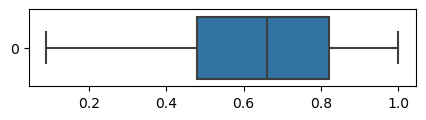

# Employee Turnover Prediction at Salifort Motors

## Project Overview

This project's goal was to analyze employee data from Salifort Motors to identify key factors that contribute to employee turnover using various machine learning models. Predicting which employees are likely to leave the company, allows HR to take proactive steps to improve retention.

The dataset includes employee features like satisfaction, evaluation scores, tenure, and work-related statistics.

The best-performing models were the Decision Tree and Random Forest, with recall scores of 92.0% and 91.5% respectively.

## Business Problem:

The HR department of Salifort Motors is concerned about employee turnover, a critical issue for many companies. High turnover rates lead to substantial recruitment and training costs and can cause operational disruptions. The department wants to understand what features contribute most to emloyee turnover rates and identify employees at risk. By retaining employees, Salifort Motors aims to lower these costs and maintain a more stable and experienced workforce.

Employee turnover costs have been studied in depth across industries, with estimates indicating that replacing an employee can cost anywhere from [50% to over 200%](https://www.jobvite.com/blog/cost-of-employee-turnover/#:~:text=The%20true%20cost%20of%20employee,annual%20salary%20to%20replace%20them.) of their annual salary, depending on the role and expertise required. Actively improving retention, therefore, not only save direct costs but can also lead to better employee satisfaction and company culture.


## Data

The dataset collected includes several variables that could influence employee turnover, such as:

* Satisfaction Level: Self-reported satisfaction scores from employees.
* Last Evaluation: Performance evaluations given to employees.
* Number of Projects: The number of projects the employee has worked on.
* Average Monthly Hours: Time spent working in the company each month.
* Years at the Company: Employee tenure.
* Work Accident: Whether the employee has experienced a work accident.
* Promotion in Last 5 Years: If the employee has been promoted in the last five years.
* Department: Department in which the employee works.
* Salary: Salary levels (Low, Medium, High).
* Turnover (Target): Whether the employee left the company or not.

Data Limitations:

* There may be potential biases in self-reported data, such as satisfaction levels.
* Salary data is categorized, limiting insights into precise pay discrepancies.
* The time frame of the data is not explicitly provided, so trends over time may be difficult to analyze without that context.
* Some features might be a scource of data leakage, such as Satisfaction levels and Evaluations, as such features are depenant on data scarsely collected.

# Modeling


```python
#Data manipulation
import numpy as np
import pandas as pd
from scipy import stats

#Data visualization
import matplotlib.pyplot as plt
import seaborn as sns

#Data modeling
from sklearn.linear_model import LogisticRegression
from sklearn.naive_bayes import CategoricalNB
from sklearn.tree import DecisionTreeClassifier
from sklearn.ensemble import RandomForestClassifier
from xgboost import XGBClassifier

#Metrics and useful functions
import sklearn.metrics as metrics
from sklearn.model_selection import train_test_split
from sklearn.preprocessing import OrdinalEncoder
from sklearn.model_selection import GridSearchCV
from xgboost import plot_importance

#Saving models
import pickle
```


```python
data = pd.read_csv("HR_capstone_dataset.csv")
```

## EDA

### Cleaning


```python
data.head()
```


<div>
<style scoped>
    .dataframe tbody tr th:only-of-type {
        vertical-align: middle;
    }

    .dataframe tbody tr th {
        vertical-align: top;
    }

    .dataframe thead th {
        text-align: right;
    }
</style>
<table border="1" class="dataframe">
  <thead>
    <tr style="text-align: right;">
      <th></th>
      <th>satisfaction_level</th>
      <th>last_evaluation</th>
      <th>number_project</th>
      <th>average_montly_hours</th>
      <th>time_spend_company</th>
      <th>Work_accident</th>
      <th>left</th>
      <th>promotion_last_5years</th>
      <th>Department</th>
      <th>salary</th>
    </tr>
  </thead>
  <tbody>
    <tr>
      <th>0</th>
      <td>0.38</td>
      <td>0.53</td>
      <td>2</td>
      <td>157</td>
      <td>3</td>
      <td>0</td>
      <td>1</td>
      <td>0</td>
      <td>sales</td>
      <td>low</td>
    </tr>
    <tr>
      <th>1</th>
      <td>0.80</td>
      <td>0.86</td>
      <td>5</td>
      <td>262</td>
      <td>6</td>
      <td>0</td>
      <td>1</td>
      <td>0</td>
      <td>sales</td>
      <td>medium</td>
    </tr>
    <tr>
      <th>2</th>
      <td>0.11</td>
      <td>0.88</td>
      <td>7</td>
      <td>272</td>
      <td>4</td>
      <td>0</td>
      <td>1</td>
      <td>0</td>
      <td>sales</td>
      <td>medium</td>
    </tr>
    <tr>
      <th>3</th>
      <td>0.72</td>
      <td>0.87</td>
      <td>5</td>
      <td>223</td>
      <td>5</td>
      <td>0</td>
      <td>1</td>
      <td>0</td>
      <td>sales</td>
      <td>low</td>
    </tr>
    <tr>
      <th>4</th>
      <td>0.37</td>
      <td>0.52</td>
      <td>2</td>
      <td>159</td>
      <td>3</td>
      <td>0</td>
      <td>1</td>
      <td>0</td>
      <td>sales</td>
      <td>low</td>
    </tr>
  </tbody>
</table>
</div>


```python
data.info()
```

    <class 'pandas.core.frame.DataFrame'>
    RangeIndex: 14999 entries, 0 to 14998
    Data columns (total 10 columns):
     #   Column                 Non-Null Count  Dtype  
    ---  ------                 --------------  -----  
     0   satisfaction_level     14999 non-null  float64
     1   last_evaluation        14999 non-null  float64
     2   number_project         14999 non-null  int64  
     3   average_montly_hours   14999 non-null  int64  
     4   time_spend_company     14999 non-null  int64  
     5   Work_accident          14999 non-null  int64  
     6   left                   14999 non-null  int64  
     7   promotion_last_5years  14999 non-null  int64  
     8   Department             14999 non-null  object 
     9   salary                 14999 non-null  object 
    dtypes: float64(2), int64(6), object(2)
    memory usage: 1.1+ MB
    


```python
data.describe()
```


<div>
<style scoped>
    .dataframe tbody tr th:only-of-type {
        vertical-align: middle;
    }

    .dataframe tbody tr th {
        vertical-align: top;
    }

    .dataframe thead th {
        text-align: right;
    }
</style>
<table border="1" class="dataframe">
  <thead>
    <tr style="text-align: right;">
      <th></th>
      <th>satisfaction_level</th>
      <th>last_evaluation</th>
      <th>number_project</th>
      <th>average_montly_hours</th>
      <th>time_spend_company</th>
      <th>Work_accident</th>
      <th>left</th>
      <th>promotion_last_5years</th>
    </tr>
  </thead>
  <tbody>
    <tr>
      <th>count</th>
      <td>14999.000000</td>
      <td>14999.000000</td>
      <td>14999.000000</td>
      <td>14999.000000</td>
      <td>14999.000000</td>
      <td>14999.000000</td>
      <td>14999.000000</td>
      <td>14999.000000</td>
    </tr>
    <tr>
      <th>mean</th>
      <td>0.612834</td>
      <td>0.716102</td>
      <td>3.803054</td>
      <td>201.050337</td>
      <td>3.498233</td>
      <td>0.144610</td>
      <td>0.238083</td>
      <td>0.021268</td>
    </tr>
    <tr>
      <th>std</th>
      <td>0.248631</td>
      <td>0.171169</td>
      <td>1.232592</td>
      <td>49.943099</td>
      <td>1.460136</td>
      <td>0.351719</td>
      <td>0.425924</td>
      <td>0.144281</td>
    </tr>
    <tr>
      <th>min</th>
      <td>0.090000</td>
      <td>0.360000</td>
      <td>2.000000</td>
      <td>96.000000</td>
      <td>2.000000</td>
      <td>0.000000</td>
      <td>0.000000</td>
      <td>0.000000</td>
    </tr>
    <tr>
      <th>25%</th>
      <td>0.440000</td>
      <td>0.560000</td>
      <td>3.000000</td>
      <td>156.000000</td>
      <td>3.000000</td>
      <td>0.000000</td>
      <td>0.000000</td>
      <td>0.000000</td>
    </tr>
    <tr>
      <th>50%</th>
      <td>0.640000</td>
      <td>0.720000</td>
      <td>4.000000</td>
      <td>200.000000</td>
      <td>3.000000</td>
      <td>0.000000</td>
      <td>0.000000</td>
      <td>0.000000</td>
    </tr>
    <tr>
      <th>75%</th>
      <td>0.820000</td>
      <td>0.870000</td>
      <td>5.000000</td>
      <td>245.000000</td>
      <td>4.000000</td>
      <td>0.000000</td>
      <td>0.000000</td>
      <td>0.000000</td>
    </tr>
    <tr>
      <th>max</th>
      <td>1.000000</td>
      <td>1.000000</td>
      <td>7.000000</td>
      <td>310.000000</td>
      <td>10.000000</td>
      <td>1.000000</td>
      <td>1.000000</td>
      <td>1.000000</td>
    </tr>
  </tbody>
</table>
</div>


#### Cleaning dataset's column names


```python
data.columns
```


    Index(['satisfaction_level', 'last_evaluation', 'number_project',
           'average_montly_hours', 'time_spend_company', 'Work_accident', 'left',
           'promotion_last_5years', 'Department', 'salary'],
          dtype='object')


```python
#Changes all column names to be in lowercase
for name in data.columns:
    data.rename(columns={name:name.lower()},inplace=True)

data.columns
```


    Index(['satisfaction_level', 'last_evaluation', 'number_project',
           'average_montly_hours', 'time_spend_company', 'work_accident', 'left',
           'promotion_last_5years', 'department', 'salary'],
          dtype='object')


```python
#imporve readability and correct misspelings
data.rename(columns={'average_montly_hours':'average_monthly_hours'},inplace=True)
data.rename(columns={'time_spend_company':'tenure'},inplace=True)
```

#### Checking for missing values


```python
data.isna().sum()
```


    satisfaction_level       0
    last_evaluation          0
    number_project           0
    average_monthly_hours    0
    tenure                   0
    work_accident            0
    left                     0
    promotion_last_5years    0
    department               0
    salary                   0
    dtype: int64


No missing values were found

#### Checking for duplicates


```python
data.duplicated().sum()
```


    3008


```python
data.duplicated().sum()/len(data.index)
```


    0.2005467031135409


There are 3008 duplicated entries, correlating to 20.05% of the dataset being comprised of duplicated entries

#### Pattern analysis within duplicated data


```python
data[data.duplicated()].head()
```


<div>
<style scoped>
    .dataframe tbody tr th:only-of-type {
        vertical-align: middle;
    }

    .dataframe tbody tr th {
        vertical-align: top;
    }

    .dataframe thead th {
        text-align: right;
    }
</style>
<table border="1" class="dataframe">
  <thead>
    <tr style="text-align: right;">
      <th></th>
      <th>satisfaction_level</th>
      <th>last_evaluation</th>
      <th>number_project</th>
      <th>average_monthly_hours</th>
      <th>tenure</th>
      <th>work_accident</th>
      <th>left</th>
      <th>promotion_last_5years</th>
      <th>department</th>
      <th>salary</th>
    </tr>
  </thead>
  <tbody>
    <tr>
      <th>396</th>
      <td>0.46</td>
      <td>0.57</td>
      <td>2</td>
      <td>139</td>
      <td>3</td>
      <td>0</td>
      <td>1</td>
      <td>0</td>
      <td>sales</td>
      <td>low</td>
    </tr>
    <tr>
      <th>866</th>
      <td>0.41</td>
      <td>0.46</td>
      <td>2</td>
      <td>128</td>
      <td>3</td>
      <td>0</td>
      <td>1</td>
      <td>0</td>
      <td>accounting</td>
      <td>low</td>
    </tr>
    <tr>
      <th>1317</th>
      <td>0.37</td>
      <td>0.51</td>
      <td>2</td>
      <td>127</td>
      <td>3</td>
      <td>0</td>
      <td>1</td>
      <td>0</td>
      <td>sales</td>
      <td>medium</td>
    </tr>
    <tr>
      <th>1368</th>
      <td>0.41</td>
      <td>0.52</td>
      <td>2</td>
      <td>132</td>
      <td>3</td>
      <td>0</td>
      <td>1</td>
      <td>0</td>
      <td>RandD</td>
      <td>low</td>
    </tr>
    <tr>
      <th>1461</th>
      <td>0.42</td>
      <td>0.53</td>
      <td>2</td>
      <td>142</td>
      <td>3</td>
      <td>0</td>
      <td>1</td>
      <td>0</td>
      <td>sales</td>
      <td>low</td>
    </tr>
  </tbody>
</table>
</div>


```python
data[data.duplicated()].describe(include='all')
```


<div>
<style scoped>
    .dataframe tbody tr th:only-of-type {
        vertical-align: middle;
    }

    .dataframe tbody tr th {
        vertical-align: top;
    }

    .dataframe thead th {
        text-align: right;
    }
</style>
<table border="1" class="dataframe">
  <thead>
    <tr style="text-align: right;">
      <th></th>
      <th>satisfaction_level</th>
      <th>last_evaluation</th>
      <th>number_project</th>
      <th>average_monthly_hours</th>
      <th>tenure</th>
      <th>work_accident</th>
      <th>left</th>
      <th>promotion_last_5years</th>
      <th>department</th>
      <th>salary</th>
    </tr>
  </thead>
  <tbody>
    <tr>
      <th>count</th>
      <td>3008.000000</td>
      <td>3008.000000</td>
      <td>3008.000000</td>
      <td>3008.000000</td>
      <td>3008.000000</td>
      <td>3008.000000</td>
      <td>3008.000000</td>
      <td>3008.000000</td>
      <td>3008</td>
      <td>3008</td>
    </tr>
    <tr>
      <th>unique</th>
      <td>NaN</td>
      <td>NaN</td>
      <td>NaN</td>
      <td>NaN</td>
      <td>NaN</td>
      <td>NaN</td>
      <td>NaN</td>
      <td>NaN</td>
      <td>10</td>
      <td>3</td>
    </tr>
    <tr>
      <th>top</th>
      <td>NaN</td>
      <td>NaN</td>
      <td>NaN</td>
      <td>NaN</td>
      <td>NaN</td>
      <td>NaN</td>
      <td>NaN</td>
      <td>NaN</td>
      <td>sales</td>
      <td>low</td>
    </tr>
    <tr>
      <th>freq</th>
      <td>NaN</td>
      <td>NaN</td>
      <td>NaN</td>
      <td>NaN</td>
      <td>NaN</td>
      <td>NaN</td>
      <td>NaN</td>
      <td>NaN</td>
      <td>901</td>
      <td>1576</td>
    </tr>
    <tr>
      <th>mean</th>
      <td>0.545765</td>
      <td>0.713787</td>
      <td>3.803856</td>
      <td>203.349734</td>
      <td>4.029920</td>
      <td>0.106051</td>
      <td>0.525266</td>
      <td>0.038564</td>
      <td>NaN</td>
      <td>NaN</td>
    </tr>
    <tr>
      <th>std</th>
      <td>0.266406</td>
      <td>0.182012</td>
      <td>1.477272</td>
      <td>54.467101</td>
      <td>1.795619</td>
      <td>0.307953</td>
      <td>0.499444</td>
      <td>0.192585</td>
      <td>NaN</td>
      <td>NaN</td>
    </tr>
    <tr>
      <th>min</th>
      <td>0.090000</td>
      <td>0.360000</td>
      <td>2.000000</td>
      <td>97.000000</td>
      <td>2.000000</td>
      <td>0.000000</td>
      <td>0.000000</td>
      <td>0.000000</td>
      <td>NaN</td>
      <td>NaN</td>
    </tr>
    <tr>
      <th>25%</th>
      <td>0.380000</td>
      <td>0.540000</td>
      <td>2.000000</td>
      <td>151.000000</td>
      <td>3.000000</td>
      <td>0.000000</td>
      <td>0.000000</td>
      <td>0.000000</td>
      <td>NaN</td>
      <td>NaN</td>
    </tr>
    <tr>
      <th>50%</th>
      <td>0.530000</td>
      <td>0.725000</td>
      <td>4.000000</td>
      <td>204.000000</td>
      <td>3.000000</td>
      <td>0.000000</td>
      <td>1.000000</td>
      <td>0.000000</td>
      <td>NaN</td>
      <td>NaN</td>
    </tr>
    <tr>
      <th>75%</th>
      <td>0.780000</td>
      <td>0.880000</td>
      <td>5.000000</td>
      <td>253.000000</td>
      <td>5.000000</td>
      <td>0.000000</td>
      <td>1.000000</td>
      <td>0.000000</td>
      <td>NaN</td>
      <td>NaN</td>
    </tr>
    <tr>
      <th>max</th>
      <td>1.000000</td>
      <td>1.000000</td>
      <td>7.000000</td>
      <td>310.000000</td>
      <td>10.000000</td>
      <td>1.000000</td>
      <td>1.000000</td>
      <td>1.000000</td>
      <td>NaN</td>
      <td>NaN</td>
    </tr>
  </tbody>
</table>
</div>


```python
data.department.value_counts(normalize=True)['sales']*3008
```


    830.2633508900592


```python
data.salary.value_counts(normalize=True)['low']*3008
```


    1467.1996799786652


```python
#Chance of two people randomly having the exact same information
1/100*1/100*1/6*1/200*1/9*1/2*1/2*1/2*1/10*1/3
```


    3.8580246913580245e-11


There isn't any specific pattern to the duplicated entries and they are too prolific to be random chance, suggest investigating further into possible problems regarding data entry or storage

As explained, data is unlikely to be representative and as such should be remomved


```python
data1 = data.drop_duplicates(keep='first')
```

#### Checking for outliers


```python
for column in data1.columns:
    plt.figure(figsize=(5,1))
    sns.boxplot(data1[column],orient='h')
    plt.show()
```


    

    


    

    


    

    


    

    


    

    


    

    


    

    


    

    


    ---------------------------------------------------------------------------

    ValueError                                Traceback (most recent call last)

    Cell In[18], line 3
          1 for column in data1.columns:
          2     plt.figure(figsize=(5,1))
    ----> 3     sns.boxplot(data1[column],orient='h')
          4     plt.show()
    

    File ~\anaconda3\Lib\site-packages\seaborn\categorical.py:2231, in boxplot(data, x, y, hue, order, hue_order, orient, color, palette, saturation, width, dodge, fliersize, linewidth, whis, ax, **kwargs)
       2224 def boxplot(
       2225     data=None, *, x=None, y=None, hue=None, order=None, hue_order=None,
       2226     orient=None, color=None, palette=None, saturation=.75, width=.8,
       2227     dodge=True, fliersize=5, linewidth=None, whis=1.5, ax=None,
       2228     **kwargs
       2229 ):
    -> 2231     plotter = _BoxPlotter(x, y, hue, data, order, hue_order,
       2232                           orient, color, palette, saturation,
       2233                           width, dodge, fliersize, linewidth)
       2235     if ax is None:
       2236         ax = plt.gca()
    

    File ~\anaconda3\Lib\site-packages\seaborn\categorical.py:785, in _BoxPlotter.__init__(self, x, y, hue, data, order, hue_order, orient, color, palette, saturation, width, dodge, fliersize, linewidth)
        781 def __init__(self, x, y, hue, data, order, hue_order,
        782              orient, color, palette, saturation,
        783              width, dodge, fliersize, linewidth):
    --> 785     self.establish_variables(x, y, hue, data, orient, order, hue_order)
        786     self.establish_colors(color, palette, saturation)
        788     self.dodge = dodge
    

    File ~\anaconda3\Lib\site-packages\seaborn\categorical.py:516, in _CategoricalPlotter.establish_variables(self, x, y, hue, data, orient, order, hue_order, units)
        513     plot_data = data
        515 # Convert to a list of arrays, the common representation
    --> 516 plot_data = [np.asarray(d, float) for d in plot_data]
        518 # The group names will just be numeric indices
        519 group_names = list(range(len(plot_data)))
    

    File ~\anaconda3\Lib\site-packages\seaborn\categorical.py:516, in <listcomp>(.0)
        513     plot_data = data
        515 # Convert to a list of arrays, the common representation
    --> 516 plot_data = [np.asarray(d, float) for d in plot_data]
        518 # The group names will just be numeric indices
        519 group_names = list(range(len(plot_data)))
    

    File ~\anaconda3\Lib\site-packages\pandas\core\series.py:917, in Series.__array__(self, dtype)
        870 """
        871 Return the values as a NumPy array.
        872 
       (...)
        914       dtype='datetime64[ns]')
        915 """
        916 values = self._values
    --> 917 arr = np.asarray(values, dtype=dtype)
        918 if using_copy_on_write() and astype_is_view(values.dtype, arr.dtype):
        919     arr = arr.view()
    

    ValueError: could not convert string to float: 'sales'


    <Figure size 500x100 with 0 Axes>


Only tenure has significant outliers that might need to be removed depending on the model chosen

### Exploration

How many employees are leaving the company


```python
data1['left'].value_counts()
```


```python
data1['left'].value_counts(normalize=True)
```

Why are employees leaving


```python
plt.figure(figsize=(6,3))
sns.histplot(data=data1,x='satisfaction_level',bins=25,hue='left',alpha=0.5)
plt.show()
```


    

    


```python
plt.figure(figsize=(6,3))
sns.histplot(data=data1,x='last_evaluation',bins=25,hue='left',alpha=0.5)
plt.show()
```


    

    


Satisfaction level vs Last evaluation shows the relationship betwwen the satisfaction of the company and an employee with their own work


```python
plt.figure(figsize=(10,5))
sns.scatterplot(data=data,x='satisfaction_level',y='last_evaluation',hue='left',alpha=0.3)
plt.yticks([x/10 for x in range(0,11,1)])
plt.show()
```


    

    


There appears to be three main grouping of employees who leave the company, those who are highly evaluated but have abysmal satisfaction scores, those who are evaluated lower but still have a below average satisfaction and those who are highly rated and are satisfied

Having established the three main groupings, proceed to try to understand more about them


```python
plt.figure(figsize=(10,5))
sns.scatterplot(data=data,x='average_monthly_hours',y='satisfaction_level',hue='left',alpha=0.3)
plt.yticks([x/10 for x in range(0,11,1)])
plt.show()
```


    

    


On average a person working full time works between 160 to 170 hours per month.

A clear distinction starts appearing between two of the most populous groups. The first are highly overworked employees, with high evaluations but dissatisfied and probably wanted to leave as fast as possible and resigned. Whilke the second are employees who were working less than average, weren't performing up to standards and were probably laid-off.

The third group is still without major characteristics towards wanting to leave, possibly satisfied employeed who found better opportunities

Note: The clear distinctions and shape of the distribution are clear symptoms of either synthetic or manipulated data

It could also be interesting to further observe what impacts satisfaction levels


```python
sns.boxplot(data=data1, x='satisfaction_level', y='tenure', hue='left', orient="h")
plt.gca().invert_yaxis()
```


    

    


Overall we see two distinct trends for employees that leave, those with lower tenures and lower satisfactions and those who stayed for longer.

It is also possible to see a decline in satisfaction from the second to fourth year, with it being unnusualy low for those who left during their 4th year, does this have a significant impact on the number of people leaving in that year?


```python
sns.histplot(data=data1, x='tenure', hue='left', multiple='dodge', shrink=5)
plt.title('Employee count according to tenure')
plt.show()
```


    

    


The decline in satisfaction within the 3-4th year seems to translate higly into higher rates of turnover, is there any reason behind this significant drop in satisfaction?


```python
#Setting up the subplots
fig, axs = plt.subplots(nrows=2, ncols=3, figsize = (14,5))
gs=axs[1, 2].get_gridspec()
for i in [0,1]:
    for j in [0,1]:
        axs[i,j].remove()
axbig0=fig.add_subplot(gs[0:2, 0])
axbig1=fig.add_subplot(gs[0:2, 1])
fig.tight_layout()

#Separating data by tenure
short_tenure=data1[data1.tenure<6]
long_tenure=data1[data1.tenure>=6]

#Graphs
sns.barplot(data=data1, x='tenure', y='average_monthly_hours', hue='left',ax=axbig0)
axbig0.set_title('Hours worked by tenure')

sns.barplot(data=data1, x='tenure', y='number_project', hue='left',ax=axbig1)
axbig1.set_title('Number of projects by tenure')

sns.histplot(data=short_tenure, x='tenure', hue='salary', discrete=1, 
             hue_order=['low', 'medium', 'high'], multiple='dodge', shrink=.5,ax=axs[0,2])
axs[0,2].set_title('Number of projects by tenure')

sns.histplot(data=long_tenure, x='tenure', hue='salary', discrete=1, 
             hue_order=['low', 'medium', 'high'], multiple='dodge', shrink=.5,ax=axs[1,2])
axs[1,2].set_title('Number of projects by tenure')
plt.show()
```


    

    


An overall increase in number of projects can be seen, especially for those who left at year 4, with them averaging more than 250 hours a month, working on average more than 12.5 hours a day. This increase in workload isn't matched with increases in salary, where the proportions are similair within the first 5 years and only later on do the proportions start shifting towards higher salaries

Beyond this it is also of interest to look whether the employees who're putting in the work are getting the promotions they deserve


```python
plt.figure(figsize=(14,3))
sns.scatterplot(data=data1, x='average_monthly_hours', y='promotion_last_5years', hue='left', alpha=0.5)
plt.title('Employees promoted according to wours worked')
plt.show()
```


    

    


Overall very few employees are being promoted, and the vast majority of them weren't the highest workers. The plot also shows that the employees weren't promoted and worked the longest hours

Following this, inpecting the distribution accross departments


```python
sns.histplot(data=data1, x='department', hue='left', discrete=1,hue_order=[0, 1], multiple='dodge', shrink=.5)
plt.xticks(rotation=45,ha='right')
plt.show()
```


    

    


No department differs significantly from the other in terms of turnover proportion

Lastly checking the correlation between variables


```python
plt.figure(figsize=(10,6))
sns.heatmap(data1.iloc[:,0:-2].corr(),annot=True,cmap='binary')
```


    <Axes: >


    

    


High positive correlation between number of projects, hours worked and evaluation received, and turnover is negatively correlated with employee satisfaction

## Creating the ML models

The goal is to predict whether an employee will leave the company or not, which is a binary categorical outcome. Defining our task as one of binary classification.

There are multiple models available for the task, with the ones considered being:
* Binomial logistic regression
* Naive Bayes
* Single Decision Tree
* Random Forest
* Gradient Boosting

### Saving and loading models


```python
def save_model(model_name,model_object):
    with open(model_name+'.pickle' , 'wb' ) as to_write:
   		 pickle.dump( model_object , to_write )
        
def load_model(model_name,model_object):
    with open(model_name+'.pickle','rb') as to_read:
        model_object = pickle.load(to_read)
```

### Preparing dataset for modeling

Dataset has two categorical features that need to be transformed into numeric:
* department: non-ordinal categorical variable
* salary: ordinal categorical variable (low-average-high)


```python
data2=data1.copy()
```


```python
data2.salary.value_counts()
```


    salary
    low       5740
    medium    5261
    high       990
    Name: count, dtype: int64


```python
ordinal_encoder = OrdinalEncoder(categories=[['low','medium','high']])
ordinal_encoder.fit(data2[['salary']])
data2.loc[:,['salary']]=ordinal_encoder.transform(data2[['salary']])
```


```python
data2.salary=data2.salary.astype('int64')
```


```python
data2.salary.value_counts()
```


    salary
    0    5740
    1    5261
    2     990
    Name: count, dtype: int64


```python
data2 = pd.get_dummies(data2,columns=['department'],drop_first=True)
```


```python
data2.info()
```

    <class 'pandas.core.frame.DataFrame'>
    Index: 11991 entries, 0 to 11999
    Data columns (total 18 columns):
     #   Column                  Non-Null Count  Dtype  
    ---  ------                  --------------  -----  
     0   satisfaction_level      11991 non-null  float64
     1   last_evaluation         11991 non-null  float64
     2   number_project          11991 non-null  int64  
     3   average_monthly_hours   11991 non-null  int64  
     4   tenure                  11991 non-null  int64  
     5   work_accident           11991 non-null  int64  
     6   left                    11991 non-null  int64  
     7   promotion_last_5years   11991 non-null  int64  
     8   salary                  11991 non-null  int64  
     9   department_RandD        11991 non-null  bool   
     10  department_accounting   11991 non-null  bool   
     11  department_hr           11991 non-null  bool   
     12  department_management   11991 non-null  bool   
     13  department_marketing    11991 non-null  bool   
     14  department_product_mng  11991 non-null  bool   
     15  department_sales        11991 non-null  bool   
     16  department_support      11991 non-null  bool   
     17  department_technical    11991 non-null  bool   
    dtypes: bool(9), float64(2), int64(7)
    memory usage: 1.3 MB
    

### Logistic Regression

Logistic regression has 4 main assumptions
* Linearity
* Independent observations
* No multicolinearity
* No Extreme Outliers

To observe multicolinearity:


```python
sns.pairplot(data2.iloc[:,:9])
plt.show()
```

    C:\Users\mglps\anaconda3\Lib\site-packages\seaborn\axisgrid.py:118: UserWarning: The figure layout has changed to tight
      self._figure.tight_layout(*args, **kwargs)
    


    

    


No multicolinearity is present and observations are independent as each is referring to a distinct employee

Removing outliers, as determined previously only present in tenure


```python
# Determining Q1 and Q3
tenure_q1=data2.tenure.quantile(0.25)
tenure_q3=data2.tenure.quantile(0.75)

# Calculating inter-quartile range
tenure_iqr=tenure_q3-tenure_q1

#Creating new dataframe without outliers
data_logreg=data2[(data2.tenure>(tenure_q1-1.5*tenure_iqr))|(data2.tenure<(tenure_q3+1.5*tenure_iqr))]
```


```python
data_logreg.head()
```


<div>
<style scoped>
    .dataframe tbody tr th:only-of-type {
        vertical-align: middle;
    }

    .dataframe tbody tr th {
        vertical-align: top;
    }

    .dataframe thead th {
        text-align: right;
    }
</style>
<table border="1" class="dataframe">
  <thead>
    <tr style="text-align: right;">
      <th></th>
      <th>satisfaction_level</th>
      <th>last_evaluation</th>
      <th>number_project</th>
      <th>average_monthly_hours</th>
      <th>tenure</th>
      <th>work_accident</th>
      <th>left</th>
      <th>promotion_last_5years</th>
      <th>salary</th>
      <th>department_RandD</th>
      <th>department_accounting</th>
      <th>department_hr</th>
      <th>department_management</th>
      <th>department_marketing</th>
      <th>department_product_mng</th>
      <th>department_sales</th>
      <th>department_support</th>
      <th>department_technical</th>
    </tr>
  </thead>
  <tbody>
    <tr>
      <th>0</th>
      <td>0.38</td>
      <td>0.53</td>
      <td>2</td>
      <td>157</td>
      <td>3</td>
      <td>0</td>
      <td>1</td>
      <td>0</td>
      <td>0</td>
      <td>False</td>
      <td>False</td>
      <td>False</td>
      <td>False</td>
      <td>False</td>
      <td>False</td>
      <td>True</td>
      <td>False</td>
      <td>False</td>
    </tr>
    <tr>
      <th>1</th>
      <td>0.80</td>
      <td>0.86</td>
      <td>5</td>
      <td>262</td>
      <td>6</td>
      <td>0</td>
      <td>1</td>
      <td>0</td>
      <td>1</td>
      <td>False</td>
      <td>False</td>
      <td>False</td>
      <td>False</td>
      <td>False</td>
      <td>False</td>
      <td>True</td>
      <td>False</td>
      <td>False</td>
    </tr>
    <tr>
      <th>2</th>
      <td>0.11</td>
      <td>0.88</td>
      <td>7</td>
      <td>272</td>
      <td>4</td>
      <td>0</td>
      <td>1</td>
      <td>0</td>
      <td>1</td>
      <td>False</td>
      <td>False</td>
      <td>False</td>
      <td>False</td>
      <td>False</td>
      <td>False</td>
      <td>True</td>
      <td>False</td>
      <td>False</td>
    </tr>
    <tr>
      <th>3</th>
      <td>0.72</td>
      <td>0.87</td>
      <td>5</td>
      <td>223</td>
      <td>5</td>
      <td>0</td>
      <td>1</td>
      <td>0</td>
      <td>0</td>
      <td>False</td>
      <td>False</td>
      <td>False</td>
      <td>False</td>
      <td>False</td>
      <td>False</td>
      <td>True</td>
      <td>False</td>
      <td>False</td>
    </tr>
    <tr>
      <th>4</th>
      <td>0.37</td>
      <td>0.52</td>
      <td>2</td>
      <td>159</td>
      <td>3</td>
      <td>0</td>
      <td>1</td>
      <td>0</td>
      <td>0</td>
      <td>False</td>
      <td>False</td>
      <td>False</td>
      <td>False</td>
      <td>False</td>
      <td>False</td>
      <td>True</td>
      <td>False</td>
      <td>False</td>
    </tr>
  </tbody>
</table>
</div>


```python
#Selecting the variables
x_logreg = data_logreg.drop(columns=['left'])
y_logreg = data_logreg.left
```


```python
x_logreg.info()
```

    <class 'pandas.core.frame.DataFrame'>
    Index: 11991 entries, 0 to 11999
    Data columns (total 17 columns):
     #   Column                  Non-Null Count  Dtype  
    ---  ------                  --------------  -----  
     0   satisfaction_level      11991 non-null  float64
     1   last_evaluation         11991 non-null  float64
     2   number_project          11991 non-null  int64  
     3   average_monthly_hours   11991 non-null  int64  
     4   tenure                  11991 non-null  int64  
     5   work_accident           11991 non-null  int64  
     6   promotion_last_5years   11991 non-null  int64  
     7   salary                  11991 non-null  int64  
     8   department_RandD        11991 non-null  bool   
     9   department_accounting   11991 non-null  bool   
     10  department_hr           11991 non-null  bool   
     11  department_management   11991 non-null  bool   
     12  department_marketing    11991 non-null  bool   
     13  department_product_mng  11991 non-null  bool   
     14  department_sales        11991 non-null  bool   
     15  department_support      11991 non-null  bool   
     16  department_technical    11991 non-null  bool   
    dtypes: bool(9), float64(2), int64(6)
    memory usage: 1.2 MB
    


```python
xtrain,xtest,ytrain,ytest = train_test_split(x_logreg,y_logreg,stratify=y_logreg,test_size=0.2,random_state=0)
```


```python
# Instantiating the model
logreg = LogisticRegression(random_state=0,max_iter=1000)

# Fitting the model
logreg.fit(xtrain,ytrain)
```


<style>#sk-container-id-1 {color: black;}#sk-container-id-1 pre{padding: 0;}#sk-container-id-1 div.sk-toggleable {background-color: white;}#sk-container-id-1 label.sk-toggleable__label {cursor: pointer;display: block;width: 100%;margin-bottom: 0;padding: 0.3em;box-sizing: border-box;text-align: center;}#sk-container-id-1 label.sk-toggleable__label-arrow:before {content: "▸";float: left;margin-right: 0.25em;color: #696969;}#sk-container-id-1 label.sk-toggleable__label-arrow:hover:before {color: black;}#sk-container-id-1 div.sk-estimator:hover label.sk-toggleable__label-arrow:before {color: black;}#sk-container-id-1 div.sk-toggleable__content {max-height: 0;max-width: 0;overflow: hidden;text-align: left;background-color: #f0f8ff;}#sk-container-id-1 div.sk-toggleable__content pre {margin: 0.2em;color: black;border-radius: 0.25em;background-color: #f0f8ff;}#sk-container-id-1 input.sk-toggleable__control:checked~div.sk-toggleable__content {max-height: 200px;max-width: 100%;overflow: auto;}#sk-container-id-1 input.sk-toggleable__control:checked~label.sk-toggleable__label-arrow:before {content: "▾";}#sk-container-id-1 div.sk-estimator input.sk-toggleable__control:checked~label.sk-toggleable__label {background-color: #d4ebff;}#sk-container-id-1 div.sk-label input.sk-toggleable__control:checked~label.sk-toggleable__label {background-color: #d4ebff;}#sk-container-id-1 input.sk-hidden--visually {border: 0;clip: rect(1px 1px 1px 1px);clip: rect(1px, 1px, 1px, 1px);height: 1px;margin: -1px;overflow: hidden;padding: 0;position: absolute;width: 1px;}#sk-container-id-1 div.sk-estimator {font-family: monospace;background-color: #f0f8ff;border: 1px dotted black;border-radius: 0.25em;box-sizing: border-box;margin-bottom: 0.5em;}#sk-container-id-1 div.sk-estimator:hover {background-color: #d4ebff;}#sk-container-id-1 div.sk-parallel-item::after {content: "";width: 100%;border-bottom: 1px solid gray;flex-grow: 1;}#sk-container-id-1 div.sk-label:hover label.sk-toggleable__label {background-color: #d4ebff;}#sk-container-id-1 div.sk-serial::before {content: "";position: absolute;border-left: 1px solid gray;box-sizing: border-box;top: 0;bottom: 0;left: 50%;z-index: 0;}#sk-container-id-1 div.sk-serial {display: flex;flex-direction: column;align-items: center;background-color: white;padding-right: 0.2em;padding-left: 0.2em;position: relative;}#sk-container-id-1 div.sk-item {position: relative;z-index: 1;}#sk-container-id-1 div.sk-parallel {display: flex;align-items: stretch;justify-content: center;background-color: white;position: relative;}#sk-container-id-1 div.sk-item::before, #sk-container-id-1 div.sk-parallel-item::before {content: "";position: absolute;border-left: 1px solid gray;box-sizing: border-box;top: 0;bottom: 0;left: 50%;z-index: -1;}#sk-container-id-1 div.sk-parallel-item {display: flex;flex-direction: column;z-index: 1;position: relative;background-color: white;}#sk-container-id-1 div.sk-parallel-item:first-child::after {align-self: flex-end;width: 50%;}#sk-container-id-1 div.sk-parallel-item:last-child::after {align-self: flex-start;width: 50%;}#sk-container-id-1 div.sk-parallel-item:only-child::after {width: 0;}#sk-container-id-1 div.sk-dashed-wrapped {border: 1px dashed gray;margin: 0 0.4em 0.5em 0.4em;box-sizing: border-box;padding-bottom: 0.4em;background-color: white;}#sk-container-id-1 div.sk-label label {font-family: monospace;font-weight: bold;display: inline-block;line-height: 1.2em;}#sk-container-id-1 div.sk-label-container {text-align: center;}#sk-container-id-1 div.sk-container {/* jupyter's `normalize.less` sets `[hidden] { display: none; }` but bootstrap.min.css set `[hidden] { display: none !important; }` so we also need the `!important` here to be able to override the default hidden behavior on the sphinx rendered scikit-learn.org. See: https://github.com/scikit-learn/scikit-learn/issues/21755 */display: inline-block !important;position: relative;}#sk-container-id-1 div.sk-text-repr-fallback {display: none;}</style><div id="sk-container-id-1" class="sk-top-container"><div class="sk-text-repr-fallback"><pre>LogisticRegression(max_iter=1000, random_state=0)</pre><b>In a Jupyter environment, please rerun this cell to show the HTML representation or trust the notebook. <br />On GitHub, the HTML representation is unable to render, please try loading this page with nbviewer.org.</b></div><div class="sk-container" hidden><div class="sk-item"><div class="sk-estimator sk-toggleable"><input class="sk-toggleable__control sk-hidden--visually" id="sk-estimator-id-1" type="checkbox" checked><label for="sk-estimator-id-1" class="sk-toggleable__label sk-toggleable__label-arrow">LogisticRegression</label><div class="sk-toggleable__content"><pre>LogisticRegression(max_iter=1000, random_state=0)</pre></div></div></div></div></div>


```python
# Predicting turnover using test dataset
ypred_logreg = logreg.predict(xtest)

# Creating the confusion matrix
cm_logreg=metrics.confusion_matrix(ytest,ypred_logreg,labels=logreg.classes_)

# Diplaying the confusion matrix
metrics.ConfusionMatrixDisplay(confusion_matrix=cm_logreg,display_labels=logreg.classes_).plot()
```


    <sklearn.metrics._plot.confusion_matrix.ConfusionMatrixDisplay at 0x1ea6cb3c1d0>


    

    


```python
model_results=pd.DataFrame({
    'Name' : ['Logistic Regression'],
    'Accuracy' : [metrics.accuracy_score(ytest,ypred_logreg)],
    'Precision' : [metrics.precision_score(ytest,ypred_logreg)],
    'Recall' : [metrics.recall_score(ytest,ypred_logreg)],
    'F1' : [metrics.f1_score(ytest,ypred_logreg)]})
```


```python
model_results
```


<div>
<style scoped>
    .dataframe tbody tr th:only-of-type {
        vertical-align: middle;
    }

    .dataframe tbody tr th {
        vertical-align: top;
    }

    .dataframe thead th {
        text-align: right;
    }
</style>
<table border="1" class="dataframe">
  <thead>
    <tr style="text-align: right;">
      <th></th>
      <th>Name</th>
      <th>Accuracy</th>
      <th>Precision</th>
      <th>Recall</th>
      <th>F1</th>
    </tr>
  </thead>
  <tbody>
    <tr>
      <th>0</th>
      <td>Logistic Regression</td>
      <td>0.825761</td>
      <td>0.440476</td>
      <td>0.18593</td>
      <td>0.261484</td>
    </tr>
  </tbody>
</table>
</div>


```python
save_model('LogReg',logreg)
```

### Naive Bayes

The only assumption made by the naive Bayes model is independence among predictors, although this doesn't apply as demonstrated previously it can still preform satisfactorly with the assumption broken


```python
x=data2.drop(columns=['left'])
y=data2.left
```


```python
xtrain,xtest,ytrain,ytest=train_test_split(x,y,stratify=y,test_size=0.2,random_state=0)
```


```python
nb = CategoricalNB()

nb.fit(xtrain,ytrain)
```


<style>#sk-container-id-2 {color: black;}#sk-container-id-2 pre{padding: 0;}#sk-container-id-2 div.sk-toggleable {background-color: white;}#sk-container-id-2 label.sk-toggleable__label {cursor: pointer;display: block;width: 100%;margin-bottom: 0;padding: 0.3em;box-sizing: border-box;text-align: center;}#sk-container-id-2 label.sk-toggleable__label-arrow:before {content: "▸";float: left;margin-right: 0.25em;color: #696969;}#sk-container-id-2 label.sk-toggleable__label-arrow:hover:before {color: black;}#sk-container-id-2 div.sk-estimator:hover label.sk-toggleable__label-arrow:before {color: black;}#sk-container-id-2 div.sk-toggleable__content {max-height: 0;max-width: 0;overflow: hidden;text-align: left;background-color: #f0f8ff;}#sk-container-id-2 div.sk-toggleable__content pre {margin: 0.2em;color: black;border-radius: 0.25em;background-color: #f0f8ff;}#sk-container-id-2 input.sk-toggleable__control:checked~div.sk-toggleable__content {max-height: 200px;max-width: 100%;overflow: auto;}#sk-container-id-2 input.sk-toggleable__control:checked~label.sk-toggleable__label-arrow:before {content: "▾";}#sk-container-id-2 div.sk-estimator input.sk-toggleable__control:checked~label.sk-toggleable__label {background-color: #d4ebff;}#sk-container-id-2 div.sk-label input.sk-toggleable__control:checked~label.sk-toggleable__label {background-color: #d4ebff;}#sk-container-id-2 input.sk-hidden--visually {border: 0;clip: rect(1px 1px 1px 1px);clip: rect(1px, 1px, 1px, 1px);height: 1px;margin: -1px;overflow: hidden;padding: 0;position: absolute;width: 1px;}#sk-container-id-2 div.sk-estimator {font-family: monospace;background-color: #f0f8ff;border: 1px dotted black;border-radius: 0.25em;box-sizing: border-box;margin-bottom: 0.5em;}#sk-container-id-2 div.sk-estimator:hover {background-color: #d4ebff;}#sk-container-id-2 div.sk-parallel-item::after {content: "";width: 100%;border-bottom: 1px solid gray;flex-grow: 1;}#sk-container-id-2 div.sk-label:hover label.sk-toggleable__label {background-color: #d4ebff;}#sk-container-id-2 div.sk-serial::before {content: "";position: absolute;border-left: 1px solid gray;box-sizing: border-box;top: 0;bottom: 0;left: 50%;z-index: 0;}#sk-container-id-2 div.sk-serial {display: flex;flex-direction: column;align-items: center;background-color: white;padding-right: 0.2em;padding-left: 0.2em;position: relative;}#sk-container-id-2 div.sk-item {position: relative;z-index: 1;}#sk-container-id-2 div.sk-parallel {display: flex;align-items: stretch;justify-content: center;background-color: white;position: relative;}#sk-container-id-2 div.sk-item::before, #sk-container-id-2 div.sk-parallel-item::before {content: "";position: absolute;border-left: 1px solid gray;box-sizing: border-box;top: 0;bottom: 0;left: 50%;z-index: -1;}#sk-container-id-2 div.sk-parallel-item {display: flex;flex-direction: column;z-index: 1;position: relative;background-color: white;}#sk-container-id-2 div.sk-parallel-item:first-child::after {align-self: flex-end;width: 50%;}#sk-container-id-2 div.sk-parallel-item:last-child::after {align-self: flex-start;width: 50%;}#sk-container-id-2 div.sk-parallel-item:only-child::after {width: 0;}#sk-container-id-2 div.sk-dashed-wrapped {border: 1px dashed gray;margin: 0 0.4em 0.5em 0.4em;box-sizing: border-box;padding-bottom: 0.4em;background-color: white;}#sk-container-id-2 div.sk-label label {font-family: monospace;font-weight: bold;display: inline-block;line-height: 1.2em;}#sk-container-id-2 div.sk-label-container {text-align: center;}#sk-container-id-2 div.sk-container {/* jupyter's `normalize.less` sets `[hidden] { display: none; }` but bootstrap.min.css set `[hidden] { display: none !important; }` so we also need the `!important` here to be able to override the default hidden behavior on the sphinx rendered scikit-learn.org. See: https://github.com/scikit-learn/scikit-learn/issues/21755 */display: inline-block !important;position: relative;}#sk-container-id-2 div.sk-text-repr-fallback {display: none;}</style><div id="sk-container-id-2" class="sk-top-container"><div class="sk-text-repr-fallback"><pre>CategoricalNB()</pre><b>In a Jupyter environment, please rerun this cell to show the HTML representation or trust the notebook. <br />On GitHub, the HTML representation is unable to render, please try loading this page with nbviewer.org.</b></div><div class="sk-container" hidden><div class="sk-item"><div class="sk-estimator sk-toggleable"><input class="sk-toggleable__control sk-hidden--visually" id="sk-estimator-id-2" type="checkbox" checked><label for="sk-estimator-id-2" class="sk-toggleable__label sk-toggleable__label-arrow">CategoricalNB</label><div class="sk-toggleable__content"><pre>CategoricalNB()</pre></div></div></div></div></div>


```python
ypred_nb=nb.predict(xtest)

cm_nb=metrics.confusion_matrix(ytest,ypred_nb,labels=nb.classes_)

metrics.ConfusionMatrixDisplay(confusion_matrix=cm_nb,display_labels=nb.classes_).plot()
```


    <sklearn.metrics._plot.confusion_matrix.ConfusionMatrixDisplay at 0x1ea7000d0d0>


    

    


```python
model_results=model_results._append(pd.DataFrame({
    'Name':'Naive Bayes',
    'Accuracy' : [metrics.accuracy_score(ytest,ypred_nb)],
    'Precision' : [metrics.precision_score(ytest,ypred_nb)],
    'Recall' : [metrics.recall_score(ytest,ypred_nb)],
    'F1' : [metrics.f1_score(ytest,ypred_nb)]}))
```


```python
model_results
```


<div>
<style scoped>
    .dataframe tbody tr th:only-of-type {
        vertical-align: middle;
    }

    .dataframe tbody tr th {
        vertical-align: top;
    }

    .dataframe thead th {
        text-align: right;
    }
</style>
<table border="1" class="dataframe">
  <thead>
    <tr style="text-align: right;">
      <th></th>
      <th>Name</th>
      <th>Accuracy</th>
      <th>Precision</th>
      <th>Recall</th>
      <th>F1</th>
    </tr>
  </thead>
  <tbody>
    <tr>
      <th>0</th>
      <td>Logistic Regression</td>
      <td>0.825761</td>
      <td>0.440476</td>
      <td>0.185930</td>
      <td>0.261484</td>
    </tr>
    <tr>
      <th>0</th>
      <td>Naive Bayes</td>
      <td>0.918299</td>
      <td>0.782123</td>
      <td>0.703518</td>
      <td>0.740741</td>
    </tr>
  </tbody>
</table>
</div>


```python
save_model('Naivebayes',nb)
```

### Decision-Tree

There are no required assumptions from the model

In this scenarion the company is mostly interested in a model that allows them to know as much as possible who is in danger of leaving the company, for that the scoring metric used will be recall


```python
# Instantiating the model
dt = DecisionTreeClassifier(random_state=0)

# Selecting parameters to tune
params_dt = {
    'max_depth':[4, 6, 8, None],
    'min_samples_leaf': [1, 2, 5],
    'min_samples_split': [2, 4, 6]
}

# Selecting scores
scoring=('accuracy','precision','recall','f1')

# Instantiating the cross-validation classifier
clf_dt = GridSearchCV(dt,param_grid=params_dt,scoring=scoring,cv=5,refit='recall')
```


```python
%%time
clf_dt.fit(xtrain,ytrain)
```

    CPU times: total: 4.75 s
    Wall time: 4.82 s
    


<style>#sk-container-id-3 {color: black;}#sk-container-id-3 pre{padding: 0;}#sk-container-id-3 div.sk-toggleable {background-color: white;}#sk-container-id-3 label.sk-toggleable__label {cursor: pointer;display: block;width: 100%;margin-bottom: 0;padding: 0.3em;box-sizing: border-box;text-align: center;}#sk-container-id-3 label.sk-toggleable__label-arrow:before {content: "▸";float: left;margin-right: 0.25em;color: #696969;}#sk-container-id-3 label.sk-toggleable__label-arrow:hover:before {color: black;}#sk-container-id-3 div.sk-estimator:hover label.sk-toggleable__label-arrow:before {color: black;}#sk-container-id-3 div.sk-toggleable__content {max-height: 0;max-width: 0;overflow: hidden;text-align: left;background-color: #f0f8ff;}#sk-container-id-3 div.sk-toggleable__content pre {margin: 0.2em;color: black;border-radius: 0.25em;background-color: #f0f8ff;}#sk-container-id-3 input.sk-toggleable__control:checked~div.sk-toggleable__content {max-height: 200px;max-width: 100%;overflow: auto;}#sk-container-id-3 input.sk-toggleable__control:checked~label.sk-toggleable__label-arrow:before {content: "▾";}#sk-container-id-3 div.sk-estimator input.sk-toggleable__control:checked~label.sk-toggleable__label {background-color: #d4ebff;}#sk-container-id-3 div.sk-label input.sk-toggleable__control:checked~label.sk-toggleable__label {background-color: #d4ebff;}#sk-container-id-3 input.sk-hidden--visually {border: 0;clip: rect(1px 1px 1px 1px);clip: rect(1px, 1px, 1px, 1px);height: 1px;margin: -1px;overflow: hidden;padding: 0;position: absolute;width: 1px;}#sk-container-id-3 div.sk-estimator {font-family: monospace;background-color: #f0f8ff;border: 1px dotted black;border-radius: 0.25em;box-sizing: border-box;margin-bottom: 0.5em;}#sk-container-id-3 div.sk-estimator:hover {background-color: #d4ebff;}#sk-container-id-3 div.sk-parallel-item::after {content: "";width: 100%;border-bottom: 1px solid gray;flex-grow: 1;}#sk-container-id-3 div.sk-label:hover label.sk-toggleable__label {background-color: #d4ebff;}#sk-container-id-3 div.sk-serial::before {content: "";position: absolute;border-left: 1px solid gray;box-sizing: border-box;top: 0;bottom: 0;left: 50%;z-index: 0;}#sk-container-id-3 div.sk-serial {display: flex;flex-direction: column;align-items: center;background-color: white;padding-right: 0.2em;padding-left: 0.2em;position: relative;}#sk-container-id-3 div.sk-item {position: relative;z-index: 1;}#sk-container-id-3 div.sk-parallel {display: flex;align-items: stretch;justify-content: center;background-color: white;position: relative;}#sk-container-id-3 div.sk-item::before, #sk-container-id-3 div.sk-parallel-item::before {content: "";position: absolute;border-left: 1px solid gray;box-sizing: border-box;top: 0;bottom: 0;left: 50%;z-index: -1;}#sk-container-id-3 div.sk-parallel-item {display: flex;flex-direction: column;z-index: 1;position: relative;background-color: white;}#sk-container-id-3 div.sk-parallel-item:first-child::after {align-self: flex-end;width: 50%;}#sk-container-id-3 div.sk-parallel-item:last-child::after {align-self: flex-start;width: 50%;}#sk-container-id-3 div.sk-parallel-item:only-child::after {width: 0;}#sk-container-id-3 div.sk-dashed-wrapped {border: 1px dashed gray;margin: 0 0.4em 0.5em 0.4em;box-sizing: border-box;padding-bottom: 0.4em;background-color: white;}#sk-container-id-3 div.sk-label label {font-family: monospace;font-weight: bold;display: inline-block;line-height: 1.2em;}#sk-container-id-3 div.sk-label-container {text-align: center;}#sk-container-id-3 div.sk-container {/* jupyter's `normalize.less` sets `[hidden] { display: none; }` but bootstrap.min.css set `[hidden] { display: none !important; }` so we also need the `!important` here to be able to override the default hidden behavior on the sphinx rendered scikit-learn.org. See: https://github.com/scikit-learn/scikit-learn/issues/21755 */display: inline-block !important;position: relative;}#sk-container-id-3 div.sk-text-repr-fallback {display: none;}</style><div id="sk-container-id-3" class="sk-top-container"><div class="sk-text-repr-fallback"><pre>GridSearchCV(cv=5, estimator=DecisionTreeClassifier(random_state=0),
             param_grid={&#x27;max_depth&#x27;: [4, 6, 8, None],
                         &#x27;min_samples_leaf&#x27;: [1, 2, 5],
                         &#x27;min_samples_split&#x27;: [2, 4, 6]},
             refit=&#x27;recall&#x27;, scoring=(&#x27;accuracy&#x27;, &#x27;precision&#x27;, &#x27;recall&#x27;, &#x27;f1&#x27;))</pre><b>In a Jupyter environment, please rerun this cell to show the HTML representation or trust the notebook. <br />On GitHub, the HTML representation is unable to render, please try loading this page with nbviewer.org.</b></div><div class="sk-container" hidden><div class="sk-item sk-dashed-wrapped"><div class="sk-label-container"><div class="sk-label sk-toggleable"><input class="sk-toggleable__control sk-hidden--visually" id="sk-estimator-id-3" type="checkbox" ><label for="sk-estimator-id-3" class="sk-toggleable__label sk-toggleable__label-arrow">GridSearchCV</label><div class="sk-toggleable__content"><pre>GridSearchCV(cv=5, estimator=DecisionTreeClassifier(random_state=0),
             param_grid={&#x27;max_depth&#x27;: [4, 6, 8, None],
                         &#x27;min_samples_leaf&#x27;: [1, 2, 5],
                         &#x27;min_samples_split&#x27;: [2, 4, 6]},
             refit=&#x27;recall&#x27;, scoring=(&#x27;accuracy&#x27;, &#x27;precision&#x27;, &#x27;recall&#x27;, &#x27;f1&#x27;))</pre></div></div></div><div class="sk-parallel"><div class="sk-parallel-item"><div class="sk-item"><div class="sk-label-container"><div class="sk-label sk-toggleable"><input class="sk-toggleable__control sk-hidden--visually" id="sk-estimator-id-4" type="checkbox" ><label for="sk-estimator-id-4" class="sk-toggleable__label sk-toggleable__label-arrow">estimator: DecisionTreeClassifier</label><div class="sk-toggleable__content"><pre>DecisionTreeClassifier(random_state=0)</pre></div></div></div><div class="sk-serial"><div class="sk-item"><div class="sk-estimator sk-toggleable"><input class="sk-toggleable__control sk-hidden--visually" id="sk-estimator-id-5" type="checkbox" ><label for="sk-estimator-id-5" class="sk-toggleable__label sk-toggleable__label-arrow">DecisionTreeClassifier</label><div class="sk-toggleable__content"><pre>DecisionTreeClassifier(random_state=0)</pre></div></div></div></div></div></div></div></div></div></div>


```python
print(clf_dt.best_params_)
print(clf_dt.best_score_)
```

    {'max_depth': 6, 'min_samples_leaf': 1, 'min_samples_split': 2}
    0.9202835117604147
    

Improving tuning


```python
params_dt = {
    'max_depth':[5,6,7],
    'min_samples_leaf': [1,2],
    'min_samples_split': [2,3]
}
clf_dt = GridSearchCV(dt,param_grid=params_dt,scoring=scoring,cv=5,refit='recall')
```


```python
%%time
clf_dt.fit(xtrain,ytrain)
```

    CPU times: total: 1.38 s
    Wall time: 1.41 s
    


<style>#sk-container-id-4 {color: black;}#sk-container-id-4 pre{padding: 0;}#sk-container-id-4 div.sk-toggleable {background-color: white;}#sk-container-id-4 label.sk-toggleable__label {cursor: pointer;display: block;width: 100%;margin-bottom: 0;padding: 0.3em;box-sizing: border-box;text-align: center;}#sk-container-id-4 label.sk-toggleable__label-arrow:before {content: "▸";float: left;margin-right: 0.25em;color: #696969;}#sk-container-id-4 label.sk-toggleable__label-arrow:hover:before {color: black;}#sk-container-id-4 div.sk-estimator:hover label.sk-toggleable__label-arrow:before {color: black;}#sk-container-id-4 div.sk-toggleable__content {max-height: 0;max-width: 0;overflow: hidden;text-align: left;background-color: #f0f8ff;}#sk-container-id-4 div.sk-toggleable__content pre {margin: 0.2em;color: black;border-radius: 0.25em;background-color: #f0f8ff;}#sk-container-id-4 input.sk-toggleable__control:checked~div.sk-toggleable__content {max-height: 200px;max-width: 100%;overflow: auto;}#sk-container-id-4 input.sk-toggleable__control:checked~label.sk-toggleable__label-arrow:before {content: "▾";}#sk-container-id-4 div.sk-estimator input.sk-toggleable__control:checked~label.sk-toggleable__label {background-color: #d4ebff;}#sk-container-id-4 div.sk-label input.sk-toggleable__control:checked~label.sk-toggleable__label {background-color: #d4ebff;}#sk-container-id-4 input.sk-hidden--visually {border: 0;clip: rect(1px 1px 1px 1px);clip: rect(1px, 1px, 1px, 1px);height: 1px;margin: -1px;overflow: hidden;padding: 0;position: absolute;width: 1px;}#sk-container-id-4 div.sk-estimator {font-family: monospace;background-color: #f0f8ff;border: 1px dotted black;border-radius: 0.25em;box-sizing: border-box;margin-bottom: 0.5em;}#sk-container-id-4 div.sk-estimator:hover {background-color: #d4ebff;}#sk-container-id-4 div.sk-parallel-item::after {content: "";width: 100%;border-bottom: 1px solid gray;flex-grow: 1;}#sk-container-id-4 div.sk-label:hover label.sk-toggleable__label {background-color: #d4ebff;}#sk-container-id-4 div.sk-serial::before {content: "";position: absolute;border-left: 1px solid gray;box-sizing: border-box;top: 0;bottom: 0;left: 50%;z-index: 0;}#sk-container-id-4 div.sk-serial {display: flex;flex-direction: column;align-items: center;background-color: white;padding-right: 0.2em;padding-left: 0.2em;position: relative;}#sk-container-id-4 div.sk-item {position: relative;z-index: 1;}#sk-container-id-4 div.sk-parallel {display: flex;align-items: stretch;justify-content: center;background-color: white;position: relative;}#sk-container-id-4 div.sk-item::before, #sk-container-id-4 div.sk-parallel-item::before {content: "";position: absolute;border-left: 1px solid gray;box-sizing: border-box;top: 0;bottom: 0;left: 50%;z-index: -1;}#sk-container-id-4 div.sk-parallel-item {display: flex;flex-direction: column;z-index: 1;position: relative;background-color: white;}#sk-container-id-4 div.sk-parallel-item:first-child::after {align-self: flex-end;width: 50%;}#sk-container-id-4 div.sk-parallel-item:last-child::after {align-self: flex-start;width: 50%;}#sk-container-id-4 div.sk-parallel-item:only-child::after {width: 0;}#sk-container-id-4 div.sk-dashed-wrapped {border: 1px dashed gray;margin: 0 0.4em 0.5em 0.4em;box-sizing: border-box;padding-bottom: 0.4em;background-color: white;}#sk-container-id-4 div.sk-label label {font-family: monospace;font-weight: bold;display: inline-block;line-height: 1.2em;}#sk-container-id-4 div.sk-label-container {text-align: center;}#sk-container-id-4 div.sk-container {/* jupyter's `normalize.less` sets `[hidden] { display: none; }` but bootstrap.min.css set `[hidden] { display: none !important; }` so we also need the `!important` here to be able to override the default hidden behavior on the sphinx rendered scikit-learn.org. See: https://github.com/scikit-learn/scikit-learn/issues/21755 */display: inline-block !important;position: relative;}#sk-container-id-4 div.sk-text-repr-fallback {display: none;}</style><div id="sk-container-id-4" class="sk-top-container"><div class="sk-text-repr-fallback"><pre>GridSearchCV(cv=5, estimator=DecisionTreeClassifier(random_state=0),
             param_grid={&#x27;max_depth&#x27;: [5, 6, 7], &#x27;min_samples_leaf&#x27;: [1, 2],
                         &#x27;min_samples_split&#x27;: [2, 3]},
             refit=&#x27;recall&#x27;, scoring=(&#x27;accuracy&#x27;, &#x27;precision&#x27;, &#x27;recall&#x27;, &#x27;f1&#x27;))</pre><b>In a Jupyter environment, please rerun this cell to show the HTML representation or trust the notebook. <br />On GitHub, the HTML representation is unable to render, please try loading this page with nbviewer.org.</b></div><div class="sk-container" hidden><div class="sk-item sk-dashed-wrapped"><div class="sk-label-container"><div class="sk-label sk-toggleable"><input class="sk-toggleable__control sk-hidden--visually" id="sk-estimator-id-6" type="checkbox" ><label for="sk-estimator-id-6" class="sk-toggleable__label sk-toggleable__label-arrow">GridSearchCV</label><div class="sk-toggleable__content"><pre>GridSearchCV(cv=5, estimator=DecisionTreeClassifier(random_state=0),
             param_grid={&#x27;max_depth&#x27;: [5, 6, 7], &#x27;min_samples_leaf&#x27;: [1, 2],
                         &#x27;min_samples_split&#x27;: [2, 3]},
             refit=&#x27;recall&#x27;, scoring=(&#x27;accuracy&#x27;, &#x27;precision&#x27;, &#x27;recall&#x27;, &#x27;f1&#x27;))</pre></div></div></div><div class="sk-parallel"><div class="sk-parallel-item"><div class="sk-item"><div class="sk-label-container"><div class="sk-label sk-toggleable"><input class="sk-toggleable__control sk-hidden--visually" id="sk-estimator-id-7" type="checkbox" ><label for="sk-estimator-id-7" class="sk-toggleable__label sk-toggleable__label-arrow">estimator: DecisionTreeClassifier</label><div class="sk-toggleable__content"><pre>DecisionTreeClassifier(random_state=0)</pre></div></div></div><div class="sk-serial"><div class="sk-item"><div class="sk-estimator sk-toggleable"><input class="sk-toggleable__control sk-hidden--visually" id="sk-estimator-id-8" type="checkbox" ><label for="sk-estimator-id-8" class="sk-toggleable__label sk-toggleable__label-arrow">DecisionTreeClassifier</label><div class="sk-toggleable__content"><pre>DecisionTreeClassifier(random_state=0)</pre></div></div></div></div></div></div></div></div></div></div>


```python
print(clf_dt.best_params_)
print(clf_dt.best_score_)
```

    {'max_depth': 6, 'min_samples_leaf': 1, 'min_samples_split': 2}
    0.9202835117604147
    


```python
ypred_dt = clf_dt.best_estimator_.predict(xtest)

cm_dt=metrics.confusion_matrix(
    ytest,
    ypred_dt,
    labels=clf_dt.best_estimator_.classes_
)

metrics.ConfusionMatrixDisplay(
    confusion_matrix=cm_dt,
    display_labels=clf_dt.best_estimator_.classes_
).plot()
```


    <sklearn.metrics._plot.confusion_matrix.ConfusionMatrixDisplay at 0x1ea71684510>


    

    


```python
model_results=model_results._append(pd.DataFrame({
    'Name':['Decision Tree'],
    'Accuracy' : [metrics.accuracy_score(ytest,ypred_dt)],
    'Precision' : [metrics.precision_score(ytest,ypred_dt)],
    'Recall' : [metrics.recall_score(ytest,ypred_dt)],
    'F1' : [metrics.f1_score(ytest,ypred_dt)]}))
```


```python
model_results
```


<div>
<style scoped>
    .dataframe tbody tr th:only-of-type {
        vertical-align: middle;
    }

    .dataframe tbody tr th {
        vertical-align: top;
    }

    .dataframe thead th {
        text-align: right;
    }
</style>
<table border="1" class="dataframe">
  <thead>
    <tr style="text-align: right;">
      <th></th>
      <th>Name</th>
      <th>Accuracy</th>
      <th>Precision</th>
      <th>Recall</th>
      <th>F1</th>
    </tr>
  </thead>
  <tbody>
    <tr>
      <th>0</th>
      <td>Logistic Regression</td>
      <td>0.825761</td>
      <td>0.440476</td>
      <td>0.185930</td>
      <td>0.261484</td>
    </tr>
    <tr>
      <th>0</th>
      <td>Naive Bayes</td>
      <td>0.918299</td>
      <td>0.782123</td>
      <td>0.703518</td>
      <td>0.740741</td>
    </tr>
    <tr>
      <th>0</th>
      <td>Decision Tree</td>
      <td>0.981659</td>
      <td>0.968254</td>
      <td>0.919598</td>
      <td>0.943299</td>
    </tr>
  </tbody>
</table>
</div>


```python
save_model('DecisionTree',clf_dt.best_estimator_)
```

### Random Forest

There are no required assumptions


```python
rf = RandomForestClassifier(random_state=0)

params_rf = {
    'max_depth':[2,5,None],
    'min_samples_leaf':[1,2,3],
    'max_features':[0.25,0.5,0.75],
    'n_estimators':[50,100]
}

clf_rf = GridSearchCV(
    rf,
    param_grid=params_rf,
    scoring=scoring,
    cv=5,
    refit='recall')
```


```python
%%time
clf_rf.fit(xtrain,ytrain)
```

    CPU times: total: 2min 7s
    Wall time: 2min 11s
    


<style>#sk-container-id-5 {color: black;}#sk-container-id-5 pre{padding: 0;}#sk-container-id-5 div.sk-toggleable {background-color: white;}#sk-container-id-5 label.sk-toggleable__label {cursor: pointer;display: block;width: 100%;margin-bottom: 0;padding: 0.3em;box-sizing: border-box;text-align: center;}#sk-container-id-5 label.sk-toggleable__label-arrow:before {content: "▸";float: left;margin-right: 0.25em;color: #696969;}#sk-container-id-5 label.sk-toggleable__label-arrow:hover:before {color: black;}#sk-container-id-5 div.sk-estimator:hover label.sk-toggleable__label-arrow:before {color: black;}#sk-container-id-5 div.sk-toggleable__content {max-height: 0;max-width: 0;overflow: hidden;text-align: left;background-color: #f0f8ff;}#sk-container-id-5 div.sk-toggleable__content pre {margin: 0.2em;color: black;border-radius: 0.25em;background-color: #f0f8ff;}#sk-container-id-5 input.sk-toggleable__control:checked~div.sk-toggleable__content {max-height: 200px;max-width: 100%;overflow: auto;}#sk-container-id-5 input.sk-toggleable__control:checked~label.sk-toggleable__label-arrow:before {content: "▾";}#sk-container-id-5 div.sk-estimator input.sk-toggleable__control:checked~label.sk-toggleable__label {background-color: #d4ebff;}#sk-container-id-5 div.sk-label input.sk-toggleable__control:checked~label.sk-toggleable__label {background-color: #d4ebff;}#sk-container-id-5 input.sk-hidden--visually {border: 0;clip: rect(1px 1px 1px 1px);clip: rect(1px, 1px, 1px, 1px);height: 1px;margin: -1px;overflow: hidden;padding: 0;position: absolute;width: 1px;}#sk-container-id-5 div.sk-estimator {font-family: monospace;background-color: #f0f8ff;border: 1px dotted black;border-radius: 0.25em;box-sizing: border-box;margin-bottom: 0.5em;}#sk-container-id-5 div.sk-estimator:hover {background-color: #d4ebff;}#sk-container-id-5 div.sk-parallel-item::after {content: "";width: 100%;border-bottom: 1px solid gray;flex-grow: 1;}#sk-container-id-5 div.sk-label:hover label.sk-toggleable__label {background-color: #d4ebff;}#sk-container-id-5 div.sk-serial::before {content: "";position: absolute;border-left: 1px solid gray;box-sizing: border-box;top: 0;bottom: 0;left: 50%;z-index: 0;}#sk-container-id-5 div.sk-serial {display: flex;flex-direction: column;align-items: center;background-color: white;padding-right: 0.2em;padding-left: 0.2em;position: relative;}#sk-container-id-5 div.sk-item {position: relative;z-index: 1;}#sk-container-id-5 div.sk-parallel {display: flex;align-items: stretch;justify-content: center;background-color: white;position: relative;}#sk-container-id-5 div.sk-item::before, #sk-container-id-5 div.sk-parallel-item::before {content: "";position: absolute;border-left: 1px solid gray;box-sizing: border-box;top: 0;bottom: 0;left: 50%;z-index: -1;}#sk-container-id-5 div.sk-parallel-item {display: flex;flex-direction: column;z-index: 1;position: relative;background-color: white;}#sk-container-id-5 div.sk-parallel-item:first-child::after {align-self: flex-end;width: 50%;}#sk-container-id-5 div.sk-parallel-item:last-child::after {align-self: flex-start;width: 50%;}#sk-container-id-5 div.sk-parallel-item:only-child::after {width: 0;}#sk-container-id-5 div.sk-dashed-wrapped {border: 1px dashed gray;margin: 0 0.4em 0.5em 0.4em;box-sizing: border-box;padding-bottom: 0.4em;background-color: white;}#sk-container-id-5 div.sk-label label {font-family: monospace;font-weight: bold;display: inline-block;line-height: 1.2em;}#sk-container-id-5 div.sk-label-container {text-align: center;}#sk-container-id-5 div.sk-container {/* jupyter's `normalize.less` sets `[hidden] { display: none; }` but bootstrap.min.css set `[hidden] { display: none !important; }` so we also need the `!important` here to be able to override the default hidden behavior on the sphinx rendered scikit-learn.org. See: https://github.com/scikit-learn/scikit-learn/issues/21755 */display: inline-block !important;position: relative;}#sk-container-id-5 div.sk-text-repr-fallback {display: none;}</style><div id="sk-container-id-5" class="sk-top-container"><div class="sk-text-repr-fallback"><pre>GridSearchCV(cv=5, estimator=RandomForestClassifier(random_state=0),
             param_grid={&#x27;max_depth&#x27;: [2, 5, None],
                         &#x27;max_features&#x27;: [0.25, 0.5, 0.75],
                         &#x27;min_samples_leaf&#x27;: [1, 2, 3],
                         &#x27;n_estimators&#x27;: [50, 100]},
             refit=&#x27;recall&#x27;, scoring=(&#x27;accuracy&#x27;, &#x27;precision&#x27;, &#x27;recall&#x27;, &#x27;f1&#x27;))</pre><b>In a Jupyter environment, please rerun this cell to show the HTML representation or trust the notebook. <br />On GitHub, the HTML representation is unable to render, please try loading this page with nbviewer.org.</b></div><div class="sk-container" hidden><div class="sk-item sk-dashed-wrapped"><div class="sk-label-container"><div class="sk-label sk-toggleable"><input class="sk-toggleable__control sk-hidden--visually" id="sk-estimator-id-9" type="checkbox" ><label for="sk-estimator-id-9" class="sk-toggleable__label sk-toggleable__label-arrow">GridSearchCV</label><div class="sk-toggleable__content"><pre>GridSearchCV(cv=5, estimator=RandomForestClassifier(random_state=0),
             param_grid={&#x27;max_depth&#x27;: [2, 5, None],
                         &#x27;max_features&#x27;: [0.25, 0.5, 0.75],
                         &#x27;min_samples_leaf&#x27;: [1, 2, 3],
                         &#x27;n_estimators&#x27;: [50, 100]},
             refit=&#x27;recall&#x27;, scoring=(&#x27;accuracy&#x27;, &#x27;precision&#x27;, &#x27;recall&#x27;, &#x27;f1&#x27;))</pre></div></div></div><div class="sk-parallel"><div class="sk-parallel-item"><div class="sk-item"><div class="sk-label-container"><div class="sk-label sk-toggleable"><input class="sk-toggleable__control sk-hidden--visually" id="sk-estimator-id-10" type="checkbox" ><label for="sk-estimator-id-10" class="sk-toggleable__label sk-toggleable__label-arrow">estimator: RandomForestClassifier</label><div class="sk-toggleable__content"><pre>RandomForestClassifier(random_state=0)</pre></div></div></div><div class="sk-serial"><div class="sk-item"><div class="sk-estimator sk-toggleable"><input class="sk-toggleable__control sk-hidden--visually" id="sk-estimator-id-11" type="checkbox" ><label for="sk-estimator-id-11" class="sk-toggleable__label sk-toggleable__label-arrow">RandomForestClassifier</label><div class="sk-toggleable__content"><pre>RandomForestClassifier(random_state=0)</pre></div></div></div></div></div></div></div></div></div></div>


```python
print(clf_rf.best_params_)
print(clf_rf.best_score_)
```

    {'max_depth': None, 'max_features': 0.75, 'min_samples_leaf': 1, 'n_estimators': 50}
    0.9215354586857514
    

Tuning hyperparameters


```python
params_rf = {
    'max_depth':[10,15,None],
    'min_samples_leaf':[1],
    'max_features':[0.6,0.7,0.8,0.9,1],
    'n_estimators':[40,60,70]
}
clf_rf = GridSearchCV(
    rf,
    param_grid=params_rf,
    scoring=scoring,
    cv=5,
    refit='recall')
```


```python
%%time
clf_rf.fit(xtrain,ytrain)
```

    CPU times: total: 2min 29s
    Wall time: 2min 31s
    


<style>#sk-container-id-6 {color: black;}#sk-container-id-6 pre{padding: 0;}#sk-container-id-6 div.sk-toggleable {background-color: white;}#sk-container-id-6 label.sk-toggleable__label {cursor: pointer;display: block;width: 100%;margin-bottom: 0;padding: 0.3em;box-sizing: border-box;text-align: center;}#sk-container-id-6 label.sk-toggleable__label-arrow:before {content: "▸";float: left;margin-right: 0.25em;color: #696969;}#sk-container-id-6 label.sk-toggleable__label-arrow:hover:before {color: black;}#sk-container-id-6 div.sk-estimator:hover label.sk-toggleable__label-arrow:before {color: black;}#sk-container-id-6 div.sk-toggleable__content {max-height: 0;max-width: 0;overflow: hidden;text-align: left;background-color: #f0f8ff;}#sk-container-id-6 div.sk-toggleable__content pre {margin: 0.2em;color: black;border-radius: 0.25em;background-color: #f0f8ff;}#sk-container-id-6 input.sk-toggleable__control:checked~div.sk-toggleable__content {max-height: 200px;max-width: 100%;overflow: auto;}#sk-container-id-6 input.sk-toggleable__control:checked~label.sk-toggleable__label-arrow:before {content: "▾";}#sk-container-id-6 div.sk-estimator input.sk-toggleable__control:checked~label.sk-toggleable__label {background-color: #d4ebff;}#sk-container-id-6 div.sk-label input.sk-toggleable__control:checked~label.sk-toggleable__label {background-color: #d4ebff;}#sk-container-id-6 input.sk-hidden--visually {border: 0;clip: rect(1px 1px 1px 1px);clip: rect(1px, 1px, 1px, 1px);height: 1px;margin: -1px;overflow: hidden;padding: 0;position: absolute;width: 1px;}#sk-container-id-6 div.sk-estimator {font-family: monospace;background-color: #f0f8ff;border: 1px dotted black;border-radius: 0.25em;box-sizing: border-box;margin-bottom: 0.5em;}#sk-container-id-6 div.sk-estimator:hover {background-color: #d4ebff;}#sk-container-id-6 div.sk-parallel-item::after {content: "";width: 100%;border-bottom: 1px solid gray;flex-grow: 1;}#sk-container-id-6 div.sk-label:hover label.sk-toggleable__label {background-color: #d4ebff;}#sk-container-id-6 div.sk-serial::before {content: "";position: absolute;border-left: 1px solid gray;box-sizing: border-box;top: 0;bottom: 0;left: 50%;z-index: 0;}#sk-container-id-6 div.sk-serial {display: flex;flex-direction: column;align-items: center;background-color: white;padding-right: 0.2em;padding-left: 0.2em;position: relative;}#sk-container-id-6 div.sk-item {position: relative;z-index: 1;}#sk-container-id-6 div.sk-parallel {display: flex;align-items: stretch;justify-content: center;background-color: white;position: relative;}#sk-container-id-6 div.sk-item::before, #sk-container-id-6 div.sk-parallel-item::before {content: "";position: absolute;border-left: 1px solid gray;box-sizing: border-box;top: 0;bottom: 0;left: 50%;z-index: -1;}#sk-container-id-6 div.sk-parallel-item {display: flex;flex-direction: column;z-index: 1;position: relative;background-color: white;}#sk-container-id-6 div.sk-parallel-item:first-child::after {align-self: flex-end;width: 50%;}#sk-container-id-6 div.sk-parallel-item:last-child::after {align-self: flex-start;width: 50%;}#sk-container-id-6 div.sk-parallel-item:only-child::after {width: 0;}#sk-container-id-6 div.sk-dashed-wrapped {border: 1px dashed gray;margin: 0 0.4em 0.5em 0.4em;box-sizing: border-box;padding-bottom: 0.4em;background-color: white;}#sk-container-id-6 div.sk-label label {font-family: monospace;font-weight: bold;display: inline-block;line-height: 1.2em;}#sk-container-id-6 div.sk-label-container {text-align: center;}#sk-container-id-6 div.sk-container {/* jupyter's `normalize.less` sets `[hidden] { display: none; }` but bootstrap.min.css set `[hidden] { display: none !important; }` so we also need the `!important` here to be able to override the default hidden behavior on the sphinx rendered scikit-learn.org. See: https://github.com/scikit-learn/scikit-learn/issues/21755 */display: inline-block !important;position: relative;}#sk-container-id-6 div.sk-text-repr-fallback {display: none;}</style><div id="sk-container-id-6" class="sk-top-container"><div class="sk-text-repr-fallback"><pre>GridSearchCV(cv=5, estimator=RandomForestClassifier(random_state=0),
             param_grid={&#x27;max_depth&#x27;: [10, 15, None],
                         &#x27;max_features&#x27;: [0.6, 0.7, 0.8, 0.9, 1],
                         &#x27;min_samples_leaf&#x27;: [1],
                         &#x27;n_estimators&#x27;: [40, 60, 70]},
             refit=&#x27;recall&#x27;, scoring=(&#x27;accuracy&#x27;, &#x27;precision&#x27;, &#x27;recall&#x27;, &#x27;f1&#x27;))</pre><b>In a Jupyter environment, please rerun this cell to show the HTML representation or trust the notebook. <br />On GitHub, the HTML representation is unable to render, please try loading this page with nbviewer.org.</b></div><div class="sk-container" hidden><div class="sk-item sk-dashed-wrapped"><div class="sk-label-container"><div class="sk-label sk-toggleable"><input class="sk-toggleable__control sk-hidden--visually" id="sk-estimator-id-12" type="checkbox" ><label for="sk-estimator-id-12" class="sk-toggleable__label sk-toggleable__label-arrow">GridSearchCV</label><div class="sk-toggleable__content"><pre>GridSearchCV(cv=5, estimator=RandomForestClassifier(random_state=0),
             param_grid={&#x27;max_depth&#x27;: [10, 15, None],
                         &#x27;max_features&#x27;: [0.6, 0.7, 0.8, 0.9, 1],
                         &#x27;min_samples_leaf&#x27;: [1],
                         &#x27;n_estimators&#x27;: [40, 60, 70]},
             refit=&#x27;recall&#x27;, scoring=(&#x27;accuracy&#x27;, &#x27;precision&#x27;, &#x27;recall&#x27;, &#x27;f1&#x27;))</pre></div></div></div><div class="sk-parallel"><div class="sk-parallel-item"><div class="sk-item"><div class="sk-label-container"><div class="sk-label sk-toggleable"><input class="sk-toggleable__control sk-hidden--visually" id="sk-estimator-id-13" type="checkbox" ><label for="sk-estimator-id-13" class="sk-toggleable__label sk-toggleable__label-arrow">estimator: RandomForestClassifier</label><div class="sk-toggleable__content"><pre>RandomForestClassifier(random_state=0)</pre></div></div></div><div class="sk-serial"><div class="sk-item"><div class="sk-estimator sk-toggleable"><input class="sk-toggleable__control sk-hidden--visually" id="sk-estimator-id-14" type="checkbox" ><label for="sk-estimator-id-14" class="sk-toggleable__label sk-toggleable__label-arrow">RandomForestClassifier</label><div class="sk-toggleable__content"><pre>RandomForestClassifier(random_state=0)</pre></div></div></div></div></div></div></div></div></div></div>


```python
print(clf_rf.best_params_)
print(clf_rf.best_score_)
```

    {'max_depth': 10, 'max_features': 0.8, 'min_samples_leaf': 1, 'n_estimators': 40}
    0.9221624179334003
    


```python
params_rf = {
    'max_depth':[8,9,10,11,12],
    'min_samples_leaf':[1],
    'max_features':[0.8],
    'n_estimators':[20,30,40,50]
}
clf_rf = GridSearchCV(
    rf,
    param_grid=params_rf,
    scoring=scoring,
    cv=5,
    refit='recall')
```


```python
%%time
clf_rf.fit(xtrain,ytrain)
```

    CPU times: total: 44.2 s
    Wall time: 44.7 s
    


<style>#sk-container-id-7 {color: black;}#sk-container-id-7 pre{padding: 0;}#sk-container-id-7 div.sk-toggleable {background-color: white;}#sk-container-id-7 label.sk-toggleable__label {cursor: pointer;display: block;width: 100%;margin-bottom: 0;padding: 0.3em;box-sizing: border-box;text-align: center;}#sk-container-id-7 label.sk-toggleable__label-arrow:before {content: "▸";float: left;margin-right: 0.25em;color: #696969;}#sk-container-id-7 label.sk-toggleable__label-arrow:hover:before {color: black;}#sk-container-id-7 div.sk-estimator:hover label.sk-toggleable__label-arrow:before {color: black;}#sk-container-id-7 div.sk-toggleable__content {max-height: 0;max-width: 0;overflow: hidden;text-align: left;background-color: #f0f8ff;}#sk-container-id-7 div.sk-toggleable__content pre {margin: 0.2em;color: black;border-radius: 0.25em;background-color: #f0f8ff;}#sk-container-id-7 input.sk-toggleable__control:checked~div.sk-toggleable__content {max-height: 200px;max-width: 100%;overflow: auto;}#sk-container-id-7 input.sk-toggleable__control:checked~label.sk-toggleable__label-arrow:before {content: "▾";}#sk-container-id-7 div.sk-estimator input.sk-toggleable__control:checked~label.sk-toggleable__label {background-color: #d4ebff;}#sk-container-id-7 div.sk-label input.sk-toggleable__control:checked~label.sk-toggleable__label {background-color: #d4ebff;}#sk-container-id-7 input.sk-hidden--visually {border: 0;clip: rect(1px 1px 1px 1px);clip: rect(1px, 1px, 1px, 1px);height: 1px;margin: -1px;overflow: hidden;padding: 0;position: absolute;width: 1px;}#sk-container-id-7 div.sk-estimator {font-family: monospace;background-color: #f0f8ff;border: 1px dotted black;border-radius: 0.25em;box-sizing: border-box;margin-bottom: 0.5em;}#sk-container-id-7 div.sk-estimator:hover {background-color: #d4ebff;}#sk-container-id-7 div.sk-parallel-item::after {content: "";width: 100%;border-bottom: 1px solid gray;flex-grow: 1;}#sk-container-id-7 div.sk-label:hover label.sk-toggleable__label {background-color: #d4ebff;}#sk-container-id-7 div.sk-serial::before {content: "";position: absolute;border-left: 1px solid gray;box-sizing: border-box;top: 0;bottom: 0;left: 50%;z-index: 0;}#sk-container-id-7 div.sk-serial {display: flex;flex-direction: column;align-items: center;background-color: white;padding-right: 0.2em;padding-left: 0.2em;position: relative;}#sk-container-id-7 div.sk-item {position: relative;z-index: 1;}#sk-container-id-7 div.sk-parallel {display: flex;align-items: stretch;justify-content: center;background-color: white;position: relative;}#sk-container-id-7 div.sk-item::before, #sk-container-id-7 div.sk-parallel-item::before {content: "";position: absolute;border-left: 1px solid gray;box-sizing: border-box;top: 0;bottom: 0;left: 50%;z-index: -1;}#sk-container-id-7 div.sk-parallel-item {display: flex;flex-direction: column;z-index: 1;position: relative;background-color: white;}#sk-container-id-7 div.sk-parallel-item:first-child::after {align-self: flex-end;width: 50%;}#sk-container-id-7 div.sk-parallel-item:last-child::after {align-self: flex-start;width: 50%;}#sk-container-id-7 div.sk-parallel-item:only-child::after {width: 0;}#sk-container-id-7 div.sk-dashed-wrapped {border: 1px dashed gray;margin: 0 0.4em 0.5em 0.4em;box-sizing: border-box;padding-bottom: 0.4em;background-color: white;}#sk-container-id-7 div.sk-label label {font-family: monospace;font-weight: bold;display: inline-block;line-height: 1.2em;}#sk-container-id-7 div.sk-label-container {text-align: center;}#sk-container-id-7 div.sk-container {/* jupyter's `normalize.less` sets `[hidden] { display: none; }` but bootstrap.min.css set `[hidden] { display: none !important; }` so we also need the `!important` here to be able to override the default hidden behavior on the sphinx rendered scikit-learn.org. See: https://github.com/scikit-learn/scikit-learn/issues/21755 */display: inline-block !important;position: relative;}#sk-container-id-7 div.sk-text-repr-fallback {display: none;}</style><div id="sk-container-id-7" class="sk-top-container"><div class="sk-text-repr-fallback"><pre>GridSearchCV(cv=5, estimator=RandomForestClassifier(random_state=0),
             param_grid={&#x27;max_depth&#x27;: [8, 9, 10, 11, 12], &#x27;max_features&#x27;: [0.8],
                         &#x27;min_samples_leaf&#x27;: [1],
                         &#x27;n_estimators&#x27;: [20, 30, 40, 50]},
             refit=&#x27;recall&#x27;, scoring=(&#x27;accuracy&#x27;, &#x27;precision&#x27;, &#x27;recall&#x27;, &#x27;f1&#x27;))</pre><b>In a Jupyter environment, please rerun this cell to show the HTML representation or trust the notebook. <br />On GitHub, the HTML representation is unable to render, please try loading this page with nbviewer.org.</b></div><div class="sk-container" hidden><div class="sk-item sk-dashed-wrapped"><div class="sk-label-container"><div class="sk-label sk-toggleable"><input class="sk-toggleable__control sk-hidden--visually" id="sk-estimator-id-15" type="checkbox" ><label for="sk-estimator-id-15" class="sk-toggleable__label sk-toggleable__label-arrow">GridSearchCV</label><div class="sk-toggleable__content"><pre>GridSearchCV(cv=5, estimator=RandomForestClassifier(random_state=0),
             param_grid={&#x27;max_depth&#x27;: [8, 9, 10, 11, 12], &#x27;max_features&#x27;: [0.8],
                         &#x27;min_samples_leaf&#x27;: [1],
                         &#x27;n_estimators&#x27;: [20, 30, 40, 50]},
             refit=&#x27;recall&#x27;, scoring=(&#x27;accuracy&#x27;, &#x27;precision&#x27;, &#x27;recall&#x27;, &#x27;f1&#x27;))</pre></div></div></div><div class="sk-parallel"><div class="sk-parallel-item"><div class="sk-item"><div class="sk-label-container"><div class="sk-label sk-toggleable"><input class="sk-toggleable__control sk-hidden--visually" id="sk-estimator-id-16" type="checkbox" ><label for="sk-estimator-id-16" class="sk-toggleable__label sk-toggleable__label-arrow">estimator: RandomForestClassifier</label><div class="sk-toggleable__content"><pre>RandomForestClassifier(random_state=0)</pre></div></div></div><div class="sk-serial"><div class="sk-item"><div class="sk-estimator sk-toggleable"><input class="sk-toggleable__control sk-hidden--visually" id="sk-estimator-id-17" type="checkbox" ><label for="sk-estimator-id-17" class="sk-toggleable__label sk-toggleable__label-arrow">RandomForestClassifier</label><div class="sk-toggleable__content"><pre>RandomForestClassifier(random_state=0)</pre></div></div></div></div></div></div></div></div></div></div>


```python
print(clf_rf.best_params_)
print(clf_rf.best_score_)
```

    {'max_depth': 10, 'max_features': 0.8, 'min_samples_leaf': 1, 'n_estimators': 30}
    0.9221624179334003
    


```python
ypred_rf = clf_rf.best_estimator_.predict(xtest)

cm_rf=metrics.confusion_matrix(
    ytest,
    ypred_rf,
    labels=clf_rf.best_estimator_.classes_
)

metrics.ConfusionMatrixDisplay(
    confusion_matrix=cm_rf,
    display_labels=clf_rf.best_estimator_.classes_
).plot()
```


    <sklearn.metrics._plot.confusion_matrix.ConfusionMatrixDisplay at 0x1ea6c9492d0>


    

    


```python
model_results=model_results._append(pd.DataFrame({
    'Name':['Random Forest'],
    'Accuracy' : [metrics.accuracy_score(ytest,ypred_rf)],
    'Precision' : [metrics.precision_score(ytest,ypred_rf)],
    'Recall' : [metrics.recall_score(ytest,ypred_rf)],
    'F1' : [metrics.f1_score(ytest,ypred_rf)]}))
```


```python
model_results
```


<div>
<style scoped>
    .dataframe tbody tr th:only-of-type {
        vertical-align: middle;
    }

    .dataframe tbody tr th {
        vertical-align: top;
    }

    .dataframe thead th {
        text-align: right;
    }
</style>
<table border="1" class="dataframe">
  <thead>
    <tr style="text-align: right;">
      <th></th>
      <th>Name</th>
      <th>Accuracy</th>
      <th>Precision</th>
      <th>Recall</th>
      <th>F1</th>
    </tr>
  </thead>
  <tbody>
    <tr>
      <th>0</th>
      <td>Logistic Regression</td>
      <td>0.825761</td>
      <td>0.440476</td>
      <td>0.185930</td>
      <td>0.261484</td>
    </tr>
    <tr>
      <th>0</th>
      <td>Naive Bayes</td>
      <td>0.918299</td>
      <td>0.782123</td>
      <td>0.703518</td>
      <td>0.740741</td>
    </tr>
    <tr>
      <th>0</th>
      <td>Decision Tree</td>
      <td>0.981659</td>
      <td>0.968254</td>
      <td>0.919598</td>
      <td>0.943299</td>
    </tr>
    <tr>
      <th>0</th>
      <td>Random Forest</td>
      <td>0.984160</td>
      <td>0.989130</td>
      <td>0.914573</td>
      <td>0.950392</td>
    </tr>
  </tbody>
</table>
</div>


```python
save_model('RandomForest',clf_rf.best_estimator_)
```

### Gradient Boosting

There are no required assumptions


```python
xgb = XGBClassifier(objective='binary:logistic',random_state=0,enable_categorical=True)

params_xgb = {
    'max_depth':[2,5,10],
    'n_estimators':[30,50,80],
    'learning_rate':[0.01,0.1,0.3],
    'min_child_weight':[1,2,3],
    'colsample_bytree':[0.25,0.5,0.75]
}

clf_xgb = GridSearchCV(
    xgb,
    param_grid=params_xgb,
    scoring=scoring,
    cv=5,
    refit='recall')
```


```python
%%time
clf_xgb.fit(xtrain,ytrain)
```

    C:\Users\mglps\anaconda3\Lib\site-packages\sklearn\metrics\_classification.py:1469: UndefinedMetricWarning: Precision is ill-defined and being set to 0.0 due to no predicted samples. Use `zero_division` parameter to control this behavior.
      _warn_prf(average, modifier, msg_start, len(result))
    C:\Users\mglps\anaconda3\Lib\site-packages\sklearn\metrics\_classification.py:1469: UndefinedMetricWarning: Precision is ill-defined and being set to 0.0 due to no predicted samples. Use `zero_division` parameter to control this behavior.
      _warn_prf(average, modifier, msg_start, len(result))
    C:\Users\mglps\anaconda3\Lib\site-packages\sklearn\metrics\_classification.py:1469: UndefinedMetricWarning: Precision is ill-defined and being set to 0.0 due to no predicted samples. Use `zero_division` parameter to control this behavior.
      _warn_prf(average, modifier, msg_start, len(result))
    C:\Users\mglps\anaconda3\Lib\site-packages\sklearn\metrics\_classification.py:1469: UndefinedMetricWarning: Precision is ill-defined and being set to 0.0 due to no predicted samples. Use `zero_division` parameter to control this behavior.
      _warn_prf(average, modifier, msg_start, len(result))
    C:\Users\mglps\anaconda3\Lib\site-packages\sklearn\metrics\_classification.py:1469: UndefinedMetricWarning: Precision is ill-defined and being set to 0.0 due to no predicted samples. Use `zero_division` parameter to control this behavior.
      _warn_prf(average, modifier, msg_start, len(result))
    C:\Users\mglps\anaconda3\Lib\site-packages\sklearn\metrics\_classification.py:1469: UndefinedMetricWarning: Precision is ill-defined and being set to 0.0 due to no predicted samples. Use `zero_division` parameter to control this behavior.
      _warn_prf(average, modifier, msg_start, len(result))
    C:\Users\mglps\anaconda3\Lib\site-packages\sklearn\metrics\_classification.py:1469: UndefinedMetricWarning: Precision is ill-defined and being set to 0.0 due to no predicted samples. Use `zero_division` parameter to control this behavior.
      _warn_prf(average, modifier, msg_start, len(result))
    C:\Users\mglps\anaconda3\Lib\site-packages\sklearn\metrics\_classification.py:1469: UndefinedMetricWarning: Precision is ill-defined and being set to 0.0 due to no predicted samples. Use `zero_division` parameter to control this behavior.
      _warn_prf(average, modifier, msg_start, len(result))
    C:\Users\mglps\anaconda3\Lib\site-packages\sklearn\metrics\_classification.py:1469: UndefinedMetricWarning: Precision is ill-defined and being set to 0.0 due to no predicted samples. Use `zero_division` parameter to control this behavior.
      _warn_prf(average, modifier, msg_start, len(result))
    C:\Users\mglps\anaconda3\Lib\site-packages\sklearn\metrics\_classification.py:1469: UndefinedMetricWarning: Precision is ill-defined and being set to 0.0 due to no predicted samples. Use `zero_division` parameter to control this behavior.
      _warn_prf(average, modifier, msg_start, len(result))
    C:\Users\mglps\anaconda3\Lib\site-packages\sklearn\metrics\_classification.py:1469: UndefinedMetricWarning: Precision is ill-defined and being set to 0.0 due to no predicted samples. Use `zero_division` parameter to control this behavior.
      _warn_prf(average, modifier, msg_start, len(result))
    C:\Users\mglps\anaconda3\Lib\site-packages\sklearn\metrics\_classification.py:1469: UndefinedMetricWarning: Precision is ill-defined and being set to 0.0 due to no predicted samples. Use `zero_division` parameter to control this behavior.
      _warn_prf(average, modifier, msg_start, len(result))
    C:\Users\mglps\anaconda3\Lib\site-packages\sklearn\metrics\_classification.py:1469: UndefinedMetricWarning: Precision is ill-defined and being set to 0.0 due to no predicted samples. Use `zero_division` parameter to control this behavior.
      _warn_prf(average, modifier, msg_start, len(result))
    C:\Users\mglps\anaconda3\Lib\site-packages\sklearn\metrics\_classification.py:1469: UndefinedMetricWarning: Precision is ill-defined and being set to 0.0 due to no predicted samples. Use `zero_division` parameter to control this behavior.
      _warn_prf(average, modifier, msg_start, len(result))
    C:\Users\mglps\anaconda3\Lib\site-packages\sklearn\metrics\_classification.py:1469: UndefinedMetricWarning: Precision is ill-defined and being set to 0.0 due to no predicted samples. Use `zero_division` parameter to control this behavior.
      _warn_prf(average, modifier, msg_start, len(result))
    C:\Users\mglps\anaconda3\Lib\site-packages\sklearn\metrics\_classification.py:1469: UndefinedMetricWarning: Precision is ill-defined and being set to 0.0 due to no predicted samples. Use `zero_division` parameter to control this behavior.
      _warn_prf(average, modifier, msg_start, len(result))
    C:\Users\mglps\anaconda3\Lib\site-packages\sklearn\metrics\_classification.py:1469: UndefinedMetricWarning: Precision is ill-defined and being set to 0.0 due to no predicted samples. Use `zero_division` parameter to control this behavior.
      _warn_prf(average, modifier, msg_start, len(result))
    C:\Users\mglps\anaconda3\Lib\site-packages\sklearn\metrics\_classification.py:1469: UndefinedMetricWarning: Precision is ill-defined and being set to 0.0 due to no predicted samples. Use `zero_division` parameter to control this behavior.
      _warn_prf(average, modifier, msg_start, len(result))
    C:\Users\mglps\anaconda3\Lib\site-packages\sklearn\metrics\_classification.py:1469: UndefinedMetricWarning: Precision is ill-defined and being set to 0.0 due to no predicted samples. Use `zero_division` parameter to control this behavior.
      _warn_prf(average, modifier, msg_start, len(result))
    C:\Users\mglps\anaconda3\Lib\site-packages\sklearn\metrics\_classification.py:1469: UndefinedMetricWarning: Precision is ill-defined and being set to 0.0 due to no predicted samples. Use `zero_division` parameter to control this behavior.
      _warn_prf(average, modifier, msg_start, len(result))
    C:\Users\mglps\anaconda3\Lib\site-packages\sklearn\metrics\_classification.py:1469: UndefinedMetricWarning: Precision is ill-defined and being set to 0.0 due to no predicted samples. Use `zero_division` parameter to control this behavior.
      _warn_prf(average, modifier, msg_start, len(result))
    C:\Users\mglps\anaconda3\Lib\site-packages\sklearn\metrics\_classification.py:1469: UndefinedMetricWarning: Precision is ill-defined and being set to 0.0 due to no predicted samples. Use `zero_division` parameter to control this behavior.
      _warn_prf(average, modifier, msg_start, len(result))
    C:\Users\mglps\anaconda3\Lib\site-packages\sklearn\metrics\_classification.py:1469: UndefinedMetricWarning: Precision is ill-defined and being set to 0.0 due to no predicted samples. Use `zero_division` parameter to control this behavior.
      _warn_prf(average, modifier, msg_start, len(result))
    C:\Users\mglps\anaconda3\Lib\site-packages\sklearn\metrics\_classification.py:1469: UndefinedMetricWarning: Precision is ill-defined and being set to 0.0 due to no predicted samples. Use `zero_division` parameter to control this behavior.
      _warn_prf(average, modifier, msg_start, len(result))
    C:\Users\mglps\anaconda3\Lib\site-packages\sklearn\metrics\_classification.py:1469: UndefinedMetricWarning: Precision is ill-defined and being set to 0.0 due to no predicted samples. Use `zero_division` parameter to control this behavior.
      _warn_prf(average, modifier, msg_start, len(result))
    C:\Users\mglps\anaconda3\Lib\site-packages\sklearn\metrics\_classification.py:1469: UndefinedMetricWarning: Precision is ill-defined and being set to 0.0 due to no predicted samples. Use `zero_division` parameter to control this behavior.
      _warn_prf(average, modifier, msg_start, len(result))
    C:\Users\mglps\anaconda3\Lib\site-packages\sklearn\metrics\_classification.py:1469: UndefinedMetricWarning: Precision is ill-defined and being set to 0.0 due to no predicted samples. Use `zero_division` parameter to control this behavior.
      _warn_prf(average, modifier, msg_start, len(result))
    C:\Users\mglps\anaconda3\Lib\site-packages\sklearn\metrics\_classification.py:1469: UndefinedMetricWarning: Precision is ill-defined and being set to 0.0 due to no predicted samples. Use `zero_division` parameter to control this behavior.
      _warn_prf(average, modifier, msg_start, len(result))
    C:\Users\mglps\anaconda3\Lib\site-packages\sklearn\metrics\_classification.py:1469: UndefinedMetricWarning: Precision is ill-defined and being set to 0.0 due to no predicted samples. Use `zero_division` parameter to control this behavior.
      _warn_prf(average, modifier, msg_start, len(result))
    C:\Users\mglps\anaconda3\Lib\site-packages\sklearn\metrics\_classification.py:1469: UndefinedMetricWarning: Precision is ill-defined and being set to 0.0 due to no predicted samples. Use `zero_division` parameter to control this behavior.
      _warn_prf(average, modifier, msg_start, len(result))
    C:\Users\mglps\anaconda3\Lib\site-packages\sklearn\metrics\_classification.py:1469: UndefinedMetricWarning: Precision is ill-defined and being set to 0.0 due to no predicted samples. Use `zero_division` parameter to control this behavior.
      _warn_prf(average, modifier, msg_start, len(result))
    C:\Users\mglps\anaconda3\Lib\site-packages\sklearn\metrics\_classification.py:1469: UndefinedMetricWarning: Precision is ill-defined and being set to 0.0 due to no predicted samples. Use `zero_division` parameter to control this behavior.
      _warn_prf(average, modifier, msg_start, len(result))
    C:\Users\mglps\anaconda3\Lib\site-packages\sklearn\metrics\_classification.py:1469: UndefinedMetricWarning: Precision is ill-defined and being set to 0.0 due to no predicted samples. Use `zero_division` parameter to control this behavior.
      _warn_prf(average, modifier, msg_start, len(result))
    C:\Users\mglps\anaconda3\Lib\site-packages\sklearn\metrics\_classification.py:1469: UndefinedMetricWarning: Precision is ill-defined and being set to 0.0 due to no predicted samples. Use `zero_division` parameter to control this behavior.
      _warn_prf(average, modifier, msg_start, len(result))
    C:\Users\mglps\anaconda3\Lib\site-packages\sklearn\metrics\_classification.py:1469: UndefinedMetricWarning: Precision is ill-defined and being set to 0.0 due to no predicted samples. Use `zero_division` parameter to control this behavior.
      _warn_prf(average, modifier, msg_start, len(result))
    C:\Users\mglps\anaconda3\Lib\site-packages\sklearn\metrics\_classification.py:1469: UndefinedMetricWarning: Precision is ill-defined and being set to 0.0 due to no predicted samples. Use `zero_division` parameter to control this behavior.
      _warn_prf(average, modifier, msg_start, len(result))
    C:\Users\mglps\anaconda3\Lib\site-packages\sklearn\metrics\_classification.py:1469: UndefinedMetricWarning: Precision is ill-defined and being set to 0.0 due to no predicted samples. Use `zero_division` parameter to control this behavior.
      _warn_prf(average, modifier, msg_start, len(result))
    C:\Users\mglps\anaconda3\Lib\site-packages\sklearn\metrics\_classification.py:1469: UndefinedMetricWarning: Precision is ill-defined and being set to 0.0 due to no predicted samples. Use `zero_division` parameter to control this behavior.
      _warn_prf(average, modifier, msg_start, len(result))
    C:\Users\mglps\anaconda3\Lib\site-packages\sklearn\metrics\_classification.py:1469: UndefinedMetricWarning: Precision is ill-defined and being set to 0.0 due to no predicted samples. Use `zero_division` parameter to control this behavior.
      _warn_prf(average, modifier, msg_start, len(result))
    C:\Users\mglps\anaconda3\Lib\site-packages\sklearn\metrics\_classification.py:1469: UndefinedMetricWarning: Precision is ill-defined and being set to 0.0 due to no predicted samples. Use `zero_division` parameter to control this behavior.
      _warn_prf(average, modifier, msg_start, len(result))
    C:\Users\mglps\anaconda3\Lib\site-packages\sklearn\metrics\_classification.py:1469: UndefinedMetricWarning: Precision is ill-defined and being set to 0.0 due to no predicted samples. Use `zero_division` parameter to control this behavior.
      _warn_prf(average, modifier, msg_start, len(result))
    C:\Users\mglps\anaconda3\Lib\site-packages\sklearn\metrics\_classification.py:1469: UndefinedMetricWarning: Precision is ill-defined and being set to 0.0 due to no predicted samples. Use `zero_division` parameter to control this behavior.
      _warn_prf(average, modifier, msg_start, len(result))
    C:\Users\mglps\anaconda3\Lib\site-packages\sklearn\metrics\_classification.py:1469: UndefinedMetricWarning: Precision is ill-defined and being set to 0.0 due to no predicted samples. Use `zero_division` parameter to control this behavior.
      _warn_prf(average, modifier, msg_start, len(result))
    C:\Users\mglps\anaconda3\Lib\site-packages\sklearn\metrics\_classification.py:1469: UndefinedMetricWarning: Precision is ill-defined and being set to 0.0 due to no predicted samples. Use `zero_division` parameter to control this behavior.
      _warn_prf(average, modifier, msg_start, len(result))
    C:\Users\mglps\anaconda3\Lib\site-packages\sklearn\metrics\_classification.py:1469: UndefinedMetricWarning: Precision is ill-defined and being set to 0.0 due to no predicted samples. Use `zero_division` parameter to control this behavior.
      _warn_prf(average, modifier, msg_start, len(result))
    C:\Users\mglps\anaconda3\Lib\site-packages\sklearn\metrics\_classification.py:1469: UndefinedMetricWarning: Precision is ill-defined and being set to 0.0 due to no predicted samples. Use `zero_division` parameter to control this behavior.
      _warn_prf(average, modifier, msg_start, len(result))
    C:\Users\mglps\anaconda3\Lib\site-packages\sklearn\metrics\_classification.py:1469: UndefinedMetricWarning: Precision is ill-defined and being set to 0.0 due to no predicted samples. Use `zero_division` parameter to control this behavior.
      _warn_prf(average, modifier, msg_start, len(result))
    C:\Users\mglps\anaconda3\Lib\site-packages\sklearn\metrics\_classification.py:1469: UndefinedMetricWarning: Precision is ill-defined and being set to 0.0 due to no predicted samples. Use `zero_division` parameter to control this behavior.
      _warn_prf(average, modifier, msg_start, len(result))
    C:\Users\mglps\anaconda3\Lib\site-packages\sklearn\metrics\_classification.py:1469: UndefinedMetricWarning: Precision is ill-defined and being set to 0.0 due to no predicted samples. Use `zero_division` parameter to control this behavior.
      _warn_prf(average, modifier, msg_start, len(result))
    C:\Users\mglps\anaconda3\Lib\site-packages\sklearn\metrics\_classification.py:1469: UndefinedMetricWarning: Precision is ill-defined and being set to 0.0 due to no predicted samples. Use `zero_division` parameter to control this behavior.
      _warn_prf(average, modifier, msg_start, len(result))
    C:\Users\mglps\anaconda3\Lib\site-packages\sklearn\metrics\_classification.py:1469: UndefinedMetricWarning: Precision is ill-defined and being set to 0.0 due to no predicted samples. Use `zero_division` parameter to control this behavior.
      _warn_prf(average, modifier, msg_start, len(result))
    C:\Users\mglps\anaconda3\Lib\site-packages\sklearn\metrics\_classification.py:1469: UndefinedMetricWarning: Precision is ill-defined and being set to 0.0 due to no predicted samples. Use `zero_division` parameter to control this behavior.
      _warn_prf(average, modifier, msg_start, len(result))
    C:\Users\mglps\anaconda3\Lib\site-packages\sklearn\metrics\_classification.py:1469: UndefinedMetricWarning: Precision is ill-defined and being set to 0.0 due to no predicted samples. Use `zero_division` parameter to control this behavior.
      _warn_prf(average, modifier, msg_start, len(result))
    C:\Users\mglps\anaconda3\Lib\site-packages\sklearn\metrics\_classification.py:1469: UndefinedMetricWarning: Precision is ill-defined and being set to 0.0 due to no predicted samples. Use `zero_division` parameter to control this behavior.
      _warn_prf(average, modifier, msg_start, len(result))
    C:\Users\mglps\anaconda3\Lib\site-packages\sklearn\metrics\_classification.py:1469: UndefinedMetricWarning: Precision is ill-defined and being set to 0.0 due to no predicted samples. Use `zero_division` parameter to control this behavior.
      _warn_prf(average, modifier, msg_start, len(result))
    C:\Users\mglps\anaconda3\Lib\site-packages\sklearn\metrics\_classification.py:1469: UndefinedMetricWarning: Precision is ill-defined and being set to 0.0 due to no predicted samples. Use `zero_division` parameter to control this behavior.
      _warn_prf(average, modifier, msg_start, len(result))
    C:\Users\mglps\anaconda3\Lib\site-packages\sklearn\metrics\_classification.py:1469: UndefinedMetricWarning: Precision is ill-defined and being set to 0.0 due to no predicted samples. Use `zero_division` parameter to control this behavior.
      _warn_prf(average, modifier, msg_start, len(result))
    C:\Users\mglps\anaconda3\Lib\site-packages\sklearn\metrics\_classification.py:1469: UndefinedMetricWarning: Precision is ill-defined and being set to 0.0 due to no predicted samples. Use `zero_division` parameter to control this behavior.
      _warn_prf(average, modifier, msg_start, len(result))
    C:\Users\mglps\anaconda3\Lib\site-packages\sklearn\metrics\_classification.py:1469: UndefinedMetricWarning: Precision is ill-defined and being set to 0.0 due to no predicted samples. Use `zero_division` parameter to control this behavior.
      _warn_prf(average, modifier, msg_start, len(result))
    C:\Users\mglps\anaconda3\Lib\site-packages\sklearn\metrics\_classification.py:1469: UndefinedMetricWarning: Precision is ill-defined and being set to 0.0 due to no predicted samples. Use `zero_division` parameter to control this behavior.
      _warn_prf(average, modifier, msg_start, len(result))
    C:\Users\mglps\anaconda3\Lib\site-packages\sklearn\metrics\_classification.py:1469: UndefinedMetricWarning: Precision is ill-defined and being set to 0.0 due to no predicted samples. Use `zero_division` parameter to control this behavior.
      _warn_prf(average, modifier, msg_start, len(result))
    C:\Users\mglps\anaconda3\Lib\site-packages\sklearn\metrics\_classification.py:1469: UndefinedMetricWarning: Precision is ill-defined and being set to 0.0 due to no predicted samples. Use `zero_division` parameter to control this behavior.
      _warn_prf(average, modifier, msg_start, len(result))
    C:\Users\mglps\anaconda3\Lib\site-packages\sklearn\metrics\_classification.py:1469: UndefinedMetricWarning: Precision is ill-defined and being set to 0.0 due to no predicted samples. Use `zero_division` parameter to control this behavior.
      _warn_prf(average, modifier, msg_start, len(result))
    C:\Users\mglps\anaconda3\Lib\site-packages\sklearn\metrics\_classification.py:1469: UndefinedMetricWarning: Precision is ill-defined and being set to 0.0 due to no predicted samples. Use `zero_division` parameter to control this behavior.
      _warn_prf(average, modifier, msg_start, len(result))
    C:\Users\mglps\anaconda3\Lib\site-packages\sklearn\metrics\_classification.py:1469: UndefinedMetricWarning: Precision is ill-defined and being set to 0.0 due to no predicted samples. Use `zero_division` parameter to control this behavior.
      _warn_prf(average, modifier, msg_start, len(result))
    C:\Users\mglps\anaconda3\Lib\site-packages\sklearn\metrics\_classification.py:1469: UndefinedMetricWarning: Precision is ill-defined and being set to 0.0 due to no predicted samples. Use `zero_division` parameter to control this behavior.
      _warn_prf(average, modifier, msg_start, len(result))
    C:\Users\mglps\anaconda3\Lib\site-packages\sklearn\metrics\_classification.py:1469: UndefinedMetricWarning: Precision is ill-defined and being set to 0.0 due to no predicted samples. Use `zero_division` parameter to control this behavior.
      _warn_prf(average, modifier, msg_start, len(result))
    C:\Users\mglps\anaconda3\Lib\site-packages\sklearn\metrics\_classification.py:1469: UndefinedMetricWarning: Precision is ill-defined and being set to 0.0 due to no predicted samples. Use `zero_division` parameter to control this behavior.
      _warn_prf(average, modifier, msg_start, len(result))
    C:\Users\mglps\anaconda3\Lib\site-packages\sklearn\metrics\_classification.py:1469: UndefinedMetricWarning: Precision is ill-defined and being set to 0.0 due to no predicted samples. Use `zero_division` parameter to control this behavior.
      _warn_prf(average, modifier, msg_start, len(result))
    C:\Users\mglps\anaconda3\Lib\site-packages\sklearn\metrics\_classification.py:1469: UndefinedMetricWarning: Precision is ill-defined and being set to 0.0 due to no predicted samples. Use `zero_division` parameter to control this behavior.
      _warn_prf(average, modifier, msg_start, len(result))
    C:\Users\mglps\anaconda3\Lib\site-packages\sklearn\metrics\_classification.py:1469: UndefinedMetricWarning: Precision is ill-defined and being set to 0.0 due to no predicted samples. Use `zero_division` parameter to control this behavior.
      _warn_prf(average, modifier, msg_start, len(result))
    C:\Users\mglps\anaconda3\Lib\site-packages\sklearn\metrics\_classification.py:1469: UndefinedMetricWarning: Precision is ill-defined and being set to 0.0 due to no predicted samples. Use `zero_division` parameter to control this behavior.
      _warn_prf(average, modifier, msg_start, len(result))
    C:\Users\mglps\anaconda3\Lib\site-packages\sklearn\metrics\_classification.py:1469: UndefinedMetricWarning: Precision is ill-defined and being set to 0.0 due to no predicted samples. Use `zero_division` parameter to control this behavior.
      _warn_prf(average, modifier, msg_start, len(result))
    C:\Users\mglps\anaconda3\Lib\site-packages\sklearn\metrics\_classification.py:1469: UndefinedMetricWarning: Precision is ill-defined and being set to 0.0 due to no predicted samples. Use `zero_division` parameter to control this behavior.
      _warn_prf(average, modifier, msg_start, len(result))
    C:\Users\mglps\anaconda3\Lib\site-packages\sklearn\metrics\_classification.py:1469: UndefinedMetricWarning: Precision is ill-defined and being set to 0.0 due to no predicted samples. Use `zero_division` parameter to control this behavior.
      _warn_prf(average, modifier, msg_start, len(result))
    C:\Users\mglps\anaconda3\Lib\site-packages\sklearn\metrics\_classification.py:1469: UndefinedMetricWarning: Precision is ill-defined and being set to 0.0 due to no predicted samples. Use `zero_division` parameter to control this behavior.
      _warn_prf(average, modifier, msg_start, len(result))
    C:\Users\mglps\anaconda3\Lib\site-packages\sklearn\metrics\_classification.py:1469: UndefinedMetricWarning: Precision is ill-defined and being set to 0.0 due to no predicted samples. Use `zero_division` parameter to control this behavior.
      _warn_prf(average, modifier, msg_start, len(result))
    C:\Users\mglps\anaconda3\Lib\site-packages\sklearn\metrics\_classification.py:1469: UndefinedMetricWarning: Precision is ill-defined and being set to 0.0 due to no predicted samples. Use `zero_division` parameter to control this behavior.
      _warn_prf(average, modifier, msg_start, len(result))
    C:\Users\mglps\anaconda3\Lib\site-packages\sklearn\metrics\_classification.py:1469: UndefinedMetricWarning: Precision is ill-defined and being set to 0.0 due to no predicted samples. Use `zero_division` parameter to control this behavior.
      _warn_prf(average, modifier, msg_start, len(result))
    C:\Users\mglps\anaconda3\Lib\site-packages\sklearn\metrics\_classification.py:1469: UndefinedMetricWarning: Precision is ill-defined and being set to 0.0 due to no predicted samples. Use `zero_division` parameter to control this behavior.
      _warn_prf(average, modifier, msg_start, len(result))
    C:\Users\mglps\anaconda3\Lib\site-packages\sklearn\metrics\_classification.py:1469: UndefinedMetricWarning: Precision is ill-defined and being set to 0.0 due to no predicted samples. Use `zero_division` parameter to control this behavior.
      _warn_prf(average, modifier, msg_start, len(result))
    C:\Users\mglps\anaconda3\Lib\site-packages\sklearn\metrics\_classification.py:1469: UndefinedMetricWarning: Precision is ill-defined and being set to 0.0 due to no predicted samples. Use `zero_division` parameter to control this behavior.
      _warn_prf(average, modifier, msg_start, len(result))
    C:\Users\mglps\anaconda3\Lib\site-packages\sklearn\metrics\_classification.py:1469: UndefinedMetricWarning: Precision is ill-defined and being set to 0.0 due to no predicted samples. Use `zero_division` parameter to control this behavior.
      _warn_prf(average, modifier, msg_start, len(result))
    C:\Users\mglps\anaconda3\Lib\site-packages\sklearn\metrics\_classification.py:1469: UndefinedMetricWarning: Precision is ill-defined and being set to 0.0 due to no predicted samples. Use `zero_division` parameter to control this behavior.
      _warn_prf(average, modifier, msg_start, len(result))
    C:\Users\mglps\anaconda3\Lib\site-packages\sklearn\metrics\_classification.py:1469: UndefinedMetricWarning: Precision is ill-defined and being set to 0.0 due to no predicted samples. Use `zero_division` parameter to control this behavior.
      _warn_prf(average, modifier, msg_start, len(result))
    C:\Users\mglps\anaconda3\Lib\site-packages\sklearn\metrics\_classification.py:1469: UndefinedMetricWarning: Precision is ill-defined and being set to 0.0 due to no predicted samples. Use `zero_division` parameter to control this behavior.
      _warn_prf(average, modifier, msg_start, len(result))
    C:\Users\mglps\anaconda3\Lib\site-packages\sklearn\metrics\_classification.py:1469: UndefinedMetricWarning: Precision is ill-defined and being set to 0.0 due to no predicted samples. Use `zero_division` parameter to control this behavior.
      _warn_prf(average, modifier, msg_start, len(result))
    C:\Users\mglps\anaconda3\Lib\site-packages\sklearn\metrics\_classification.py:1469: UndefinedMetricWarning: Precision is ill-defined and being set to 0.0 due to no predicted samples. Use `zero_division` parameter to control this behavior.
      _warn_prf(average, modifier, msg_start, len(result))
    C:\Users\mglps\anaconda3\Lib\site-packages\sklearn\metrics\_classification.py:1469: UndefinedMetricWarning: Precision is ill-defined and being set to 0.0 due to no predicted samples. Use `zero_division` parameter to control this behavior.
      _warn_prf(average, modifier, msg_start, len(result))
    C:\Users\mglps\anaconda3\Lib\site-packages\sklearn\metrics\_classification.py:1469: UndefinedMetricWarning: Precision is ill-defined and being set to 0.0 due to no predicted samples. Use `zero_division` parameter to control this behavior.
      _warn_prf(average, modifier, msg_start, len(result))
    C:\Users\mglps\anaconda3\Lib\site-packages\sklearn\metrics\_classification.py:1469: UndefinedMetricWarning: Precision is ill-defined and being set to 0.0 due to no predicted samples. Use `zero_division` parameter to control this behavior.
      _warn_prf(average, modifier, msg_start, len(result))
    C:\Users\mglps\anaconda3\Lib\site-packages\sklearn\metrics\_classification.py:1469: UndefinedMetricWarning: Precision is ill-defined and being set to 0.0 due to no predicted samples. Use `zero_division` parameter to control this behavior.
      _warn_prf(average, modifier, msg_start, len(result))
    C:\Users\mglps\anaconda3\Lib\site-packages\sklearn\metrics\_classification.py:1469: UndefinedMetricWarning: Precision is ill-defined and being set to 0.0 due to no predicted samples. Use `zero_division` parameter to control this behavior.
      _warn_prf(average, modifier, msg_start, len(result))
    C:\Users\mglps\anaconda3\Lib\site-packages\sklearn\metrics\_classification.py:1469: UndefinedMetricWarning: Precision is ill-defined and being set to 0.0 due to no predicted samples. Use `zero_division` parameter to control this behavior.
      _warn_prf(average, modifier, msg_start, len(result))
    C:\Users\mglps\anaconda3\Lib\site-packages\sklearn\metrics\_classification.py:1469: UndefinedMetricWarning: Precision is ill-defined and being set to 0.0 due to no predicted samples. Use `zero_division` parameter to control this behavior.
      _warn_prf(average, modifier, msg_start, len(result))
    C:\Users\mglps\anaconda3\Lib\site-packages\sklearn\metrics\_classification.py:1469: UndefinedMetricWarning: Precision is ill-defined and being set to 0.0 due to no predicted samples. Use `zero_division` parameter to control this behavior.
      _warn_prf(average, modifier, msg_start, len(result))
    C:\Users\mglps\anaconda3\Lib\site-packages\sklearn\metrics\_classification.py:1469: UndefinedMetricWarning: Precision is ill-defined and being set to 0.0 due to no predicted samples. Use `zero_division` parameter to control this behavior.
      _warn_prf(average, modifier, msg_start, len(result))
    C:\Users\mglps\anaconda3\Lib\site-packages\sklearn\metrics\_classification.py:1469: UndefinedMetricWarning: Precision is ill-defined and being set to 0.0 due to no predicted samples. Use `zero_division` parameter to control this behavior.
      _warn_prf(average, modifier, msg_start, len(result))
    C:\Users\mglps\anaconda3\Lib\site-packages\sklearn\metrics\_classification.py:1469: UndefinedMetricWarning: Precision is ill-defined and being set to 0.0 due to no predicted samples. Use `zero_division` parameter to control this behavior.
      _warn_prf(average, modifier, msg_start, len(result))
    C:\Users\mglps\anaconda3\Lib\site-packages\sklearn\metrics\_classification.py:1469: UndefinedMetricWarning: Precision is ill-defined and being set to 0.0 due to no predicted samples. Use `zero_division` parameter to control this behavior.
      _warn_prf(average, modifier, msg_start, len(result))
    C:\Users\mglps\anaconda3\Lib\site-packages\sklearn\metrics\_classification.py:1469: UndefinedMetricWarning: Precision is ill-defined and being set to 0.0 due to no predicted samples. Use `zero_division` parameter to control this behavior.
      _warn_prf(average, modifier, msg_start, len(result))
    C:\Users\mglps\anaconda3\Lib\site-packages\sklearn\metrics\_classification.py:1469: UndefinedMetricWarning: Precision is ill-defined and being set to 0.0 due to no predicted samples. Use `zero_division` parameter to control this behavior.
      _warn_prf(average, modifier, msg_start, len(result))
    C:\Users\mglps\anaconda3\Lib\site-packages\sklearn\metrics\_classification.py:1469: UndefinedMetricWarning: Precision is ill-defined and being set to 0.0 due to no predicted samples. Use `zero_division` parameter to control this behavior.
      _warn_prf(average, modifier, msg_start, len(result))
    C:\Users\mglps\anaconda3\Lib\site-packages\sklearn\metrics\_classification.py:1469: UndefinedMetricWarning: Precision is ill-defined and being set to 0.0 due to no predicted samples. Use `zero_division` parameter to control this behavior.
      _warn_prf(average, modifier, msg_start, len(result))
    C:\Users\mglps\anaconda3\Lib\site-packages\sklearn\metrics\_classification.py:1469: UndefinedMetricWarning: Precision is ill-defined and being set to 0.0 due to no predicted samples. Use `zero_division` parameter to control this behavior.
      _warn_prf(average, modifier, msg_start, len(result))
    C:\Users\mglps\anaconda3\Lib\site-packages\sklearn\metrics\_classification.py:1469: UndefinedMetricWarning: Precision is ill-defined and being set to 0.0 due to no predicted samples. Use `zero_division` parameter to control this behavior.
      _warn_prf(average, modifier, msg_start, len(result))
    C:\Users\mglps\anaconda3\Lib\site-packages\sklearn\metrics\_classification.py:1469: UndefinedMetricWarning: Precision is ill-defined and being set to 0.0 due to no predicted samples. Use `zero_division` parameter to control this behavior.
      _warn_prf(average, modifier, msg_start, len(result))
    C:\Users\mglps\anaconda3\Lib\site-packages\sklearn\metrics\_classification.py:1469: UndefinedMetricWarning: Precision is ill-defined and being set to 0.0 due to no predicted samples. Use `zero_division` parameter to control this behavior.
      _warn_prf(average, modifier, msg_start, len(result))
    C:\Users\mglps\anaconda3\Lib\site-packages\sklearn\metrics\_classification.py:1469: UndefinedMetricWarning: Precision is ill-defined and being set to 0.0 due to no predicted samples. Use `zero_division` parameter to control this behavior.
      _warn_prf(average, modifier, msg_start, len(result))
    C:\Users\mglps\anaconda3\Lib\site-packages\sklearn\metrics\_classification.py:1469: UndefinedMetricWarning: Precision is ill-defined and being set to 0.0 due to no predicted samples. Use `zero_division` parameter to control this behavior.
      _warn_prf(average, modifier, msg_start, len(result))
    C:\Users\mglps\anaconda3\Lib\site-packages\sklearn\metrics\_classification.py:1469: UndefinedMetricWarning: Precision is ill-defined and being set to 0.0 due to no predicted samples. Use `zero_division` parameter to control this behavior.
      _warn_prf(average, modifier, msg_start, len(result))
    C:\Users\mglps\anaconda3\Lib\site-packages\sklearn\metrics\_classification.py:1469: UndefinedMetricWarning: Precision is ill-defined and being set to 0.0 due to no predicted samples. Use `zero_division` parameter to control this behavior.
      _warn_prf(average, modifier, msg_start, len(result))
    C:\Users\mglps\anaconda3\Lib\site-packages\sklearn\metrics\_classification.py:1469: UndefinedMetricWarning: Precision is ill-defined and being set to 0.0 due to no predicted samples. Use `zero_division` parameter to control this behavior.
      _warn_prf(average, modifier, msg_start, len(result))
    C:\Users\mglps\anaconda3\Lib\site-packages\sklearn\metrics\_classification.py:1469: UndefinedMetricWarning: Precision is ill-defined and being set to 0.0 due to no predicted samples. Use `zero_division` parameter to control this behavior.
      _warn_prf(average, modifier, msg_start, len(result))
    C:\Users\mglps\anaconda3\Lib\site-packages\sklearn\metrics\_classification.py:1469: UndefinedMetricWarning: Precision is ill-defined and being set to 0.0 due to no predicted samples. Use `zero_division` parameter to control this behavior.
      _warn_prf(average, modifier, msg_start, len(result))
    C:\Users\mglps\anaconda3\Lib\site-packages\sklearn\metrics\_classification.py:1469: UndefinedMetricWarning: Precision is ill-defined and being set to 0.0 due to no predicted samples. Use `zero_division` parameter to control this behavior.
      _warn_prf(average, modifier, msg_start, len(result))
    C:\Users\mglps\anaconda3\Lib\site-packages\sklearn\metrics\_classification.py:1469: UndefinedMetricWarning: Precision is ill-defined and being set to 0.0 due to no predicted samples. Use `zero_division` parameter to control this behavior.
      _warn_prf(average, modifier, msg_start, len(result))
    C:\Users\mglps\anaconda3\Lib\site-packages\sklearn\metrics\_classification.py:1469: UndefinedMetricWarning: Precision is ill-defined and being set to 0.0 due to no predicted samples. Use `zero_division` parameter to control this behavior.
      _warn_prf(average, modifier, msg_start, len(result))
    C:\Users\mglps\anaconda3\Lib\site-packages\sklearn\metrics\_classification.py:1469: UndefinedMetricWarning: Precision is ill-defined and being set to 0.0 due to no predicted samples. Use `zero_division` parameter to control this behavior.
      _warn_prf(average, modifier, msg_start, len(result))
    C:\Users\mglps\anaconda3\Lib\site-packages\sklearn\metrics\_classification.py:1469: UndefinedMetricWarning: Precision is ill-defined and being set to 0.0 due to no predicted samples. Use `zero_division` parameter to control this behavior.
      _warn_prf(average, modifier, msg_start, len(result))
    C:\Users\mglps\anaconda3\Lib\site-packages\sklearn\metrics\_classification.py:1469: UndefinedMetricWarning: Precision is ill-defined and being set to 0.0 due to no predicted samples. Use `zero_division` parameter to control this behavior.
      _warn_prf(average, modifier, msg_start, len(result))
    C:\Users\mglps\anaconda3\Lib\site-packages\sklearn\metrics\_classification.py:1469: UndefinedMetricWarning: Precision is ill-defined and being set to 0.0 due to no predicted samples. Use `zero_division` parameter to control this behavior.
      _warn_prf(average, modifier, msg_start, len(result))
    C:\Users\mglps\anaconda3\Lib\site-packages\sklearn\metrics\_classification.py:1469: UndefinedMetricWarning: Precision is ill-defined and being set to 0.0 due to no predicted samples. Use `zero_division` parameter to control this behavior.
      _warn_prf(average, modifier, msg_start, len(result))
    C:\Users\mglps\anaconda3\Lib\site-packages\sklearn\metrics\_classification.py:1469: UndefinedMetricWarning: Precision is ill-defined and being set to 0.0 due to no predicted samples. Use `zero_division` parameter to control this behavior.
      _warn_prf(average, modifier, msg_start, len(result))
    C:\Users\mglps\anaconda3\Lib\site-packages\sklearn\metrics\_classification.py:1469: UndefinedMetricWarning: Precision is ill-defined and being set to 0.0 due to no predicted samples. Use `zero_division` parameter to control this behavior.
      _warn_prf(average, modifier, msg_start, len(result))
    C:\Users\mglps\anaconda3\Lib\site-packages\sklearn\metrics\_classification.py:1469: UndefinedMetricWarning: Precision is ill-defined and being set to 0.0 due to no predicted samples. Use `zero_division` parameter to control this behavior.
      _warn_prf(average, modifier, msg_start, len(result))
    C:\Users\mglps\anaconda3\Lib\site-packages\sklearn\metrics\_classification.py:1469: UndefinedMetricWarning: Precision is ill-defined and being set to 0.0 due to no predicted samples. Use `zero_division` parameter to control this behavior.
      _warn_prf(average, modifier, msg_start, len(result))
    C:\Users\mglps\anaconda3\Lib\site-packages\sklearn\metrics\_classification.py:1469: UndefinedMetricWarning: Precision is ill-defined and being set to 0.0 due to no predicted samples. Use `zero_division` parameter to control this behavior.
      _warn_prf(average, modifier, msg_start, len(result))
    C:\Users\mglps\anaconda3\Lib\site-packages\sklearn\metrics\_classification.py:1469: UndefinedMetricWarning: Precision is ill-defined and being set to 0.0 due to no predicted samples. Use `zero_division` parameter to control this behavior.
      _warn_prf(average, modifier, msg_start, len(result))
    C:\Users\mglps\anaconda3\Lib\site-packages\sklearn\metrics\_classification.py:1469: UndefinedMetricWarning: Precision is ill-defined and being set to 0.0 due to no predicted samples. Use `zero_division` parameter to control this behavior.
      _warn_prf(average, modifier, msg_start, len(result))
    C:\Users\mglps\anaconda3\Lib\site-packages\sklearn\metrics\_classification.py:1469: UndefinedMetricWarning: Precision is ill-defined and being set to 0.0 due to no predicted samples. Use `zero_division` parameter to control this behavior.
      _warn_prf(average, modifier, msg_start, len(result))
    C:\Users\mglps\anaconda3\Lib\site-packages\sklearn\metrics\_classification.py:1469: UndefinedMetricWarning: Precision is ill-defined and being set to 0.0 due to no predicted samples. Use `zero_division` parameter to control this behavior.
      _warn_prf(average, modifier, msg_start, len(result))
    C:\Users\mglps\anaconda3\Lib\site-packages\sklearn\metrics\_classification.py:1469: UndefinedMetricWarning: Precision is ill-defined and being set to 0.0 due to no predicted samples. Use `zero_division` parameter to control this behavior.
      _warn_prf(average, modifier, msg_start, len(result))
    C:\Users\mglps\anaconda3\Lib\site-packages\sklearn\metrics\_classification.py:1469: UndefinedMetricWarning: Precision is ill-defined and being set to 0.0 due to no predicted samples. Use `zero_division` parameter to control this behavior.
      _warn_prf(average, modifier, msg_start, len(result))
    C:\Users\mglps\anaconda3\Lib\site-packages\sklearn\metrics\_classification.py:1469: UndefinedMetricWarning: Precision is ill-defined and being set to 0.0 due to no predicted samples. Use `zero_division` parameter to control this behavior.
      _warn_prf(average, modifier, msg_start, len(result))
    C:\Users\mglps\anaconda3\Lib\site-packages\sklearn\metrics\_classification.py:1469: UndefinedMetricWarning: Precision is ill-defined and being set to 0.0 due to no predicted samples. Use `zero_division` parameter to control this behavior.
      _warn_prf(average, modifier, msg_start, len(result))
    C:\Users\mglps\anaconda3\Lib\site-packages\sklearn\metrics\_classification.py:1469: UndefinedMetricWarning: Precision is ill-defined and being set to 0.0 due to no predicted samples. Use `zero_division` parameter to control this behavior.
      _warn_prf(average, modifier, msg_start, len(result))
    C:\Users\mglps\anaconda3\Lib\site-packages\sklearn\metrics\_classification.py:1469: UndefinedMetricWarning: Precision is ill-defined and being set to 0.0 due to no predicted samples. Use `zero_division` parameter to control this behavior.
      _warn_prf(average, modifier, msg_start, len(result))
    C:\Users\mglps\anaconda3\Lib\site-packages\sklearn\metrics\_classification.py:1469: UndefinedMetricWarning: Precision is ill-defined and being set to 0.0 due to no predicted samples. Use `zero_division` parameter to control this behavior.
      _warn_prf(average, modifier, msg_start, len(result))
    C:\Users\mglps\anaconda3\Lib\site-packages\sklearn\metrics\_classification.py:1469: UndefinedMetricWarning: Precision is ill-defined and being set to 0.0 due to no predicted samples. Use `zero_division` parameter to control this behavior.
      _warn_prf(average, modifier, msg_start, len(result))
    C:\Users\mglps\anaconda3\Lib\site-packages\sklearn\metrics\_classification.py:1469: UndefinedMetricWarning: Precision is ill-defined and being set to 0.0 due to no predicted samples. Use `zero_division` parameter to control this behavior.
      _warn_prf(average, modifier, msg_start, len(result))
    C:\Users\mglps\anaconda3\Lib\site-packages\sklearn\metrics\_classification.py:1469: UndefinedMetricWarning: Precision is ill-defined and being set to 0.0 due to no predicted samples. Use `zero_division` parameter to control this behavior.
      _warn_prf(average, modifier, msg_start, len(result))
    C:\Users\mglps\anaconda3\Lib\site-packages\sklearn\metrics\_classification.py:1469: UndefinedMetricWarning: Precision is ill-defined and being set to 0.0 due to no predicted samples. Use `zero_division` parameter to control this behavior.
      _warn_prf(average, modifier, msg_start, len(result))
    C:\Users\mglps\anaconda3\Lib\site-packages\sklearn\metrics\_classification.py:1469: UndefinedMetricWarning: Precision is ill-defined and being set to 0.0 due to no predicted samples. Use `zero_division` parameter to control this behavior.
      _warn_prf(average, modifier, msg_start, len(result))
    C:\Users\mglps\anaconda3\Lib\site-packages\sklearn\metrics\_classification.py:1469: UndefinedMetricWarning: Precision is ill-defined and being set to 0.0 due to no predicted samples. Use `zero_division` parameter to control this behavior.
      _warn_prf(average, modifier, msg_start, len(result))
    C:\Users\mglps\anaconda3\Lib\site-packages\sklearn\metrics\_classification.py:1469: UndefinedMetricWarning: Precision is ill-defined and being set to 0.0 due to no predicted samples. Use `zero_division` parameter to control this behavior.
      _warn_prf(average, modifier, msg_start, len(result))
    C:\Users\mglps\anaconda3\Lib\site-packages\sklearn\metrics\_classification.py:1469: UndefinedMetricWarning: Precision is ill-defined and being set to 0.0 due to no predicted samples. Use `zero_division` parameter to control this behavior.
      _warn_prf(average, modifier, msg_start, len(result))
    C:\Users\mglps\anaconda3\Lib\site-packages\sklearn\metrics\_classification.py:1469: UndefinedMetricWarning: Precision is ill-defined and being set to 0.0 due to no predicted samples. Use `zero_division` parameter to control this behavior.
      _warn_prf(average, modifier, msg_start, len(result))
    C:\Users\mglps\anaconda3\Lib\site-packages\sklearn\metrics\_classification.py:1469: UndefinedMetricWarning: Precision is ill-defined and being set to 0.0 due to no predicted samples. Use `zero_division` parameter to control this behavior.
      _warn_prf(average, modifier, msg_start, len(result))
    C:\Users\mglps\anaconda3\Lib\site-packages\sklearn\metrics\_classification.py:1469: UndefinedMetricWarning: Precision is ill-defined and being set to 0.0 due to no predicted samples. Use `zero_division` parameter to control this behavior.
      _warn_prf(average, modifier, msg_start, len(result))
    C:\Users\mglps\anaconda3\Lib\site-packages\sklearn\metrics\_classification.py:1469: UndefinedMetricWarning: Precision is ill-defined and being set to 0.0 due to no predicted samples. Use `zero_division` parameter to control this behavior.
      _warn_prf(average, modifier, msg_start, len(result))
    C:\Users\mglps\anaconda3\Lib\site-packages\sklearn\metrics\_classification.py:1469: UndefinedMetricWarning: Precision is ill-defined and being set to 0.0 due to no predicted samples. Use `zero_division` parameter to control this behavior.
      _warn_prf(average, modifier, msg_start, len(result))
    C:\Users\mglps\anaconda3\Lib\site-packages\sklearn\metrics\_classification.py:1469: UndefinedMetricWarning: Precision is ill-defined and being set to 0.0 due to no predicted samples. Use `zero_division` parameter to control this behavior.
      _warn_prf(average, modifier, msg_start, len(result))
    C:\Users\mglps\anaconda3\Lib\site-packages\sklearn\metrics\_classification.py:1469: UndefinedMetricWarning: Precision is ill-defined and being set to 0.0 due to no predicted samples. Use `zero_division` parameter to control this behavior.
      _warn_prf(average, modifier, msg_start, len(result))
    C:\Users\mglps\anaconda3\Lib\site-packages\sklearn\metrics\_classification.py:1469: UndefinedMetricWarning: Precision is ill-defined and being set to 0.0 due to no predicted samples. Use `zero_division` parameter to control this behavior.
      _warn_prf(average, modifier, msg_start, len(result))
    C:\Users\mglps\anaconda3\Lib\site-packages\sklearn\metrics\_classification.py:1469: UndefinedMetricWarning: Precision is ill-defined and being set to 0.0 due to no predicted samples. Use `zero_division` parameter to control this behavior.
      _warn_prf(average, modifier, msg_start, len(result))
    C:\Users\mglps\anaconda3\Lib\site-packages\sklearn\metrics\_classification.py:1469: UndefinedMetricWarning: Precision is ill-defined and being set to 0.0 due to no predicted samples. Use `zero_division` parameter to control this behavior.
      _warn_prf(average, modifier, msg_start, len(result))
    C:\Users\mglps\anaconda3\Lib\site-packages\sklearn\metrics\_classification.py:1469: UndefinedMetricWarning: Precision is ill-defined and being set to 0.0 due to no predicted samples. Use `zero_division` parameter to control this behavior.
      _warn_prf(average, modifier, msg_start, len(result))
    C:\Users\mglps\anaconda3\Lib\site-packages\sklearn\metrics\_classification.py:1469: UndefinedMetricWarning: Precision is ill-defined and being set to 0.0 due to no predicted samples. Use `zero_division` parameter to control this behavior.
      _warn_prf(average, modifier, msg_start, len(result))
    C:\Users\mglps\anaconda3\Lib\site-packages\sklearn\metrics\_classification.py:1469: UndefinedMetricWarning: Precision is ill-defined and being set to 0.0 due to no predicted samples. Use `zero_division` parameter to control this behavior.
      _warn_prf(average, modifier, msg_start, len(result))
    C:\Users\mglps\anaconda3\Lib\site-packages\sklearn\metrics\_classification.py:1469: UndefinedMetricWarning: Precision is ill-defined and being set to 0.0 due to no predicted samples. Use `zero_division` parameter to control this behavior.
      _warn_prf(average, modifier, msg_start, len(result))
    C:\Users\mglps\anaconda3\Lib\site-packages\sklearn\metrics\_classification.py:1469: UndefinedMetricWarning: Precision is ill-defined and being set to 0.0 due to no predicted samples. Use `zero_division` parameter to control this behavior.
      _warn_prf(average, modifier, msg_start, len(result))
    C:\Users\mglps\anaconda3\Lib\site-packages\sklearn\metrics\_classification.py:1469: UndefinedMetricWarning: Precision is ill-defined and being set to 0.0 due to no predicted samples. Use `zero_division` parameter to control this behavior.
      _warn_prf(average, modifier, msg_start, len(result))
    C:\Users\mglps\anaconda3\Lib\site-packages\sklearn\metrics\_classification.py:1469: UndefinedMetricWarning: Precision is ill-defined and being set to 0.0 due to no predicted samples. Use `zero_division` parameter to control this behavior.
      _warn_prf(average, modifier, msg_start, len(result))
    C:\Users\mglps\anaconda3\Lib\site-packages\sklearn\metrics\_classification.py:1469: UndefinedMetricWarning: Precision is ill-defined and being set to 0.0 due to no predicted samples. Use `zero_division` parameter to control this behavior.
      _warn_prf(average, modifier, msg_start, len(result))
    C:\Users\mglps\anaconda3\Lib\site-packages\sklearn\metrics\_classification.py:1469: UndefinedMetricWarning: Precision is ill-defined and being set to 0.0 due to no predicted samples. Use `zero_division` parameter to control this behavior.
      _warn_prf(average, modifier, msg_start, len(result))
    C:\Users\mglps\anaconda3\Lib\site-packages\sklearn\metrics\_classification.py:1469: UndefinedMetricWarning: Precision is ill-defined and being set to 0.0 due to no predicted samples. Use `zero_division` parameter to control this behavior.
      _warn_prf(average, modifier, msg_start, len(result))
    C:\Users\mglps\anaconda3\Lib\site-packages\sklearn\metrics\_classification.py:1469: UndefinedMetricWarning: Precision is ill-defined and being set to 0.0 due to no predicted samples. Use `zero_division` parameter to control this behavior.
      _warn_prf(average, modifier, msg_start, len(result))
    C:\Users\mglps\anaconda3\Lib\site-packages\sklearn\metrics\_classification.py:1469: UndefinedMetricWarning: Precision is ill-defined and being set to 0.0 due to no predicted samples. Use `zero_division` parameter to control this behavior.
      _warn_prf(average, modifier, msg_start, len(result))
    C:\Users\mglps\anaconda3\Lib\site-packages\sklearn\metrics\_classification.py:1469: UndefinedMetricWarning: Precision is ill-defined and being set to 0.0 due to no predicted samples. Use `zero_division` parameter to control this behavior.
      _warn_prf(average, modifier, msg_start, len(result))
    C:\Users\mglps\anaconda3\Lib\site-packages\sklearn\metrics\_classification.py:1469: UndefinedMetricWarning: Precision is ill-defined and being set to 0.0 due to no predicted samples. Use `zero_division` parameter to control this behavior.
      _warn_prf(average, modifier, msg_start, len(result))
    C:\Users\mglps\anaconda3\Lib\site-packages\sklearn\metrics\_classification.py:1469: UndefinedMetricWarning: Precision is ill-defined and being set to 0.0 due to no predicted samples. Use `zero_division` parameter to control this behavior.
      _warn_prf(average, modifier, msg_start, len(result))
    C:\Users\mglps\anaconda3\Lib\site-packages\sklearn\metrics\_classification.py:1469: UndefinedMetricWarning: Precision is ill-defined and being set to 0.0 due to no predicted samples. Use `zero_division` parameter to control this behavior.
      _warn_prf(average, modifier, msg_start, len(result))
    C:\Users\mglps\anaconda3\Lib\site-packages\sklearn\metrics\_classification.py:1469: UndefinedMetricWarning: Precision is ill-defined and being set to 0.0 due to no predicted samples. Use `zero_division` parameter to control this behavior.
      _warn_prf(average, modifier, msg_start, len(result))
    C:\Users\mglps\anaconda3\Lib\site-packages\sklearn\metrics\_classification.py:1469: UndefinedMetricWarning: Precision is ill-defined and being set to 0.0 due to no predicted samples. Use `zero_division` parameter to control this behavior.
      _warn_prf(average, modifier, msg_start, len(result))
    C:\Users\mglps\anaconda3\Lib\site-packages\sklearn\metrics\_classification.py:1469: UndefinedMetricWarning: Precision is ill-defined and being set to 0.0 due to no predicted samples. Use `zero_division` parameter to control this behavior.
      _warn_prf(average, modifier, msg_start, len(result))
    C:\Users\mglps\anaconda3\Lib\site-packages\sklearn\metrics\_classification.py:1469: UndefinedMetricWarning: Precision is ill-defined and being set to 0.0 due to no predicted samples. Use `zero_division` parameter to control this behavior.
      _warn_prf(average, modifier, msg_start, len(result))
    C:\Users\mglps\anaconda3\Lib\site-packages\sklearn\metrics\_classification.py:1469: UndefinedMetricWarning: Precision is ill-defined and being set to 0.0 due to no predicted samples. Use `zero_division` parameter to control this behavior.
      _warn_prf(average, modifier, msg_start, len(result))
    C:\Users\mglps\anaconda3\Lib\site-packages\sklearn\metrics\_classification.py:1469: UndefinedMetricWarning: Precision is ill-defined and being set to 0.0 due to no predicted samples. Use `zero_division` parameter to control this behavior.
      _warn_prf(average, modifier, msg_start, len(result))
    C:\Users\mglps\anaconda3\Lib\site-packages\sklearn\metrics\_classification.py:1469: UndefinedMetricWarning: Precision is ill-defined and being set to 0.0 due to no predicted samples. Use `zero_division` parameter to control this behavior.
      _warn_prf(average, modifier, msg_start, len(result))
    C:\Users\mglps\anaconda3\Lib\site-packages\sklearn\metrics\_classification.py:1469: UndefinedMetricWarning: Precision is ill-defined and being set to 0.0 due to no predicted samples. Use `zero_division` parameter to control this behavior.
      _warn_prf(average, modifier, msg_start, len(result))
    C:\Users\mglps\anaconda3\Lib\site-packages\sklearn\metrics\_classification.py:1469: UndefinedMetricWarning: Precision is ill-defined and being set to 0.0 due to no predicted samples. Use `zero_division` parameter to control this behavior.
      _warn_prf(average, modifier, msg_start, len(result))
    C:\Users\mglps\anaconda3\Lib\site-packages\sklearn\metrics\_classification.py:1469: UndefinedMetricWarning: Precision is ill-defined and being set to 0.0 due to no predicted samples. Use `zero_division` parameter to control this behavior.
      _warn_prf(average, modifier, msg_start, len(result))
    C:\Users\mglps\anaconda3\Lib\site-packages\sklearn\metrics\_classification.py:1469: UndefinedMetricWarning: Precision is ill-defined and being set to 0.0 due to no predicted samples. Use `zero_division` parameter to control this behavior.
      _warn_prf(average, modifier, msg_start, len(result))
    C:\Users\mglps\anaconda3\Lib\site-packages\sklearn\metrics\_classification.py:1469: UndefinedMetricWarning: Precision is ill-defined and being set to 0.0 due to no predicted samples. Use `zero_division` parameter to control this behavior.
      _warn_prf(average, modifier, msg_start, len(result))
    C:\Users\mglps\anaconda3\Lib\site-packages\sklearn\metrics\_classification.py:1469: UndefinedMetricWarning: Precision is ill-defined and being set to 0.0 due to no predicted samples. Use `zero_division` parameter to control this behavior.
      _warn_prf(average, modifier, msg_start, len(result))
    C:\Users\mglps\anaconda3\Lib\site-packages\sklearn\metrics\_classification.py:1469: UndefinedMetricWarning: Precision is ill-defined and being set to 0.0 due to no predicted samples. Use `zero_division` parameter to control this behavior.
      _warn_prf(average, modifier, msg_start, len(result))
    C:\Users\mglps\anaconda3\Lib\site-packages\sklearn\metrics\_classification.py:1469: UndefinedMetricWarning: Precision is ill-defined and being set to 0.0 due to no predicted samples. Use `zero_division` parameter to control this behavior.
      _warn_prf(average, modifier, msg_start, len(result))
    C:\Users\mglps\anaconda3\Lib\site-packages\sklearn\metrics\_classification.py:1469: UndefinedMetricWarning: Precision is ill-defined and being set to 0.0 due to no predicted samples. Use `zero_division` parameter to control this behavior.
      _warn_prf(average, modifier, msg_start, len(result))
    C:\Users\mglps\anaconda3\Lib\site-packages\sklearn\metrics\_classification.py:1469: UndefinedMetricWarning: Precision is ill-defined and being set to 0.0 due to no predicted samples. Use `zero_division` parameter to control this behavior.
      _warn_prf(average, modifier, msg_start, len(result))
    C:\Users\mglps\anaconda3\Lib\site-packages\sklearn\metrics\_classification.py:1469: UndefinedMetricWarning: Precision is ill-defined and being set to 0.0 due to no predicted samples. Use `zero_division` parameter to control this behavior.
      _warn_prf(average, modifier, msg_start, len(result))
    C:\Users\mglps\anaconda3\Lib\site-packages\sklearn\metrics\_classification.py:1469: UndefinedMetricWarning: Precision is ill-defined and being set to 0.0 due to no predicted samples. Use `zero_division` parameter to control this behavior.
      _warn_prf(average, modifier, msg_start, len(result))
    C:\Users\mglps\anaconda3\Lib\site-packages\sklearn\metrics\_classification.py:1469: UndefinedMetricWarning: Precision is ill-defined and being set to 0.0 due to no predicted samples. Use `zero_division` parameter to control this behavior.
      _warn_prf(average, modifier, msg_start, len(result))
    C:\Users\mglps\anaconda3\Lib\site-packages\sklearn\metrics\_classification.py:1469: UndefinedMetricWarning: Precision is ill-defined and being set to 0.0 due to no predicted samples. Use `zero_division` parameter to control this behavior.
      _warn_prf(average, modifier, msg_start, len(result))
    C:\Users\mglps\anaconda3\Lib\site-packages\sklearn\metrics\_classification.py:1469: UndefinedMetricWarning: Precision is ill-defined and being set to 0.0 due to no predicted samples. Use `zero_division` parameter to control this behavior.
      _warn_prf(average, modifier, msg_start, len(result))
    C:\Users\mglps\anaconda3\Lib\site-packages\sklearn\metrics\_classification.py:1469: UndefinedMetricWarning: Precision is ill-defined and being set to 0.0 due to no predicted samples. Use `zero_division` parameter to control this behavior.
      _warn_prf(average, modifier, msg_start, len(result))
    C:\Users\mglps\anaconda3\Lib\site-packages\sklearn\metrics\_classification.py:1469: UndefinedMetricWarning: Precision is ill-defined and being set to 0.0 due to no predicted samples. Use `zero_division` parameter to control this behavior.
      _warn_prf(average, modifier, msg_start, len(result))
    C:\Users\mglps\anaconda3\Lib\site-packages\sklearn\metrics\_classification.py:1469: UndefinedMetricWarning: Precision is ill-defined and being set to 0.0 due to no predicted samples. Use `zero_division` parameter to control this behavior.
      _warn_prf(average, modifier, msg_start, len(result))
    C:\Users\mglps\anaconda3\Lib\site-packages\sklearn\metrics\_classification.py:1469: UndefinedMetricWarning: Precision is ill-defined and being set to 0.0 due to no predicted samples. Use `zero_division` parameter to control this behavior.
      _warn_prf(average, modifier, msg_start, len(result))
    C:\Users\mglps\anaconda3\Lib\site-packages\sklearn\metrics\_classification.py:1469: UndefinedMetricWarning: Precision is ill-defined and being set to 0.0 due to no predicted samples. Use `zero_division` parameter to control this behavior.
      _warn_prf(average, modifier, msg_start, len(result))
    C:\Users\mglps\anaconda3\Lib\site-packages\sklearn\metrics\_classification.py:1469: UndefinedMetricWarning: Precision is ill-defined and being set to 0.0 due to no predicted samples. Use `zero_division` parameter to control this behavior.
      _warn_prf(average, modifier, msg_start, len(result))
    C:\Users\mglps\anaconda3\Lib\site-packages\sklearn\metrics\_classification.py:1469: UndefinedMetricWarning: Precision is ill-defined and being set to 0.0 due to no predicted samples. Use `zero_division` parameter to control this behavior.
      _warn_prf(average, modifier, msg_start, len(result))
    C:\Users\mglps\anaconda3\Lib\site-packages\sklearn\metrics\_classification.py:1469: UndefinedMetricWarning: Precision is ill-defined and being set to 0.0 due to no predicted samples. Use `zero_division` parameter to control this behavior.
      _warn_prf(average, modifier, msg_start, len(result))
    C:\Users\mglps\anaconda3\Lib\site-packages\sklearn\metrics\_classification.py:1469: UndefinedMetricWarning: Precision is ill-defined and being set to 0.0 due to no predicted samples. Use `zero_division` parameter to control this behavior.
      _warn_prf(average, modifier, msg_start, len(result))
    C:\Users\mglps\anaconda3\Lib\site-packages\sklearn\metrics\_classification.py:1469: UndefinedMetricWarning: Precision is ill-defined and being set to 0.0 due to no predicted samples. Use `zero_division` parameter to control this behavior.
      _warn_prf(average, modifier, msg_start, len(result))
    C:\Users\mglps\anaconda3\Lib\site-packages\sklearn\metrics\_classification.py:1469: UndefinedMetricWarning: Precision is ill-defined and being set to 0.0 due to no predicted samples. Use `zero_division` parameter to control this behavior.
      _warn_prf(average, modifier, msg_start, len(result))
    C:\Users\mglps\anaconda3\Lib\site-packages\sklearn\metrics\_classification.py:1469: UndefinedMetricWarning: Precision is ill-defined and being set to 0.0 due to no predicted samples. Use `zero_division` parameter to control this behavior.
      _warn_prf(average, modifier, msg_start, len(result))
    C:\Users\mglps\anaconda3\Lib\site-packages\sklearn\metrics\_classification.py:1469: UndefinedMetricWarning: Precision is ill-defined and being set to 0.0 due to no predicted samples. Use `zero_division` parameter to control this behavior.
      _warn_prf(average, modifier, msg_start, len(result))
    C:\Users\mglps\anaconda3\Lib\site-packages\sklearn\metrics\_classification.py:1469: UndefinedMetricWarning: Precision is ill-defined and being set to 0.0 due to no predicted samples. Use `zero_division` parameter to control this behavior.
      _warn_prf(average, modifier, msg_start, len(result))
    C:\Users\mglps\anaconda3\Lib\site-packages\sklearn\metrics\_classification.py:1469: UndefinedMetricWarning: Precision is ill-defined and being set to 0.0 due to no predicted samples. Use `zero_division` parameter to control this behavior.
      _warn_prf(average, modifier, msg_start, len(result))
    C:\Users\mglps\anaconda3\Lib\site-packages\sklearn\metrics\_classification.py:1469: UndefinedMetricWarning: Precision is ill-defined and being set to 0.0 due to no predicted samples. Use `zero_division` parameter to control this behavior.
      _warn_prf(average, modifier, msg_start, len(result))
    C:\Users\mglps\anaconda3\Lib\site-packages\sklearn\metrics\_classification.py:1469: UndefinedMetricWarning: Precision is ill-defined and being set to 0.0 due to no predicted samples. Use `zero_division` parameter to control this behavior.
      _warn_prf(average, modifier, msg_start, len(result))
    C:\Users\mglps\anaconda3\Lib\site-packages\sklearn\metrics\_classification.py:1469: UndefinedMetricWarning: Precision is ill-defined and being set to 0.0 due to no predicted samples. Use `zero_division` parameter to control this behavior.
      _warn_prf(average, modifier, msg_start, len(result))
    C:\Users\mglps\anaconda3\Lib\site-packages\sklearn\metrics\_classification.py:1469: UndefinedMetricWarning: Precision is ill-defined and being set to 0.0 due to no predicted samples. Use `zero_division` parameter to control this behavior.
      _warn_prf(average, modifier, msg_start, len(result))
    C:\Users\mglps\anaconda3\Lib\site-packages\sklearn\metrics\_classification.py:1469: UndefinedMetricWarning: Precision is ill-defined and being set to 0.0 due to no predicted samples. Use `zero_division` parameter to control this behavior.
      _warn_prf(average, modifier, msg_start, len(result))
    C:\Users\mglps\anaconda3\Lib\site-packages\sklearn\metrics\_classification.py:1469: UndefinedMetricWarning: Precision is ill-defined and being set to 0.0 due to no predicted samples. Use `zero_division` parameter to control this behavior.
      _warn_prf(average, modifier, msg_start, len(result))
    C:\Users\mglps\anaconda3\Lib\site-packages\sklearn\metrics\_classification.py:1469: UndefinedMetricWarning: Precision is ill-defined and being set to 0.0 due to no predicted samples. Use `zero_division` parameter to control this behavior.
      _warn_prf(average, modifier, msg_start, len(result))
    C:\Users\mglps\anaconda3\Lib\site-packages\sklearn\metrics\_classification.py:1469: UndefinedMetricWarning: Precision is ill-defined and being set to 0.0 due to no predicted samples. Use `zero_division` parameter to control this behavior.
      _warn_prf(average, modifier, msg_start, len(result))
    C:\Users\mglps\anaconda3\Lib\site-packages\sklearn\metrics\_classification.py:1469: UndefinedMetricWarning: Precision is ill-defined and being set to 0.0 due to no predicted samples. Use `zero_division` parameter to control this behavior.
      _warn_prf(average, modifier, msg_start, len(result))
    C:\Users\mglps\anaconda3\Lib\site-packages\sklearn\metrics\_classification.py:1469: UndefinedMetricWarning: Precision is ill-defined and being set to 0.0 due to no predicted samples. Use `zero_division` parameter to control this behavior.
      _warn_prf(average, modifier, msg_start, len(result))
    C:\Users\mglps\anaconda3\Lib\site-packages\sklearn\metrics\_classification.py:1469: UndefinedMetricWarning: Precision is ill-defined and being set to 0.0 due to no predicted samples. Use `zero_division` parameter to control this behavior.
      _warn_prf(average, modifier, msg_start, len(result))
    C:\Users\mglps\anaconda3\Lib\site-packages\sklearn\metrics\_classification.py:1469: UndefinedMetricWarning: Precision is ill-defined and being set to 0.0 due to no predicted samples. Use `zero_division` parameter to control this behavior.
      _warn_prf(average, modifier, msg_start, len(result))
    C:\Users\mglps\anaconda3\Lib\site-packages\sklearn\metrics\_classification.py:1469: UndefinedMetricWarning: Precision is ill-defined and being set to 0.0 due to no predicted samples. Use `zero_division` parameter to control this behavior.
      _warn_prf(average, modifier, msg_start, len(result))
    C:\Users\mglps\anaconda3\Lib\site-packages\sklearn\metrics\_classification.py:1469: UndefinedMetricWarning: Precision is ill-defined and being set to 0.0 due to no predicted samples. Use `zero_division` parameter to control this behavior.
      _warn_prf(average, modifier, msg_start, len(result))
    C:\Users\mglps\anaconda3\Lib\site-packages\sklearn\metrics\_classification.py:1469: UndefinedMetricWarning: Precision is ill-defined and being set to 0.0 due to no predicted samples. Use `zero_division` parameter to control this behavior.
      _warn_prf(average, modifier, msg_start, len(result))
    C:\Users\mglps\anaconda3\Lib\site-packages\sklearn\metrics\_classification.py:1469: UndefinedMetricWarning: Precision is ill-defined and being set to 0.0 due to no predicted samples. Use `zero_division` parameter to control this behavior.
      _warn_prf(average, modifier, msg_start, len(result))
    C:\Users\mglps\anaconda3\Lib\site-packages\sklearn\metrics\_classification.py:1469: UndefinedMetricWarning: Precision is ill-defined and being set to 0.0 due to no predicted samples. Use `zero_division` parameter to control this behavior.
      _warn_prf(average, modifier, msg_start, len(result))
    C:\Users\mglps\anaconda3\Lib\site-packages\sklearn\metrics\_classification.py:1469: UndefinedMetricWarning: Precision is ill-defined and being set to 0.0 due to no predicted samples. Use `zero_division` parameter to control this behavior.
      _warn_prf(average, modifier, msg_start, len(result))
    C:\Users\mglps\anaconda3\Lib\site-packages\sklearn\metrics\_classification.py:1469: UndefinedMetricWarning: Precision is ill-defined and being set to 0.0 due to no predicted samples. Use `zero_division` parameter to control this behavior.
      _warn_prf(average, modifier, msg_start, len(result))
    C:\Users\mglps\anaconda3\Lib\site-packages\sklearn\metrics\_classification.py:1469: UndefinedMetricWarning: Precision is ill-defined and being set to 0.0 due to no predicted samples. Use `zero_division` parameter to control this behavior.
      _warn_prf(average, modifier, msg_start, len(result))
    C:\Users\mglps\anaconda3\Lib\site-packages\sklearn\metrics\_classification.py:1469: UndefinedMetricWarning: Precision is ill-defined and being set to 0.0 due to no predicted samples. Use `zero_division` parameter to control this behavior.
      _warn_prf(average, modifier, msg_start, len(result))
    C:\Users\mglps\anaconda3\Lib\site-packages\sklearn\metrics\_classification.py:1469: UndefinedMetricWarning: Precision is ill-defined and being set to 0.0 due to no predicted samples. Use `zero_division` parameter to control this behavior.
      _warn_prf(average, modifier, msg_start, len(result))
    C:\Users\mglps\anaconda3\Lib\site-packages\sklearn\metrics\_classification.py:1469: UndefinedMetricWarning: Precision is ill-defined and being set to 0.0 due to no predicted samples. Use `zero_division` parameter to control this behavior.
      _warn_prf(average, modifier, msg_start, len(result))
    C:\Users\mglps\anaconda3\Lib\site-packages\sklearn\metrics\_classification.py:1469: UndefinedMetricWarning: Precision is ill-defined and being set to 0.0 due to no predicted samples. Use `zero_division` parameter to control this behavior.
      _warn_prf(average, modifier, msg_start, len(result))
    C:\Users\mglps\anaconda3\Lib\site-packages\sklearn\metrics\_classification.py:1469: UndefinedMetricWarning: Precision is ill-defined and being set to 0.0 due to no predicted samples. Use `zero_division` parameter to control this behavior.
      _warn_prf(average, modifier, msg_start, len(result))
    C:\Users\mglps\anaconda3\Lib\site-packages\sklearn\metrics\_classification.py:1469: UndefinedMetricWarning: Precision is ill-defined and being set to 0.0 due to no predicted samples. Use `zero_division` parameter to control this behavior.
      _warn_prf(average, modifier, msg_start, len(result))
    C:\Users\mglps\anaconda3\Lib\site-packages\sklearn\metrics\_classification.py:1469: UndefinedMetricWarning: Precision is ill-defined and being set to 0.0 due to no predicted samples. Use `zero_division` parameter to control this behavior.
      _warn_prf(average, modifier, msg_start, len(result))
    C:\Users\mglps\anaconda3\Lib\site-packages\sklearn\metrics\_classification.py:1469: UndefinedMetricWarning: Precision is ill-defined and being set to 0.0 due to no predicted samples. Use `zero_division` parameter to control this behavior.
      _warn_prf(average, modifier, msg_start, len(result))
    C:\Users\mglps\anaconda3\Lib\site-packages\sklearn\metrics\_classification.py:1469: UndefinedMetricWarning: Precision is ill-defined and being set to 0.0 due to no predicted samples. Use `zero_division` parameter to control this behavior.
      _warn_prf(average, modifier, msg_start, len(result))
    C:\Users\mglps\anaconda3\Lib\site-packages\sklearn\metrics\_classification.py:1469: UndefinedMetricWarning: Precision is ill-defined and being set to 0.0 due to no predicted samples. Use `zero_division` parameter to control this behavior.
      _warn_prf(average, modifier, msg_start, len(result))
    C:\Users\mglps\anaconda3\Lib\site-packages\sklearn\metrics\_classification.py:1469: UndefinedMetricWarning: Precision is ill-defined and being set to 0.0 due to no predicted samples. Use `zero_division` parameter to control this behavior.
      _warn_prf(average, modifier, msg_start, len(result))
    C:\Users\mglps\anaconda3\Lib\site-packages\sklearn\metrics\_classification.py:1469: UndefinedMetricWarning: Precision is ill-defined and being set to 0.0 due to no predicted samples. Use `zero_division` parameter to control this behavior.
      _warn_prf(average, modifier, msg_start, len(result))
    C:\Users\mglps\anaconda3\Lib\site-packages\sklearn\metrics\_classification.py:1469: UndefinedMetricWarning: Precision is ill-defined and being set to 0.0 due to no predicted samples. Use `zero_division` parameter to control this behavior.
      _warn_prf(average, modifier, msg_start, len(result))
    C:\Users\mglps\anaconda3\Lib\site-packages\sklearn\metrics\_classification.py:1469: UndefinedMetricWarning: Precision is ill-defined and being set to 0.0 due to no predicted samples. Use `zero_division` parameter to control this behavior.
      _warn_prf(average, modifier, msg_start, len(result))
    C:\Users\mglps\anaconda3\Lib\site-packages\sklearn\metrics\_classification.py:1469: UndefinedMetricWarning: Precision is ill-defined and being set to 0.0 due to no predicted samples. Use `zero_division` parameter to control this behavior.
      _warn_prf(average, modifier, msg_start, len(result))
    C:\Users\mglps\anaconda3\Lib\site-packages\sklearn\metrics\_classification.py:1469: UndefinedMetricWarning: Precision is ill-defined and being set to 0.0 due to no predicted samples. Use `zero_division` parameter to control this behavior.
      _warn_prf(average, modifier, msg_start, len(result))
    C:\Users\mglps\anaconda3\Lib\site-packages\sklearn\metrics\_classification.py:1469: UndefinedMetricWarning: Precision is ill-defined and being set to 0.0 due to no predicted samples. Use `zero_division` parameter to control this behavior.
      _warn_prf(average, modifier, msg_start, len(result))
    C:\Users\mglps\anaconda3\Lib\site-packages\sklearn\metrics\_classification.py:1469: UndefinedMetricWarning: Precision is ill-defined and being set to 0.0 due to no predicted samples. Use `zero_division` parameter to control this behavior.
      _warn_prf(average, modifier, msg_start, len(result))
    C:\Users\mglps\anaconda3\Lib\site-packages\sklearn\metrics\_classification.py:1469: UndefinedMetricWarning: Precision is ill-defined and being set to 0.0 due to no predicted samples. Use `zero_division` parameter to control this behavior.
      _warn_prf(average, modifier, msg_start, len(result))
    C:\Users\mglps\anaconda3\Lib\site-packages\sklearn\metrics\_classification.py:1469: UndefinedMetricWarning: Precision is ill-defined and being set to 0.0 due to no predicted samples. Use `zero_division` parameter to control this behavior.
      _warn_prf(average, modifier, msg_start, len(result))
    C:\Users\mglps\anaconda3\Lib\site-packages\sklearn\metrics\_classification.py:1469: UndefinedMetricWarning: Precision is ill-defined and being set to 0.0 due to no predicted samples. Use `zero_division` parameter to control this behavior.
      _warn_prf(average, modifier, msg_start, len(result))
    C:\Users\mglps\anaconda3\Lib\site-packages\sklearn\metrics\_classification.py:1469: UndefinedMetricWarning: Precision is ill-defined and being set to 0.0 due to no predicted samples. Use `zero_division` parameter to control this behavior.
      _warn_prf(average, modifier, msg_start, len(result))
    C:\Users\mglps\anaconda3\Lib\site-packages\sklearn\metrics\_classification.py:1469: UndefinedMetricWarning: Precision is ill-defined and being set to 0.0 due to no predicted samples. Use `zero_division` parameter to control this behavior.
      _warn_prf(average, modifier, msg_start, len(result))
    C:\Users\mglps\anaconda3\Lib\site-packages\sklearn\metrics\_classification.py:1469: UndefinedMetricWarning: Precision is ill-defined and being set to 0.0 due to no predicted samples. Use `zero_division` parameter to control this behavior.
      _warn_prf(average, modifier, msg_start, len(result))
    C:\Users\mglps\anaconda3\Lib\site-packages\sklearn\metrics\_classification.py:1469: UndefinedMetricWarning: Precision is ill-defined and being set to 0.0 due to no predicted samples. Use `zero_division` parameter to control this behavior.
      _warn_prf(average, modifier, msg_start, len(result))
    C:\Users\mglps\anaconda3\Lib\site-packages\sklearn\metrics\_classification.py:1469: UndefinedMetricWarning: Precision is ill-defined and being set to 0.0 due to no predicted samples. Use `zero_division` parameter to control this behavior.
      _warn_prf(average, modifier, msg_start, len(result))
    C:\Users\mglps\anaconda3\Lib\site-packages\sklearn\metrics\_classification.py:1469: UndefinedMetricWarning: Precision is ill-defined and being set to 0.0 due to no predicted samples. Use `zero_division` parameter to control this behavior.
      _warn_prf(average, modifier, msg_start, len(result))
    C:\Users\mglps\anaconda3\Lib\site-packages\sklearn\metrics\_classification.py:1469: UndefinedMetricWarning: Precision is ill-defined and being set to 0.0 due to no predicted samples. Use `zero_division` parameter to control this behavior.
      _warn_prf(average, modifier, msg_start, len(result))
    C:\Users\mglps\anaconda3\Lib\site-packages\sklearn\metrics\_classification.py:1469: UndefinedMetricWarning: Precision is ill-defined and being set to 0.0 due to no predicted samples. Use `zero_division` parameter to control this behavior.
      _warn_prf(average, modifier, msg_start, len(result))
    

    CPU times: total: 4min 5s
    Wall time: 1min 11s
    


<style>#sk-container-id-8 {color: black;}#sk-container-id-8 pre{padding: 0;}#sk-container-id-8 div.sk-toggleable {background-color: white;}#sk-container-id-8 label.sk-toggleable__label {cursor: pointer;display: block;width: 100%;margin-bottom: 0;padding: 0.3em;box-sizing: border-box;text-align: center;}#sk-container-id-8 label.sk-toggleable__label-arrow:before {content: "▸";float: left;margin-right: 0.25em;color: #696969;}#sk-container-id-8 label.sk-toggleable__label-arrow:hover:before {color: black;}#sk-container-id-8 div.sk-estimator:hover label.sk-toggleable__label-arrow:before {color: black;}#sk-container-id-8 div.sk-toggleable__content {max-height: 0;max-width: 0;overflow: hidden;text-align: left;background-color: #f0f8ff;}#sk-container-id-8 div.sk-toggleable__content pre {margin: 0.2em;color: black;border-radius: 0.25em;background-color: #f0f8ff;}#sk-container-id-8 input.sk-toggleable__control:checked~div.sk-toggleable__content {max-height: 200px;max-width: 100%;overflow: auto;}#sk-container-id-8 input.sk-toggleable__control:checked~label.sk-toggleable__label-arrow:before {content: "▾";}#sk-container-id-8 div.sk-estimator input.sk-toggleable__control:checked~label.sk-toggleable__label {background-color: #d4ebff;}#sk-container-id-8 div.sk-label input.sk-toggleable__control:checked~label.sk-toggleable__label {background-color: #d4ebff;}#sk-container-id-8 input.sk-hidden--visually {border: 0;clip: rect(1px 1px 1px 1px);clip: rect(1px, 1px, 1px, 1px);height: 1px;margin: -1px;overflow: hidden;padding: 0;position: absolute;width: 1px;}#sk-container-id-8 div.sk-estimator {font-family: monospace;background-color: #f0f8ff;border: 1px dotted black;border-radius: 0.25em;box-sizing: border-box;margin-bottom: 0.5em;}#sk-container-id-8 div.sk-estimator:hover {background-color: #d4ebff;}#sk-container-id-8 div.sk-parallel-item::after {content: "";width: 100%;border-bottom: 1px solid gray;flex-grow: 1;}#sk-container-id-8 div.sk-label:hover label.sk-toggleable__label {background-color: #d4ebff;}#sk-container-id-8 div.sk-serial::before {content: "";position: absolute;border-left: 1px solid gray;box-sizing: border-box;top: 0;bottom: 0;left: 50%;z-index: 0;}#sk-container-id-8 div.sk-serial {display: flex;flex-direction: column;align-items: center;background-color: white;padding-right: 0.2em;padding-left: 0.2em;position: relative;}#sk-container-id-8 div.sk-item {position: relative;z-index: 1;}#sk-container-id-8 div.sk-parallel {display: flex;align-items: stretch;justify-content: center;background-color: white;position: relative;}#sk-container-id-8 div.sk-item::before, #sk-container-id-8 div.sk-parallel-item::before {content: "";position: absolute;border-left: 1px solid gray;box-sizing: border-box;top: 0;bottom: 0;left: 50%;z-index: -1;}#sk-container-id-8 div.sk-parallel-item {display: flex;flex-direction: column;z-index: 1;position: relative;background-color: white;}#sk-container-id-8 div.sk-parallel-item:first-child::after {align-self: flex-end;width: 50%;}#sk-container-id-8 div.sk-parallel-item:last-child::after {align-self: flex-start;width: 50%;}#sk-container-id-8 div.sk-parallel-item:only-child::after {width: 0;}#sk-container-id-8 div.sk-dashed-wrapped {border: 1px dashed gray;margin: 0 0.4em 0.5em 0.4em;box-sizing: border-box;padding-bottom: 0.4em;background-color: white;}#sk-container-id-8 div.sk-label label {font-family: monospace;font-weight: bold;display: inline-block;line-height: 1.2em;}#sk-container-id-8 div.sk-label-container {text-align: center;}#sk-container-id-8 div.sk-container {/* jupyter's `normalize.less` sets `[hidden] { display: none; }` but bootstrap.min.css set `[hidden] { display: none !important; }` so we also need the `!important` here to be able to override the default hidden behavior on the sphinx rendered scikit-learn.org. See: https://github.com/scikit-learn/scikit-learn/issues/21755 */display: inline-block !important;position: relative;}#sk-container-id-8 div.sk-text-repr-fallback {display: none;}</style><div id="sk-container-id-8" class="sk-top-container"><div class="sk-text-repr-fallback"><pre>GridSearchCV(cv=5,
             estimator=XGBClassifier(base_score=None, booster=None,
                                     callbacks=None, colsample_bylevel=None,
                                     colsample_bynode=None,
                                     colsample_bytree=None, device=None,
                                     early_stopping_rounds=None,
                                     enable_categorical=True, eval_metric=None,
                                     feature_types=None, gamma=None,
                                     grow_policy=None, importance_type=None,
                                     interaction_constraints=None,
                                     learning_rate=None, m...
                                     max_leaves=None, min_child_weight=None,
                                     missing=nan, monotone_constraints=None,
                                     multi_strategy=None, n_estimators=None,
                                     n_jobs=None, num_parallel_tree=None,
                                     random_state=0, ...),
             param_grid={&#x27;colsample_bytree&#x27;: [0.25, 0.5, 0.75],
                         &#x27;learning_rate&#x27;: [0.01, 0.1, 0.3],
                         &#x27;max_depth&#x27;: [2, 5, 10], &#x27;min_child_weight&#x27;: [1, 2, 3],
                         &#x27;n_estimators&#x27;: [30, 50, 80]},
             refit=&#x27;recall&#x27;, scoring=(&#x27;accuracy&#x27;, &#x27;precision&#x27;, &#x27;recall&#x27;, &#x27;f1&#x27;))</pre><b>In a Jupyter environment, please rerun this cell to show the HTML representation or trust the notebook. <br />On GitHub, the HTML representation is unable to render, please try loading this page with nbviewer.org.</b></div><div class="sk-container" hidden><div class="sk-item sk-dashed-wrapped"><div class="sk-label-container"><div class="sk-label sk-toggleable"><input class="sk-toggleable__control sk-hidden--visually" id="sk-estimator-id-18" type="checkbox" ><label for="sk-estimator-id-18" class="sk-toggleable__label sk-toggleable__label-arrow">GridSearchCV</label><div class="sk-toggleable__content"><pre>GridSearchCV(cv=5,
             estimator=XGBClassifier(base_score=None, booster=None,
                                     callbacks=None, colsample_bylevel=None,
                                     colsample_bynode=None,
                                     colsample_bytree=None, device=None,
                                     early_stopping_rounds=None,
                                     enable_categorical=True, eval_metric=None,
                                     feature_types=None, gamma=None,
                                     grow_policy=None, importance_type=None,
                                     interaction_constraints=None,
                                     learning_rate=None, m...
                                     max_leaves=None, min_child_weight=None,
                                     missing=nan, monotone_constraints=None,
                                     multi_strategy=None, n_estimators=None,
                                     n_jobs=None, num_parallel_tree=None,
                                     random_state=0, ...),
             param_grid={&#x27;colsample_bytree&#x27;: [0.25, 0.5, 0.75],
                         &#x27;learning_rate&#x27;: [0.01, 0.1, 0.3],
                         &#x27;max_depth&#x27;: [2, 5, 10], &#x27;min_child_weight&#x27;: [1, 2, 3],
                         &#x27;n_estimators&#x27;: [30, 50, 80]},
             refit=&#x27;recall&#x27;, scoring=(&#x27;accuracy&#x27;, &#x27;precision&#x27;, &#x27;recall&#x27;, &#x27;f1&#x27;))</pre></div></div></div><div class="sk-parallel"><div class="sk-parallel-item"><div class="sk-item"><div class="sk-label-container"><div class="sk-label sk-toggleable"><input class="sk-toggleable__control sk-hidden--visually" id="sk-estimator-id-19" type="checkbox" ><label for="sk-estimator-id-19" class="sk-toggleable__label sk-toggleable__label-arrow">estimator: XGBClassifier</label><div class="sk-toggleable__content"><pre>XGBClassifier(base_score=None, booster=None, callbacks=None,
              colsample_bylevel=None, colsample_bynode=None,
              colsample_bytree=None, device=None, early_stopping_rounds=None,
              enable_categorical=True, eval_metric=None, feature_types=None,
              gamma=None, grow_policy=None, importance_type=None,
              interaction_constraints=None, learning_rate=None, max_bin=None,
              max_cat_threshold=None, max_cat_to_onehot=None,
              max_delta_step=None, max_depth=None, max_leaves=None,
              min_child_weight=None, missing=nan, monotone_constraints=None,
              multi_strategy=None, n_estimators=None, n_jobs=None,
              num_parallel_tree=None, random_state=0, ...)</pre></div></div></div><div class="sk-serial"><div class="sk-item"><div class="sk-estimator sk-toggleable"><input class="sk-toggleable__control sk-hidden--visually" id="sk-estimator-id-20" type="checkbox" ><label for="sk-estimator-id-20" class="sk-toggleable__label sk-toggleable__label-arrow">XGBClassifier</label><div class="sk-toggleable__content"><pre>XGBClassifier(base_score=None, booster=None, callbacks=None,
              colsample_bylevel=None, colsample_bynode=None,
              colsample_bytree=None, device=None, early_stopping_rounds=None,
              enable_categorical=True, eval_metric=None, feature_types=None,
              gamma=None, grow_policy=None, importance_type=None,
              interaction_constraints=None, learning_rate=None, max_bin=None,
              max_cat_threshold=None, max_cat_to_onehot=None,
              max_delta_step=None, max_depth=None, max_leaves=None,
              min_child_weight=None, missing=nan, monotone_constraints=None,
              multi_strategy=None, n_estimators=None, n_jobs=None,
              num_parallel_tree=None, random_state=0, ...)</pre></div></div></div></div></div></div></div></div></div></div>


```python
print(clf_xgb.best_params_)
print(clf_xgb.best_score_)
```

    {'colsample_bytree': 0.5, 'learning_rate': 0.3, 'max_depth': 5, 'min_child_weight': 1, 'n_estimators': 50}
    0.9246761696338794
    


```python
params_xgb = {
    'max_depth':[4,5,6],
    'n_estimators':[40,50,60],
    'learning_rate':[0.2,0.3,0.4],
    'min_child_weight':[1],
    'colsample_bytree':[0.4,0.5,0.6]
}

clf_xgb = GridSearchCV(
    xgb,
    param_grid=params_xgb,
    scoring=scoring,
    cv=5,
    refit='recall')
```


```python
%%time
clf_xgb.fit(xtrain,ytrain)
```

    CPU times: total: 1min 17s
    Wall time: 22 s
    


<style>#sk-container-id-9 {color: black;}#sk-container-id-9 pre{padding: 0;}#sk-container-id-9 div.sk-toggleable {background-color: white;}#sk-container-id-9 label.sk-toggleable__label {cursor: pointer;display: block;width: 100%;margin-bottom: 0;padding: 0.3em;box-sizing: border-box;text-align: center;}#sk-container-id-9 label.sk-toggleable__label-arrow:before {content: "▸";float: left;margin-right: 0.25em;color: #696969;}#sk-container-id-9 label.sk-toggleable__label-arrow:hover:before {color: black;}#sk-container-id-9 div.sk-estimator:hover label.sk-toggleable__label-arrow:before {color: black;}#sk-container-id-9 div.sk-toggleable__content {max-height: 0;max-width: 0;overflow: hidden;text-align: left;background-color: #f0f8ff;}#sk-container-id-9 div.sk-toggleable__content pre {margin: 0.2em;color: black;border-radius: 0.25em;background-color: #f0f8ff;}#sk-container-id-9 input.sk-toggleable__control:checked~div.sk-toggleable__content {max-height: 200px;max-width: 100%;overflow: auto;}#sk-container-id-9 input.sk-toggleable__control:checked~label.sk-toggleable__label-arrow:before {content: "▾";}#sk-container-id-9 div.sk-estimator input.sk-toggleable__control:checked~label.sk-toggleable__label {background-color: #d4ebff;}#sk-container-id-9 div.sk-label input.sk-toggleable__control:checked~label.sk-toggleable__label {background-color: #d4ebff;}#sk-container-id-9 input.sk-hidden--visually {border: 0;clip: rect(1px 1px 1px 1px);clip: rect(1px, 1px, 1px, 1px);height: 1px;margin: -1px;overflow: hidden;padding: 0;position: absolute;width: 1px;}#sk-container-id-9 div.sk-estimator {font-family: monospace;background-color: #f0f8ff;border: 1px dotted black;border-radius: 0.25em;box-sizing: border-box;margin-bottom: 0.5em;}#sk-container-id-9 div.sk-estimator:hover {background-color: #d4ebff;}#sk-container-id-9 div.sk-parallel-item::after {content: "";width: 100%;border-bottom: 1px solid gray;flex-grow: 1;}#sk-container-id-9 div.sk-label:hover label.sk-toggleable__label {background-color: #d4ebff;}#sk-container-id-9 div.sk-serial::before {content: "";position: absolute;border-left: 1px solid gray;box-sizing: border-box;top: 0;bottom: 0;left: 50%;z-index: 0;}#sk-container-id-9 div.sk-serial {display: flex;flex-direction: column;align-items: center;background-color: white;padding-right: 0.2em;padding-left: 0.2em;position: relative;}#sk-container-id-9 div.sk-item {position: relative;z-index: 1;}#sk-container-id-9 div.sk-parallel {display: flex;align-items: stretch;justify-content: center;background-color: white;position: relative;}#sk-container-id-9 div.sk-item::before, #sk-container-id-9 div.sk-parallel-item::before {content: "";position: absolute;border-left: 1px solid gray;box-sizing: border-box;top: 0;bottom: 0;left: 50%;z-index: -1;}#sk-container-id-9 div.sk-parallel-item {display: flex;flex-direction: column;z-index: 1;position: relative;background-color: white;}#sk-container-id-9 div.sk-parallel-item:first-child::after {align-self: flex-end;width: 50%;}#sk-container-id-9 div.sk-parallel-item:last-child::after {align-self: flex-start;width: 50%;}#sk-container-id-9 div.sk-parallel-item:only-child::after {width: 0;}#sk-container-id-9 div.sk-dashed-wrapped {border: 1px dashed gray;margin: 0 0.4em 0.5em 0.4em;box-sizing: border-box;padding-bottom: 0.4em;background-color: white;}#sk-container-id-9 div.sk-label label {font-family: monospace;font-weight: bold;display: inline-block;line-height: 1.2em;}#sk-container-id-9 div.sk-label-container {text-align: center;}#sk-container-id-9 div.sk-container {/* jupyter's `normalize.less` sets `[hidden] { display: none; }` but bootstrap.min.css set `[hidden] { display: none !important; }` so we also need the `!important` here to be able to override the default hidden behavior on the sphinx rendered scikit-learn.org. See: https://github.com/scikit-learn/scikit-learn/issues/21755 */display: inline-block !important;position: relative;}#sk-container-id-9 div.sk-text-repr-fallback {display: none;}</style><div id="sk-container-id-9" class="sk-top-container"><div class="sk-text-repr-fallback"><pre>GridSearchCV(cv=5,
             estimator=XGBClassifier(base_score=None, booster=None,
                                     callbacks=None, colsample_bylevel=None,
                                     colsample_bynode=None,
                                     colsample_bytree=None, device=None,
                                     early_stopping_rounds=None,
                                     enable_categorical=True, eval_metric=None,
                                     feature_types=None, gamma=None,
                                     grow_policy=None, importance_type=None,
                                     interaction_constraints=None,
                                     learning_rate=None, m...
                                     max_leaves=None, min_child_weight=None,
                                     missing=nan, monotone_constraints=None,
                                     multi_strategy=None, n_estimators=None,
                                     n_jobs=None, num_parallel_tree=None,
                                     random_state=0, ...),
             param_grid={&#x27;colsample_bytree&#x27;: [0.4, 0.5, 0.6],
                         &#x27;learning_rate&#x27;: [0.2, 0.3, 0.4],
                         &#x27;max_depth&#x27;: [4, 5, 6], &#x27;min_child_weight&#x27;: [1],
                         &#x27;n_estimators&#x27;: [40, 50, 60]},
             refit=&#x27;recall&#x27;, scoring=(&#x27;accuracy&#x27;, &#x27;precision&#x27;, &#x27;recall&#x27;, &#x27;f1&#x27;))</pre><b>In a Jupyter environment, please rerun this cell to show the HTML representation or trust the notebook. <br />On GitHub, the HTML representation is unable to render, please try loading this page with nbviewer.org.</b></div><div class="sk-container" hidden><div class="sk-item sk-dashed-wrapped"><div class="sk-label-container"><div class="sk-label sk-toggleable"><input class="sk-toggleable__control sk-hidden--visually" id="sk-estimator-id-21" type="checkbox" ><label for="sk-estimator-id-21" class="sk-toggleable__label sk-toggleable__label-arrow">GridSearchCV</label><div class="sk-toggleable__content"><pre>GridSearchCV(cv=5,
             estimator=XGBClassifier(base_score=None, booster=None,
                                     callbacks=None, colsample_bylevel=None,
                                     colsample_bynode=None,
                                     colsample_bytree=None, device=None,
                                     early_stopping_rounds=None,
                                     enable_categorical=True, eval_metric=None,
                                     feature_types=None, gamma=None,
                                     grow_policy=None, importance_type=None,
                                     interaction_constraints=None,
                                     learning_rate=None, m...
                                     max_leaves=None, min_child_weight=None,
                                     missing=nan, monotone_constraints=None,
                                     multi_strategy=None, n_estimators=None,
                                     n_jobs=None, num_parallel_tree=None,
                                     random_state=0, ...),
             param_grid={&#x27;colsample_bytree&#x27;: [0.4, 0.5, 0.6],
                         &#x27;learning_rate&#x27;: [0.2, 0.3, 0.4],
                         &#x27;max_depth&#x27;: [4, 5, 6], &#x27;min_child_weight&#x27;: [1],
                         &#x27;n_estimators&#x27;: [40, 50, 60]},
             refit=&#x27;recall&#x27;, scoring=(&#x27;accuracy&#x27;, &#x27;precision&#x27;, &#x27;recall&#x27;, &#x27;f1&#x27;))</pre></div></div></div><div class="sk-parallel"><div class="sk-parallel-item"><div class="sk-item"><div class="sk-label-container"><div class="sk-label sk-toggleable"><input class="sk-toggleable__control sk-hidden--visually" id="sk-estimator-id-22" type="checkbox" ><label for="sk-estimator-id-22" class="sk-toggleable__label sk-toggleable__label-arrow">estimator: XGBClassifier</label><div class="sk-toggleable__content"><pre>XGBClassifier(base_score=None, booster=None, callbacks=None,
              colsample_bylevel=None, colsample_bynode=None,
              colsample_bytree=None, device=None, early_stopping_rounds=None,
              enable_categorical=True, eval_metric=None, feature_types=None,
              gamma=None, grow_policy=None, importance_type=None,
              interaction_constraints=None, learning_rate=None, max_bin=None,
              max_cat_threshold=None, max_cat_to_onehot=None,
              max_delta_step=None, max_depth=None, max_leaves=None,
              min_child_weight=None, missing=nan, monotone_constraints=None,
              multi_strategy=None, n_estimators=None, n_jobs=None,
              num_parallel_tree=None, random_state=0, ...)</pre></div></div></div><div class="sk-serial"><div class="sk-item"><div class="sk-estimator sk-toggleable"><input class="sk-toggleable__control sk-hidden--visually" id="sk-estimator-id-23" type="checkbox" ><label for="sk-estimator-id-23" class="sk-toggleable__label sk-toggleable__label-arrow">XGBClassifier</label><div class="sk-toggleable__content"><pre>XGBClassifier(base_score=None, booster=None, callbacks=None,
              colsample_bylevel=None, colsample_bynode=None,
              colsample_bytree=None, device=None, early_stopping_rounds=None,
              enable_categorical=True, eval_metric=None, feature_types=None,
              gamma=None, grow_policy=None, importance_type=None,
              interaction_constraints=None, learning_rate=None, max_bin=None,
              max_cat_threshold=None, max_cat_to_onehot=None,
              max_delta_step=None, max_depth=None, max_leaves=None,
              min_child_weight=None, missing=nan, monotone_constraints=None,
              multi_strategy=None, n_estimators=None, n_jobs=None,
              num_parallel_tree=None, random_state=0, ...)</pre></div></div></div></div></div></div></div></div></div></div>


```python
print(clf_xgb.best_params_)
print(clf_xgb.best_score_)
```

    {'colsample_bytree': 0.5, 'learning_rate': 0.3, 'max_depth': 5, 'min_child_weight': 1, 'n_estimators': 50}
    0.9246761696338794
    


```python
params_xgb = {
    'max_depth':[5],
    'n_estimators':[50],
    'learning_rate':[0.25,0.3,0.35],
    'min_child_weight':[1],
    'colsample_bytree':[0.5]
}

clf_xgb = GridSearchCV(
    xgb,
    param_grid=params_xgb,
    scoring=scoring,
    cv=5,
    refit='recall')
```


```python
%%time
clf_xgb.fit(xtrain,ytrain)
```

    CPU times: total: 2.31 s
    Wall time: 1.18 s
    


<style>#sk-container-id-10 {color: black;}#sk-container-id-10 pre{padding: 0;}#sk-container-id-10 div.sk-toggleable {background-color: white;}#sk-container-id-10 label.sk-toggleable__label {cursor: pointer;display: block;width: 100%;margin-bottom: 0;padding: 0.3em;box-sizing: border-box;text-align: center;}#sk-container-id-10 label.sk-toggleable__label-arrow:before {content: "▸";float: left;margin-right: 0.25em;color: #696969;}#sk-container-id-10 label.sk-toggleable__label-arrow:hover:before {color: black;}#sk-container-id-10 div.sk-estimator:hover label.sk-toggleable__label-arrow:before {color: black;}#sk-container-id-10 div.sk-toggleable__content {max-height: 0;max-width: 0;overflow: hidden;text-align: left;background-color: #f0f8ff;}#sk-container-id-10 div.sk-toggleable__content pre {margin: 0.2em;color: black;border-radius: 0.25em;background-color: #f0f8ff;}#sk-container-id-10 input.sk-toggleable__control:checked~div.sk-toggleable__content {max-height: 200px;max-width: 100%;overflow: auto;}#sk-container-id-10 input.sk-toggleable__control:checked~label.sk-toggleable__label-arrow:before {content: "▾";}#sk-container-id-10 div.sk-estimator input.sk-toggleable__control:checked~label.sk-toggleable__label {background-color: #d4ebff;}#sk-container-id-10 div.sk-label input.sk-toggleable__control:checked~label.sk-toggleable__label {background-color: #d4ebff;}#sk-container-id-10 input.sk-hidden--visually {border: 0;clip: rect(1px 1px 1px 1px);clip: rect(1px, 1px, 1px, 1px);height: 1px;margin: -1px;overflow: hidden;padding: 0;position: absolute;width: 1px;}#sk-container-id-10 div.sk-estimator {font-family: monospace;background-color: #f0f8ff;border: 1px dotted black;border-radius: 0.25em;box-sizing: border-box;margin-bottom: 0.5em;}#sk-container-id-10 div.sk-estimator:hover {background-color: #d4ebff;}#sk-container-id-10 div.sk-parallel-item::after {content: "";width: 100%;border-bottom: 1px solid gray;flex-grow: 1;}#sk-container-id-10 div.sk-label:hover label.sk-toggleable__label {background-color: #d4ebff;}#sk-container-id-10 div.sk-serial::before {content: "";position: absolute;border-left: 1px solid gray;box-sizing: border-box;top: 0;bottom: 0;left: 50%;z-index: 0;}#sk-container-id-10 div.sk-serial {display: flex;flex-direction: column;align-items: center;background-color: white;padding-right: 0.2em;padding-left: 0.2em;position: relative;}#sk-container-id-10 div.sk-item {position: relative;z-index: 1;}#sk-container-id-10 div.sk-parallel {display: flex;align-items: stretch;justify-content: center;background-color: white;position: relative;}#sk-container-id-10 div.sk-item::before, #sk-container-id-10 div.sk-parallel-item::before {content: "";position: absolute;border-left: 1px solid gray;box-sizing: border-box;top: 0;bottom: 0;left: 50%;z-index: -1;}#sk-container-id-10 div.sk-parallel-item {display: flex;flex-direction: column;z-index: 1;position: relative;background-color: white;}#sk-container-id-10 div.sk-parallel-item:first-child::after {align-self: flex-end;width: 50%;}#sk-container-id-10 div.sk-parallel-item:last-child::after {align-self: flex-start;width: 50%;}#sk-container-id-10 div.sk-parallel-item:only-child::after {width: 0;}#sk-container-id-10 div.sk-dashed-wrapped {border: 1px dashed gray;margin: 0 0.4em 0.5em 0.4em;box-sizing: border-box;padding-bottom: 0.4em;background-color: white;}#sk-container-id-10 div.sk-label label {font-family: monospace;font-weight: bold;display: inline-block;line-height: 1.2em;}#sk-container-id-10 div.sk-label-container {text-align: center;}#sk-container-id-10 div.sk-container {/* jupyter's `normalize.less` sets `[hidden] { display: none; }` but bootstrap.min.css set `[hidden] { display: none !important; }` so we also need the `!important` here to be able to override the default hidden behavior on the sphinx rendered scikit-learn.org. See: https://github.com/scikit-learn/scikit-learn/issues/21755 */display: inline-block !important;position: relative;}#sk-container-id-10 div.sk-text-repr-fallback {display: none;}</style><div id="sk-container-id-10" class="sk-top-container"><div class="sk-text-repr-fallback"><pre>GridSearchCV(cv=5,
             estimator=XGBClassifier(base_score=None, booster=None,
                                     callbacks=None, colsample_bylevel=None,
                                     colsample_bynode=None,
                                     colsample_bytree=None, device=None,
                                     early_stopping_rounds=None,
                                     enable_categorical=True, eval_metric=None,
                                     feature_types=None, gamma=None,
                                     grow_policy=None, importance_type=None,
                                     interaction_constraints=None,
                                     learning_rate=None, m...
                                     max_leaves=None, min_child_weight=None,
                                     missing=nan, monotone_constraints=None,
                                     multi_strategy=None, n_estimators=None,
                                     n_jobs=None, num_parallel_tree=None,
                                     random_state=0, ...),
             param_grid={&#x27;colsample_bytree&#x27;: [0.5],
                         &#x27;learning_rate&#x27;: [0.25, 0.3, 0.35], &#x27;max_depth&#x27;: [5],
                         &#x27;min_child_weight&#x27;: [1], &#x27;n_estimators&#x27;: [50]},
             refit=&#x27;recall&#x27;, scoring=(&#x27;accuracy&#x27;, &#x27;precision&#x27;, &#x27;recall&#x27;, &#x27;f1&#x27;))</pre><b>In a Jupyter environment, please rerun this cell to show the HTML representation or trust the notebook. <br />On GitHub, the HTML representation is unable to render, please try loading this page with nbviewer.org.</b></div><div class="sk-container" hidden><div class="sk-item sk-dashed-wrapped"><div class="sk-label-container"><div class="sk-label sk-toggleable"><input class="sk-toggleable__control sk-hidden--visually" id="sk-estimator-id-24" type="checkbox" ><label for="sk-estimator-id-24" class="sk-toggleable__label sk-toggleable__label-arrow">GridSearchCV</label><div class="sk-toggleable__content"><pre>GridSearchCV(cv=5,
             estimator=XGBClassifier(base_score=None, booster=None,
                                     callbacks=None, colsample_bylevel=None,
                                     colsample_bynode=None,
                                     colsample_bytree=None, device=None,
                                     early_stopping_rounds=None,
                                     enable_categorical=True, eval_metric=None,
                                     feature_types=None, gamma=None,
                                     grow_policy=None, importance_type=None,
                                     interaction_constraints=None,
                                     learning_rate=None, m...
                                     max_leaves=None, min_child_weight=None,
                                     missing=nan, monotone_constraints=None,
                                     multi_strategy=None, n_estimators=None,
                                     n_jobs=None, num_parallel_tree=None,
                                     random_state=0, ...),
             param_grid={&#x27;colsample_bytree&#x27;: [0.5],
                         &#x27;learning_rate&#x27;: [0.25, 0.3, 0.35], &#x27;max_depth&#x27;: [5],
                         &#x27;min_child_weight&#x27;: [1], &#x27;n_estimators&#x27;: [50]},
             refit=&#x27;recall&#x27;, scoring=(&#x27;accuracy&#x27;, &#x27;precision&#x27;, &#x27;recall&#x27;, &#x27;f1&#x27;))</pre></div></div></div><div class="sk-parallel"><div class="sk-parallel-item"><div class="sk-item"><div class="sk-label-container"><div class="sk-label sk-toggleable"><input class="sk-toggleable__control sk-hidden--visually" id="sk-estimator-id-25" type="checkbox" ><label for="sk-estimator-id-25" class="sk-toggleable__label sk-toggleable__label-arrow">estimator: XGBClassifier</label><div class="sk-toggleable__content"><pre>XGBClassifier(base_score=None, booster=None, callbacks=None,
              colsample_bylevel=None, colsample_bynode=None,
              colsample_bytree=None, device=None, early_stopping_rounds=None,
              enable_categorical=True, eval_metric=None, feature_types=None,
              gamma=None, grow_policy=None, importance_type=None,
              interaction_constraints=None, learning_rate=None, max_bin=None,
              max_cat_threshold=None, max_cat_to_onehot=None,
              max_delta_step=None, max_depth=None, max_leaves=None,
              min_child_weight=None, missing=nan, monotone_constraints=None,
              multi_strategy=None, n_estimators=None, n_jobs=None,
              num_parallel_tree=None, random_state=0, ...)</pre></div></div></div><div class="sk-serial"><div class="sk-item"><div class="sk-estimator sk-toggleable"><input class="sk-toggleable__control sk-hidden--visually" id="sk-estimator-id-26" type="checkbox" ><label for="sk-estimator-id-26" class="sk-toggleable__label sk-toggleable__label-arrow">XGBClassifier</label><div class="sk-toggleable__content"><pre>XGBClassifier(base_score=None, booster=None, callbacks=None,
              colsample_bylevel=None, colsample_bynode=None,
              colsample_bytree=None, device=None, early_stopping_rounds=None,
              enable_categorical=True, eval_metric=None, feature_types=None,
              gamma=None, grow_policy=None, importance_type=None,
              interaction_constraints=None, learning_rate=None, max_bin=None,
              max_cat_threshold=None, max_cat_to_onehot=None,
              max_delta_step=None, max_depth=None, max_leaves=None,
              min_child_weight=None, missing=nan, monotone_constraints=None,
              multi_strategy=None, n_estimators=None, n_jobs=None,
              num_parallel_tree=None, random_state=0, ...)</pre></div></div></div></div></div></div></div></div></div></div>


```python
print(clf_xgb.best_params_)
print(clf_xgb.best_score_)
```

    {'colsample_bytree': 0.5, 'learning_rate': 0.3, 'max_depth': 5, 'min_child_weight': 1, 'n_estimators': 50}
    0.9246761696338794
    


```python
ypred_xgb = clf_xgb.best_estimator_.predict(xtest)

cm_xgb=metrics.confusion_matrix(
    ytest,
    ypred_xgb,
    labels=clf_xgb.best_estimator_.classes_
)

metrics.ConfusionMatrixDisplay(
    confusion_matrix=cm_xgb,
    display_labels=clf_xgb.best_estimator_.classes_
).plot()
```


    <sklearn.metrics._plot.confusion_matrix.ConfusionMatrixDisplay at 0x1ea6d4b01d0>


    

    


```python
model_results=model_results._append(pd.DataFrame({
    'Name':['Gradient Boosting'],
    'Accuracy' : [metrics.accuracy_score(ytest,ypred_xgb)],
    'Precision' : [metrics.precision_score(ytest,ypred_xgb)],
    'Recall' : [metrics.recall_score(ytest,ypred_xgb)],
    'F1' : [metrics.f1_score(ytest,ypred_xgb)]}))
```


```python
model_results
```


<div>
<style scoped>
    .dataframe tbody tr th:only-of-type {
        vertical-align: middle;
    }

    .dataframe tbody tr th {
        vertical-align: top;
    }

    .dataframe thead th {
        text-align: right;
    }
</style>
<table border="1" class="dataframe">
  <thead>
    <tr style="text-align: right;">
      <th></th>
      <th>Name</th>
      <th>Accuracy</th>
      <th>Precision</th>
      <th>Recall</th>
      <th>F1</th>
    </tr>
  </thead>
  <tbody>
    <tr>
      <th>0</th>
      <td>Logistic Regression</td>
      <td>0.825761</td>
      <td>0.440476</td>
      <td>0.185930</td>
      <td>0.261484</td>
    </tr>
    <tr>
      <th>0</th>
      <td>Naive Bayes</td>
      <td>0.918299</td>
      <td>0.782123</td>
      <td>0.703518</td>
      <td>0.740741</td>
    </tr>
    <tr>
      <th>0</th>
      <td>Decision Tree</td>
      <td>0.981659</td>
      <td>0.968254</td>
      <td>0.919598</td>
      <td>0.943299</td>
    </tr>
    <tr>
      <th>0</th>
      <td>Random Forest</td>
      <td>0.984160</td>
      <td>0.989130</td>
      <td>0.914573</td>
      <td>0.950392</td>
    </tr>
    <tr>
      <th>0</th>
      <td>Gradient Boosting</td>
      <td>0.982493</td>
      <td>0.975936</td>
      <td>0.917085</td>
      <td>0.945596</td>
    </tr>
  </tbody>
</table>
</div>


```python
save_model('GradientBoosting',clf_xgb.best_estimator_)
```

### Most important features for modeling


```python
importances=pd.DataFrame({'feature':x.columns,'feature_importance':clf_dt.best_estimator_.feature_importances_})
importances=importances[importances.feature_importance>0].sort_values(by='feature_importance',ascending=False)
importances
```


<div>
<style scoped>
    .dataframe tbody tr th:only-of-type {
        vertical-align: middle;
    }

    .dataframe tbody tr th {
        vertical-align: top;
    }

    .dataframe thead th {
        text-align: right;
    }
</style>
<table border="1" class="dataframe">
  <thead>
    <tr style="text-align: right;">
      <th></th>
      <th>feature</th>
      <th>feature_importance</th>
    </tr>
  </thead>
  <tbody>
    <tr>
      <th>0</th>
      <td>satisfaction_level</td>
      <td>0.523339</td>
    </tr>
    <tr>
      <th>1</th>
      <td>last_evaluation</td>
      <td>0.166406</td>
    </tr>
    <tr>
      <th>2</th>
      <td>number_project</td>
      <td>0.129295</td>
    </tr>
    <tr>
      <th>4</th>
      <td>tenure</td>
      <td>0.114793</td>
    </tr>
    <tr>
      <th>3</th>
      <td>average_monthly_hours</td>
      <td>0.066123</td>
    </tr>
    <tr>
      <th>16</th>
      <td>department_technical</td>
      <td>0.000044</td>
    </tr>
  </tbody>
</table>
</div>


Since both satisfaction levels and evaluations are so significant for the model, it could be usefull to develop a model to predict the values that doesn't depend on self reported values

Note: Satisfaction levels might be a scource of data leakage, further development could be made to have models that aren't based of such features

## Conclusion

Based on the analysis, the decision Tree and Random Forest models emerged as the most effective tools for predicting employee turnover as they achieved the highest recall and precision scores, suggesting they can reliably identify employees who may leave the company. These models can be used by HR to focus retention efforts on high-risk employees.

## Recommendations

* **Focus on employee satisfaction:** The company should prioritize initiatives to improve employee satisfaction, as this was a key factor in predicting turnover.

* **Work-life balance:** Employees with the most work hours billed have the highest risk of leaving, so a more balanced approach to time-spent at work is essential.

* **Career development:** Offering promotions and career advancement opportunities could be a way to retain employees, especially those who are highly evaluated and are dedicated to the work.

## Future Steps

* Expand the analysis by including time-series data, which could provide deeper insights into employee behavior over time.

* Investigate the impact of external factors, such as economic conditions, on employee turnover.

* Test models with additional features, such as work-life balance or employee project interest, to enhance prediction accuracy further.
